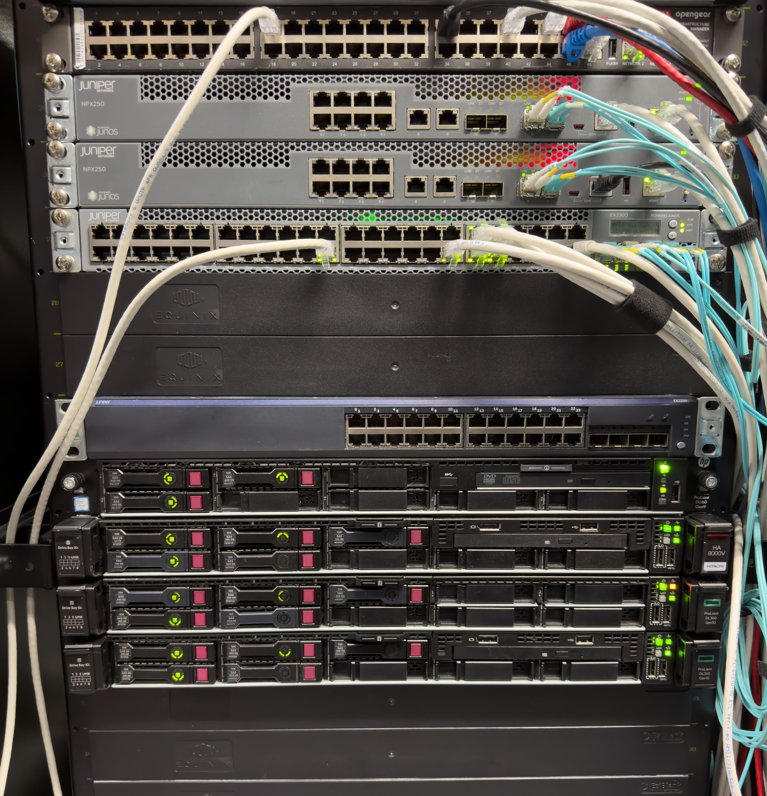
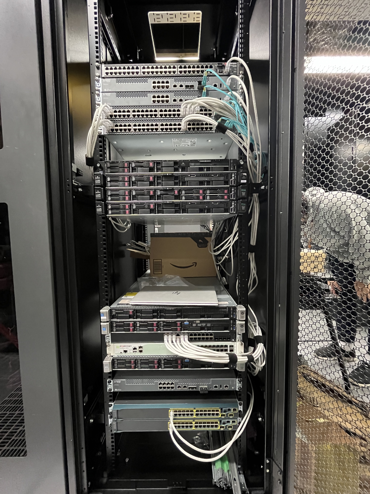

# CNTUG Infra Labs 2022 Recap

CNTUG Infra Labs 自從 2022/1/1 開放申請至今已經快一年了，其中經過了幾次軟硬體升級、架構更改以及 outage。這篇文章大概來記錄一下 Infra Labs 這一年的整個建立以及營運過程。

## 專案動機

自己其實在很久以前一直就有在購買伺服器及網路設備建立一個小小的 OpenStack/Ceph 測試集群，但集群使用率不管是運算資源、儲存空間還是網路資源其實一直都不高。幾年前獲得 public IPv4 地址的時候就有想法要免費提供給社群和學生使用，希望能夠促進社群的成長。但由於資金問題遲遲無法實施這項計畫。

來日本工作後，手邊能夠運用的資金變得稍微充足一點，再加上日本不管是機櫃空間還是網路服務相較台灣都便宜的許多，於是這個計畫就死灰復燃了。

## 專案資金來源

### 企業贊助

一開始資金來源是由一些社群成員的個人贊助，剩下不足的從自己的荷包中出。後續在社群成員的努力之下有拉到了 Red Hat 以及聚碩一年的贊助，大大減輕了資金的負擔。

### 個人贊助

在這裡也先特別感謝社群成員 Hazel, Samina 等人的贊助，以及 [OCF](https://ocf.tw) 協助管理贊助款項。

由於租借機櫃以及網路的每月費用仍是一筆不小的數字，如果各位讀者有餘力的話也歡迎[贊助 CNTUG 社群](https://ocf.neticrm.tw/civicrm/contribute/transact?reset=1&id=29)，有部分款項將會用來維持 Infra Labs 的營運。

## 設備清單列表

設備的部分主要有幾個來源

- 以前 homelab 使用過的設備
- 日本 Yahoo 拍賣購買
- 中國淘寶/閒魚購買
- 台灣二手社團購買
- eBay 購買

其中前兩項佔了大多數。

設備的購買基本上全部都是二手的，甚至在日本 Yahoo 拍賣上買到日本俗稱的 Junk 品（為測試不知道好壞）CPU，大約 30 顆一個一個拿來測試挑出能使用的來。這也是為什麼 Infra Labs 可以使用相對新的 CPU (Xeon Scalabe 2nd Generation) 的原因。

若想詳細了解目前使用的設備可以參考 [Architecture](/docs/architecture/network)

## 專案建置流程

### 硬體資源建置流程

在與上游廠商談好了網路以及機櫃的租用合約後就來了實際建構環境的過程了。整個 Infra Labs 的建置基本上是從一個空空的機櫃開始、從上架、接線、設備設定、OS 安裝、IaaS 部署一層一層的蓋上去。

在這邊也額外感謝 [Shouko](https://github.com/shouko) 以及 Samina 抽空來幫忙上架以及接線和 [steveyiyo](https://steveyi.net/)、[p6i](https://pwtsai.github.io) 協助網路設定和排除等。

### 軟體資源建置流程

軟體的建置過程在 [COSCUP x KCD Taiwan 2022 議程 如何在幾小時內快速部署一個私有雲 — 以 CNTUG Infra Labs 為例](https://coscup.org/2022/zh-TW/session/HPTAUB) 有介紹，如果想瞭解的話可以觀看[錄影影片](https://www.youtube.com/watch?v=YexUnVOZC8M&t=430s)。目前也有部分設定公開在 Infra Labs 的 GitHub 上，後續將會陸續公開其他設定。

## 營運過程

### Outage

營運過程其實發生不少 outage，主要都是在網路或是 OpenStack 上，Ceph 目前還沒有遇到太多問題。總體來講，系統可用率應該是有在 95% 以上。

Outage 的部分不乏幾個蠻有趣的：

- 在機櫃的時候不小心扯到上游網路設備的電源線，好死不死那台設備只有接單電源加上忘記 commit 設定，造成了幾個小時的斷線。
- Core router 更新 firmware 後某個本來壞掉的功能修好了，結果那個功能造成網路不定時掉包。

由於是免費提供的服務並沒有提供 SLA，但是還是盡力能讓系統可用率越高越好。明年若是時間允許的話，每次 outage 也都希望能夠提供比較詳細的 outage report 給使用者。

### 提供的服務

目前提供的皆為普遍 Public Cloud 常見的服務

- 虛擬機器 (Virtual Machine)
- 區塊儲存 (Block Storage)
- 物件儲存 (Object Storage)
- 網路
- 附載平衡 (Load Balancer)
- DNS

最近新增了提供給虛擬機器 GPU 使用，如果有需求歡迎申請使用。

## 專案成果

今年 (2022) 本專案提供對象，主要包含技術社群與電資學生使用，其中亦對 Infra Labs 進行測試和系統架設，以下為 2022 年使用案例的成果發表，並達成本專案回饋社會與培育英才的目標。

- [在 Kubernetes 用 Loki 蒐集 log 做監控警告通知方法整理筆記](https://malagege.github.io/blog/2022/04/03/%E5%9C%A8-Kubernetes-%E7%94%A8-Loki-%E8%92%90%E9%9B%86-log-%E5%81%9A%E7%9B%A3%E6%8E%A7%E8%AD%A6%E5%91%8A%E9%80%9A%E7%9F%A5%E6%96%B9%E6%B3%95%E6%95%B4%E7%90%86%E7%AD%86%E8%A8%98/)
- [使用 CNTUG Infra Labs 編譯 Android Custom ROM](https://hackmd.io/@EdwardWu/InfraLabs_OB)
- [TOEDU 台灣開放教育推動團隊](https://toedu.g0v.tw/index.html)
- Building Kubernetes cluster the hard way
    - [影片](https://www.youtube.com/watch?v=YexUnVOZC8M&t=17837s)
- 2022 iThome 鐵人賽《關於我怎麼把一年內學到的新手 IT/SRE 濃縮到 30 天筆記這檔事》
    - [Jerry Yang's Blog](https://blog.yangjerry.tw/categories/IT-%E9%90%B5%E4%BA%BA%E8%B3%BD/2022/)
    - [iThome](https://ithelp.ithome.com.tw/users/20112934/ironman/5640)
- [2022 iThome 鐵人賽《5G 核心網路與雲原生開發之亂彈阿翔》](https://ithelp.ithome.com.tw/articles/10306986)
- [UniCourse 大學課程資訊交流平臺](https://github.com/cloud-native-taiwan/Infra-Labs-Docs/blob/main/unicourse.tw)
    - [GitHub](https://github.com/UniCourse-TW)
    - [g0v 專案](https://sch001.g0v.tw/dash/prj/PHfxJKR2hpg7f9rt58i9g6WZ_ZRo08)
- [SCIST 南臺灣學生資訊社群](https://scist.org/)

## 目前困難

### 資金

今年有 Red Hat 以及聚碩兩間公司贊助了不小的一筆錢才能安然度過，但目前已經確定明年無法再繼續贊助。雖然以目前的薪資是足以撐起每月的費用，但是也是月月成為月光族的狀態。雖然整個集群是免費提供，但是使用者有餘力的話還是可以透過 OCF 進行贊助以維持計畫持續的營運。

### 設備

目前記憶體的使用率已經達到了一定的程度，由於整個系統是只有 3 台主機組成的 Hyper Converged Infrastructure，在目前的記憶體使用率下，在一台主機維護的時候將不夠資源 live migrate 那台主機的所有 VM instance 至其他兩台。後續在資金允許的狀況下應該會先將主機記憶體進行升級。

網路的部分是目前最大的 SPOF (Single point of failure)。目前在網路架構中使用了 100G 交換機作為主要的交換器，由於在疫情期間那台交換器已經漲價了超過 6 倍，沒辦法購入第二台做 MLAG 等機制備援。另外主機上的 100G NIC 也是單 port，所以目前只要相關網路設備有需要進行升級或維護整個系統將會下線。

### 人力

目前整個系統的維護是由我一人進行完成，基本上所有心力放在維護和運營上就已經很忙了，要做架構的調整或是其他的改進時間上就顯得不太足夠。

由於 OpenStack 跟 Ceph 上手難度較高，自己也還沒有一個比較系統性的流程可以教學沒有相關經驗的人上手，因此要尋找新的人手難度非常高。

## 未來規劃

未來規劃其實很多項目已經寫很久了，但是由於時間問題一直無法實行。

### 改進監控

監控系統其實是目前最沒有規劃的一個部分，雖然 OpenStack 部署工具在部署時有一併部署一些相關的工具，但其實沒有到很符合需求。目前已經有一些改進項目測試到一半，例如 smoke-test 等，未來希望能夠提供使用者一個查看目前系統狀況的網頁。

### 新增 ARM 伺服器

幾個月前有收到了幾台捐助給社群的 ARM64 架構的伺服器，但由於那個系統實在太挑記憶體了，一直無法找到足夠的記憶體讓 3 台主機上線。未來會持續收集記憶體，希望能提供使用者一些不同的硬體架構進行測試和學習。

### 新增 RISC-V 伺服器

這一項規劃其實比較偏向許願性質，RISC-V 本身在虛擬化的規格上有一部分剛制定完畢，自己還蠻有興趣測試是否能在 RISC-V 上利用 OpenStack 系統跑 Virtual Machine。當初 ARM64 剛興起進行 OpenStack porting 也是個蠻有趣的經歷。但目前由於支援虛擬化的 RISC-V 測試板不易取得，所以這項計畫還在擱置當中。

### 改善網路架構

上面有提到目前網路架構其實是整個 Infra Labs 最脆弱的部分，但由於牽扯到設備、資金等問題，改善難度比較大。

### 更多貢獻

Infra Labs 維運過程中其實有時都會遭遇一些 bug，筆者已經貢獻了幾個 PR 至 kops 以及 OpenStack 的 bug report，期望在未來能夠利用 Infra Labs 對開源社群進行更多的貢獻。

## 總結

Infra Labs 算是我生涯中進行過最複雜的一個計畫了，其中其實學到了蠻多東西也燒了蠻多的錢。在這一年內其實整個系統的利用率比我一開始預期的好，也希望明年 Infra Labs 可以為台灣甚至全世界的開源社群帶來更多的貢獻。

最後如果對 Infra Labs 不管是想贊助，想深入了解或是有興趣加入的都歡迎寄信到 [infra@cloudnative.tw](mailto:infra@cloudnative.tw) 或是透過各種管道找我聊天。