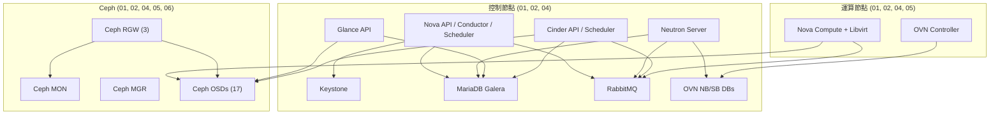

# 節點角色與服務配置

本頁將每台 Infra Labs 伺服器對應至其指派的角色，並記錄各主機上運行的 OpenStack 和 Ceph daemon。資料來源為 Docker 容器即時檢視、Ceph daemon 列表及 OpenStack 服務目錄。

---

## 角色矩陣

| 主機名稱 | Controller | Compute | Ceph MON | Ceph MGR | Ceph OSD | OVN Gateway | RGW |
|----------|-----------|---------|----------|----------|----------|-------------|-----|
| openstack01 | 是 | 是 | 是 | 是（standby） | 是（3） | 是 | 是 |
| openstack02 | 是 | 是 | 是 | 是（active） | 是（5） | 是 | 是 |
| openstack04 | 是 | 是 | 是 | 否 | 是（4） | 是 | 是 |
| openstack05 | 否 | 是 | 否 | 否 | 是（3） | 否 | 否 |
| openstack06 | 否 | 否 | 否 | 否 | 是（2） | 否 | 否 |

---

## 控制節點（openstack01、openstack02、openstack04）

三台控制節點構成 OpenStack 控制平面。所有具狀態的服務（資料庫、訊息佇列、OVN 資料庫）均在這三台主機上以 quorum 式叢集方式運作。

### 控制節點上的 OpenStack 服務

以下容器在每台控制節點上運行（來自 openstack01 的 `docker ps` 觀察結果；openstack02 和 openstack04 運行同等組合）：

**身分認證（Keystone）**
- keystone
- keystone_fernet
- keystone_ssh

**運算（Nova）**
- nova_api
- nova_conductor
- nova_scheduler
- nova_compute
- nova_libvirt
- nova_metadata
- nova_novncproxy
- nova_ssh

**網路（Neutron + OVN）**
- neutron_server
- neutron_rpc_server
- neutron_periodic_worker
- neutron_ovn_agent
- neutron_ovn_maintenance_worker
- neutron_ovn_metadata_agent

**區塊儲存（Cinder）**
- cinder_api
- cinder_backup
- cinder_scheduler
- cinder_volume

**映像（Glance）**
- glance_api

**物件儲存**
- 由 Ceph RGW 提供（非 Kolla 容器）

**儀表板**
- horizon
- skyline_apiserver
- skyline_console

**編排（Heat）**
- heat_api
- heat_api_cfn
- heat_engine

**DNS（Designate）**
- designate_api
- designate_central
- designate_mdns
- designate_producer
- designate_sink
- designate_worker
- designate_backend_bind9

**負載均衡器（Octavia）**
- octavia_api
- octavia_driver_agent
- octavia_health_manager
- octavia_housekeeping
- octavia_worker

**Placement**
- placement_api

**資料庫**
- mariadb
- proxysql

**訊息佇列**
- rabbitmq

**快取**
- memcached
- valkey_server
- valkey_sentinel

**高可用性**
- keepalived

**OVN / Open vSwitch**
- openvswitch_db
- openvswitch_vswitchd
- ovn_controller
- ovn_nb_db
- ovn_northd
- ovn_sb_db
- ovn_sb_db_relay_1

**監控與日誌**
- prometheus_server
- prometheus_alertmanager
- prometheus_node_exporter
- prometheus_cadvisor
- prometheus_libvirt_exporter
- prometheus_memcached_exporter
- prometheus_mysqld_exporter
- prometheus_blackbox_exporter
- prometheus_openstack_exporter
- ipmi_exporter
- grafana
- fluentd

**工具**
- kolla_toolbox
- cron

---

## 純運算節點

### openstack05

僅運行 Nova compute 和 Ceph OSD daemon。不參與控制平面或 OVN gateway chassis 集合。

容器：nova_compute、nova_libvirt、nova_ssh、neutron_ovn_metadata_agent、ovn_controller、openvswitch_db、openvswitch_vswitchd、prometheus_node_exporter、prometheus_cadvisor、fluentd、kolla_toolbox、cron，以及 Ceph OSD daemon。

### openstack06

純儲存節點。運行 Ceph OSD daemon，但不運行 Nova compute 或控制平面服務。

---

## Quorum 分析

三台控制節點提供以下 quorum 保證：

| 服務 | Quorum 模型 | 可容忍故障數 | 備註 |
|------|------------|-------------|------|
| MariaDB Galera | 3 取 2 | 1 個節點 | Galera 需要多數決才能寫入 |
| RabbitMQ | 3 取 2 | 1 個節點 | 跨叢集鏡像佇列 |
| Ceph MON | 3 取 2 | 1 個節點 | Paxos 共識機制管理叢集 map |
| OVN NB DB | 3 取 2 | 1 個節點 | Raft 共識機制（OVSDB clustering） |
| OVN SB DB | 3 取 2 | 1 個節點 | Raft 共識機制（OVSDB clustering） |

任何單一控制節點的遺失仍可維持所有叢集服務的 quorum。同時遺失兩台控制節點將會破壞 quorum，導致整個平台的寫入作業中斷。

### 控制節點角色不對稱性

雖然三台控制節點運行相同的容器組合，但部分服務具有不對稱的 active/standby 角色：

| 服務 | Active | Standby |
|------|--------|---------|
| Ceph MGR | openstack02 | openstack01 |
| Keepalived（VIP 持有者） | 依 VRRP 選舉而定 | 其餘控制節點 |

---

## 服務相依流程

