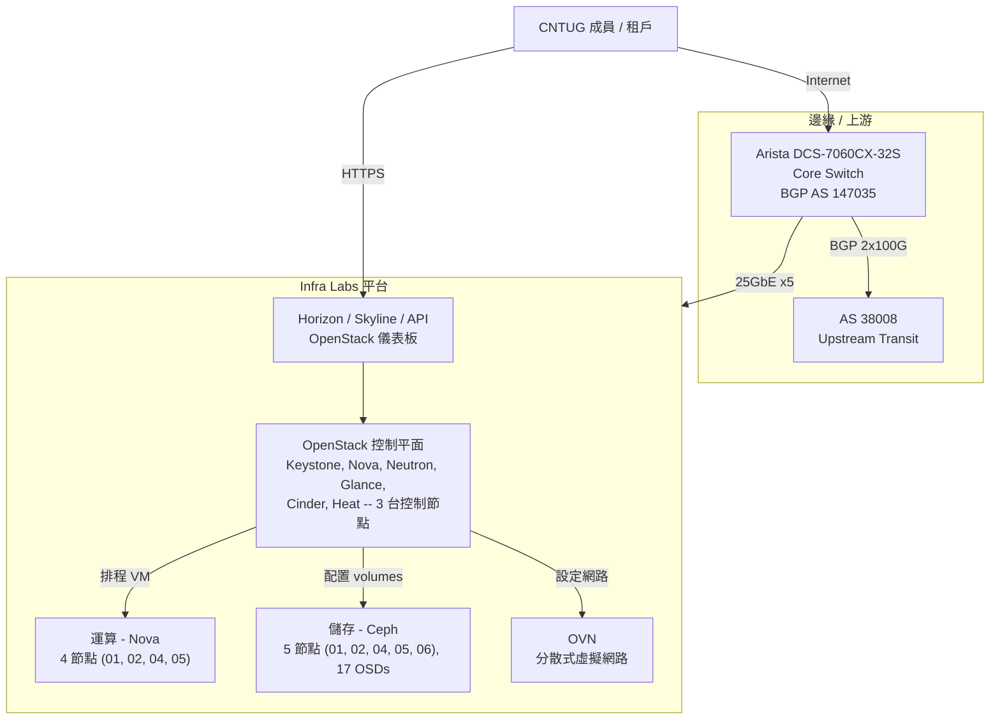

# Infra Labs 架構

Infra Labs 是由 [Cloud Native Taiwan User Group (CNTUG)](https://cloudnative.tw/) 營運的社群基礎設施即服務（IaaS）平台。平台以 OpenStack 提供運算資源、Ceph 提供儲存服務、OVN 提供軟體定義網路，服務對象為 CNTUG 成員及社群專案。平台部署於單一機櫃的實體環境中，具備雙協定棧 IPv4/IPv6 連線能力，並透過 BGP 與上游對等互聯。

本文件為架構文件的頂層入口。請先從下方的情境圖瞭解各主要子系統之間的關係，再循連結深入各專題區域。

---

## 情境圖

---

## 目錄

| # | 章節 | 說明 |
|---|------|------|
| 1 | [系統概覽](overview.md) | 使命、技術選型、實體設備清冊、公開服務、IP 定址及重要架構決策紀錄 |
| 2 | [網路架構](network/) | 實體拓撲、VLAN 規劃、BGP 組態、OVN overlay、DNS 及 IPv4/IPv6 定址 |
| 3 | [運算架構](compute/) | Nova 組態、Hypervisor 節點、CPU/RAM 分配及 flavor 規格 |
| 4 | [儲存架構](storage/) | Ceph 叢集設計、OSD 配置、CRUSH 規則、RBD 儲存池、CephFS 及 RGW/S3 端點 |
| 5 | [OpenStack 服務](openstack/) | Kolla-Ansible 部署、服務目錄、Keystone domain、Neutron/OVN 整合、Glance 後端及 Cinder volumes |
| 6 | [維運](operations/) | 常見任務手冊——節點維護、Ceph 復原、OpenStack 升級、事件應變 |

---

## 目標讀者

本文件針對三類主要讀者撰寫：

- **維運人員**——日常維護與排障平台的人員。
- **貢獻者**——對基礎設施或其組態提出變更的社群成員。
- **稽核人員**——審視平台安全性、合規性或架構適切性的任何人。

每個章節皆包含足夠的背景資訊可獨立閱讀，但在主題交疊之處會提供交叉參照（例如 Ceph 儲存同時出現在儲存與 OpenStack 章節中）。
