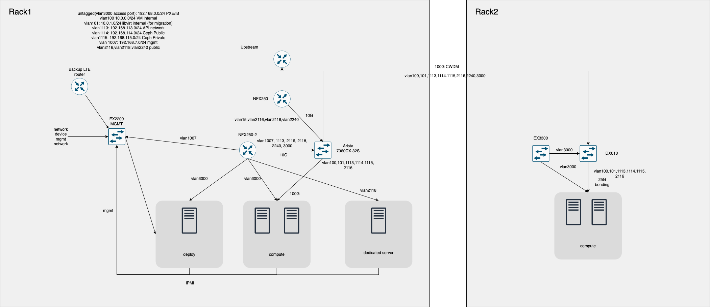

# Infra Labs 網路架構

## 前言

此篇文件將介紹目前 Infra Labs 所使用的網路架構，由於預算問題很多部分設計都可以再改進，如果有相關建議歡迎與[管理員](mailto:infra@cloudnative.tw)討論。

## 架構圖

## 設備

目前 Infra Labs 採用多廠牌網路設備，由於網路設備使用開源軟體極少以及價格通常偏高。
因預算問題，目前網路設備大多數使用閉源軟體，並且有單點故障的風險 (Single Point of Failure)。

廠商若有意願贊助網路設備，歡迎[聯絡管理員](mailto:infra@cloudnative.tw)

### 路由器

路由器目前使用兩台 Juniper NFX250，主要功能是與上游進行 BGP 宣告和 Infra Labs 使用 public IP 的 gateway。除此之外，路由器也被用來過濾掉一些容易被攻擊的連接埠。

### 交換機

#### Juniper EX3300-48T

2 台 EX3300-48T stacking 提供了 PXE/In band management 網路、OpenStack API 網路和 OpenStack VM 所使用的 public network。往上接至 NFX250

#### Arista DCS-7060CX-32S

Arista DCS-7060CX-32S 100G 交換機主要用於 VM 內部網路、Libvirt migration 網路和 Ceph 的 public/private 網路。

向下用 breakout cable 接至主機的 25G 網卡。

#### Juniper EX2200-24T

Juniper EX2200-24T 主要用於 Out of band management 網路。下接至各個主機 IPMI、網路設備 management port，上接至 Fortigate 200D。

## 防火牆

防火牆使用 Fortigate 200D 一台，主要用於

- In band management 網路 NAT gateway
- Dashboard, DNS server 的 NAT
- Mangement 網路 VPN access
- DNS server 流量限制

### LTE 設備

LTE 設備主要提供備援網路，若 NFX250 設定出問題導致主要網路斷線無法從外部連入，可以透過 LTE 設備連入 management 網路進行維修。

## 網段

目前網段主要分為以下：

- untagged: 
    - 192.168.0.0/24 
    - PXE/IB
- vlan 100 
    - 10.0.0.0/24 
    - VM internal
- vlan 101
    - 10.0.1.0/24
    - libvirt internal (for migration)
- vlan 1113
    - 192.168.113.0/24
    - API network
- vlan 1114
    - 192.168.114.0/24
    - Ceph Public
- vlan 1115
    - 192.168.115.0/24
    - Ceph Private
- vlan 2116
    - 103.122.116.0/23 public
- vlan 1007
    - mgmt: 192.168.7.0/24
