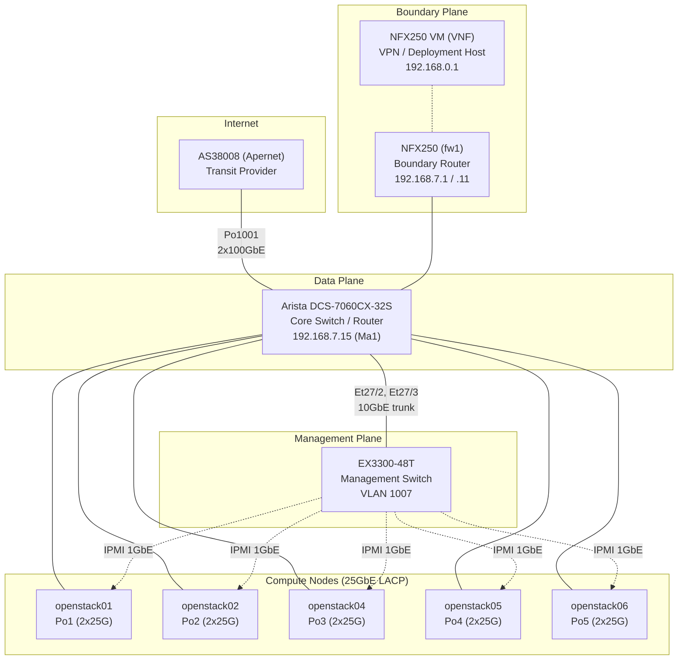

# 網路架構

Infra Labs 的網路劃分為三個獨立的平面，各由專用硬體承載。此分離設計確保管理流量、儲存複製與租戶工作負載不會競爭相同鏈路，且單一平面故障不會連鎖影響其他平面。

## 設計原則

- **三平面分離** -- 資料、管理及邊界流量分別由獨立的硬體與 VLAN 承載。
- **資料平面使用巨型訊框** -- 所有 bond0 介面及其 VLAN 子介面的 MTU 為 9000，降低 Ceph 與虛擬機流量的 CPU 負擔。
- **管理平面使用標準訊框** -- EX3300 管理交換機與 IPMI 介面的 MTU 為 1500。
- **IPv4 + IPv6 雙棧** -- 一個 /48 的 IPv6 區塊（台灣）透過 eBGP 與 IPv4 前綴一同宣告。
- **全面採用 LACP** -- 每台伺服器上行鏈路皆為兩條 25GbE 綁定，提供冗餘與頻寬。

## 三個平面

### 資料平面 -- Arista DCS-7060CX-32S

Arista 為網路核心。其 32 埠 100GbE (QSFP28) 交換機透過 breakout 線纜為每台伺服器提供 25GbE 連線。每台運算節點透過 2x25GbE LACP port-channel (bond0) 連接，提供每台主機 50 Gbps 的聚合頻寬。Arista 同時終結上游 2x100GbE 鏈路至 AS38008 (Apernet)，並為路由 VLAN 提供所有 L3 SVI。

主要特性：
- 透過 QSFP28 轉 SFP28 breakout 提供每鏈路 25GbE 至伺服器
- 2x100GbE 上游鏈路 (Po1001) 至轉接供應商
- 承載 VLAN：100, 101, 1000, 1113, 1114, 1115, 2116
- 伺服器端口 MTU 9000
- 公共前綴的 BGP speaker（與 AS38008 對等互聯）

### 管理平面 -- Juniper EX3300-48T

EX3300 為 IPMI/BMC 介面及帶外管理提供 1GbE 銅纜連線。在 L2 層級上與資料平面完全隔離；兩者之間唯一的路徑需經由 NFX250 邊界路由器。此設計確保即使資料平面設定錯誤或遭受攻擊，管理存取仍可使用。

主要特性：
- 48 埠 1GbE 銅纜
- VLAN 1007 (oob-mgmt, 192.168.7.0/24)
- 透過 Et27/3 連接至 Arista，提供有限的跨平面流量
- MTU 1500

### 邊界 -- Juniper NFX250

單一 NFX250 設備（主機名稱 `fw1`）位於網路邊緣。其具備 8 個 RJ-45 埠（ge-0/0/0 至 ge-0/0/7）用於伺服器管理連線，另有 10GbE SFP+ 上行鏈路連接至 Arista。JunOS 主機本身提供：
- 管理網路預設閘道 (192.168.0.254 on ge-1/0/0.1)
- 管理主機的 NAT 出站網際網路存取
- 邊界路由與防火牆

NFX250 同時託管一台 VNF 虛擬機，提供：
- WireGuard VPN 端點 (192.168.118.1/24 on wg0)
- 部署主機（容器 registry 及自動化工具）

NFX250 具有兩個管理平面 IP：192.168.7.1（ge-1/0/0.3，OOB 管理閘道）及 192.168.7.11（fxp0，設備管理）。透過 10GbE trunk 連接至 Arista。

## 網路拓撲圖

## MTU 摘要

| 平面 | MTU | 介面 |
|------|-----|------|
| 資料平面 | 9000 | bond0, bond0.1113, bond0.1115, bond0.100, bond0.101 |
| 管理平面 | 1500 | eno1, IPMI/BMC, Ma1 |
| 上游鏈路 | 9000 | Po1001 (Arista to AS38008) |

## 雙棧定址

| 協定棧 | 區塊 |
|--------|------|
| IPv4 | 103.122.116.0/23 (VLAN 2116) |
| IPv6 | 2403:8ec0::/48 |

IPv4 與 IPv6 前綴皆透過 eBGP 宣告至 AS38008，使用 bgp-apernet VRF (AS 147035)。

## 子頁面

- [實體拓撲](physical-topology.md) -- 設備清冊、port-channel 對應、線纜連接、bond 組態
- [VLAN 與 IP 定址](vlan-ip-addressing.md) -- 完整 VLAN 表、各主機 IP 分配、VIP、IPv6 區塊
