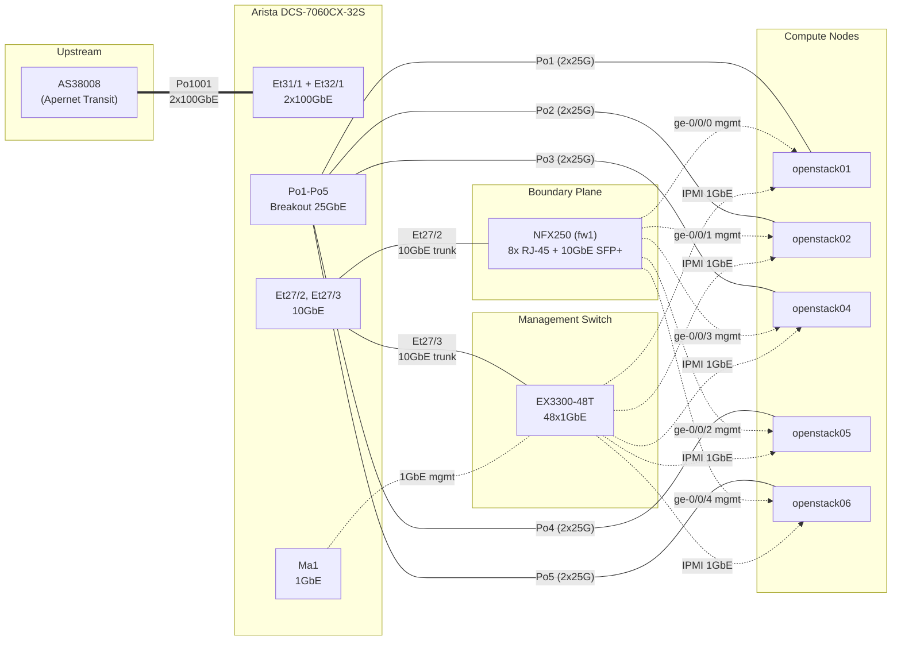

# 實體拓撲

本頁文件記錄每台網路設備、其角色及設備間的實體線纜連接。所有資料均來自即時設備查詢。

## 設備清冊

| 設備 | 主機名稱 | 型號 | 作業系統 | 角色 | 管理 IP | 關鍵規格 |
|------|----------|------|----------|------|---------|----------|
| NFX250 | fw1 | Juniper NFX250 | Junos 22.4R1.10 | 邊界路由器 | 192.168.7.1 (ge-1/0/0.3), 192.168.7.11 (fxp0) | NAT、閘道、VNF 主機（VPN 及部署 VM） |
| Arista | cr1 | DCS-7060CX-32S | EOS 4.31.3.1M | 核心交換機 / 路由器 | 192.168.7.15 (Ma1) | 32x100G QSFP28，執行 node-exporter 及 snmp-exporter 容器 |
| EX3300 | - | Juniper EX3300-48T | - | 管理交換機 | - | 48x1GbE 銅纜 |

### Arista DCS-7060CX-32S (cr1)

Arista（主機名稱 `cr1`，EOS 4.31.3.1M）為唯一的資料平面交換機。同時執行兩個監控容器：**node-exporter**（Prometheus 主機指標）及 **snmp-exporter**（Prometheus SNMP 指標）。其 32 個 QSFP28 埠以三種方式使用：

1. **Breakout 為 4x25GbE SFP28** -- 提供伺服器上行鏈路 (Et1/1 至 Et4/4)。
2. **原生 100GbE** -- 提供至 AS38008 的上游 trunk (Et31/1, Et32/1 組成 Po1001)。
3. **Breakout 為 4x10GbE** -- Et27/1-4 提供 10 Gbps trunk 埠至 EX3300 及 NFX250。

### Juniper NFX250

單一 NFX250（主機名稱 `fw1`，Junos 22.4R1.10）提供實驗室網路與公用網際網路之間的邊界功能。其具備 8 個 RJ-45 埠（ge-0/0/0 至 ge-0/0/7）用於伺服器管理連線及 IPMI，另有 10GbE SFP+ 上行鏈路連接至 Arista。該設備託管一台 Linux 虛擬機，執行 NAT、WireGuard VPN，並作為帶內管理 VLAN 的預設閘道。設備具有兩個管理平面 IP：192.168.7.1 位於 ge-1/0/0.3（OOB 管理閘道）及 192.168.7.11 位於 fxp0（設備管理）。

### Juniper EX3300-48T

EX3300 專用於帶外管理。每台伺服器的 IPMI/BMC 埠透過 1GbE 銅纜連接至此。交換機透過 Et27/3 連接至 Arista，允許 VLAN 1007 (oob-mgmt) 受控的跨平面可達性。

### NFX250 (fw1) 介面詳情

NFX250（主機名稱 `fw1`）執行 Junos 22.4R1.10，同時具備實體路由器及 VNF 主機（執行 WireGuard VM）的功能。

**實體介面（ge-0/0/x -- 8 個 RJ-45 1GbE 埠，用於伺服器管理及 IPMI）：**

| 埠 | 名稱 | 模式 | VLAN | 連接至 |
|----|------|------|------|--------|
| ge-0/0/0 | openstack01-mgmt | trunk | 3000 (native), 1007 | openstack01 mgmt |
| ge-0/0/1 | openstack02-mgmt | trunk | 3000 (native), 1007 | openstack02 mgmt |
| ge-0/0/2 | openstack05-mgmt | trunk | 3000 (native), 1007 | openstack05 mgmt |
| ge-0/0/3 | openstack04-mgmt | trunk | 3000 (native), 1007 | openstack04 mgmt |
| ge-0/0/4 | openstack06-mgmt | access | 3000 | openstack06 mgmt |
| ge-0/0/5 - ge-0/0/7 | - | access | 3000 | 未使用 / 保留 |

**10GbE SFP+ 上行鏈路：**

| 埠 | 模式 | VLAN | 連接至 |
|----|------|------|--------|
| xe-0/0/12 | trunk | 1113, 1007, 3000, 2116 | Arista (cr1) Et27/2 |
| xe-0/0/13 | - | - | 未使用 |

**路由介面（ge-1/0/x -- L3）：**

| 介面 | VLAN | IP 位址 | 用途 |
|------|------|---------|------|
| ge-1/0/0.0 | 2116 | 103.122.117.250/23, .241, .242, .252 + 2403:8ec0::11/48 | 台灣公用（untrust zone） |
| ge-1/0/0.1 | 3000 | 192.168.0.254/24 | 帶內管理閘道 |
| ge-1/0/0.2 | 1113 | 192.168.113.250/24 | API 網路 |
| ge-1/0/0.3 | 1007 | 192.168.7.1/24 | OOB 管理閘道 |
| fxp0 | mgmt | 192.168.7.11/24 | 設備管理 |

**VNF（Virtual Network Function）：**

- WireGuard VM 以名為 "wg" 的 VNF 形式在 NFX250 內執行。
- SXE fabric 介面 (sxe-0/0/0) 以 MTU 9192 橋接實體埠至 VNF。

## Port-Channel 對應表

資料來源為 Arista 上的 `show port-channel dense`。

| Port-Channel | 名稱 | 速率 | 連接至 |
|--------------|------|------|--------|
| Po1 | openstack01 | 2x25G (50G) | openstack01 的 LACP bond0 |
| Po2 | openstack02 | 2x25G (50G) | openstack02 的 LACP bond0 |
| Po3 | openstack04 | 2x25G (50G) | openstack04 的 LACP bond0 |
| Po4 | openstack05 | 2x25G (50G) | openstack05 的 LACP bond0 |
| Po5 | openstack06 | 2x25G (50G) | openstack06 的 LACP bond0 |
| Po1001 | apernet | 2x100G (200G) | 上游 AS38008 |

### Port-channel 設計說明

- **Po1 至 Po5** 各承載所有運算 VLAN (100, 101, 1113, 1114, 1115, 2116) 作為 tagged 流量，VLAN 1114 (Ceph public) 為 native VLAN。
- **Po1001** 為連接 Apernet (AS38008) 的上游鏈路。以 2x100GbE 提供 200 Gbps 聚合轉接頻寬。承載 VLAN 1（預設）及 1000，供 BGP peering 與管理使用。

## 其他 Arista 埠

Port-channel 群組外仍在使用的埠：

| 埠 | 速率 | 狀態 | 連接至 | VLAN |
|----|------|------|--------|------|
| Et27/2 | 10G | 已連接 | NFX250 | 1007, 1113, 2116 |
| Et27/3 | 10G | 已連接 | EX3300 | 1007 |
| Ma1 | 1G | 已連接 | EX3300（管理） | 192.168.7.15/24 |

## 實體拓撲圖



## 運算節點 Bond 組態

每台運算節點使用 2x25GbE LACP bond (bond0) 搭配 Mellanox ConnectX-4 Lx 網卡。各主機使用不同的介面命名；bond 透過自訂腳本部署。

| 參數 | 值 |
|------|-----|
| 模式 | IEEE 802.3ad (LACP) |
| 傳輸雜湊策略 | layer3+4 |
| LACP 速率 | fast |
| 網卡型號 | Mellanox ConnectX-4 Lx 25GbE |
| 每鏈路速率 | 25000 Mbps |
| 聚合頻寬 | 50 Gbps |
| MTU | 9000 |

### Bond 介面層級架構

每台運算節點的網路介面層級架構如下：

```
bond0 (LACP, MTU 9000, native VLAN 1114)
  |-- 2x25GbE Mellanox ConnectX-4 Lx
  |
  |-- bond0.100    (VM internal)
  |-- bond0.101    (live migration)
  |-- bond0.1113   (OpenStack API)
  |-- bond0.1115   (Ceph cluster/replication)
  |-- bond0.2116   (TW public)
```

bond0 上的 native（untagged）VLAN 為 **1114 (Ceph public)**。這意味著 Ceph 客戶端流量無需 802.1Q 標籤即可傳輸，為頻寬需求最高的網路節省少量的逐封包負擔。

### 為何使用 layer3+4 雜湊

`layer3+4` 傳輸雜湊策略使用來源與目的 IP 位址加上 L4 埠號，將流量分散至 bond 成員。此方式為 TCP 密集型工作負載（如 Ceph OSD 複製及虛擬機間流量）提供良好的負載平衡，因為同一對主機之間存在大量使用不同埠號的連線。
