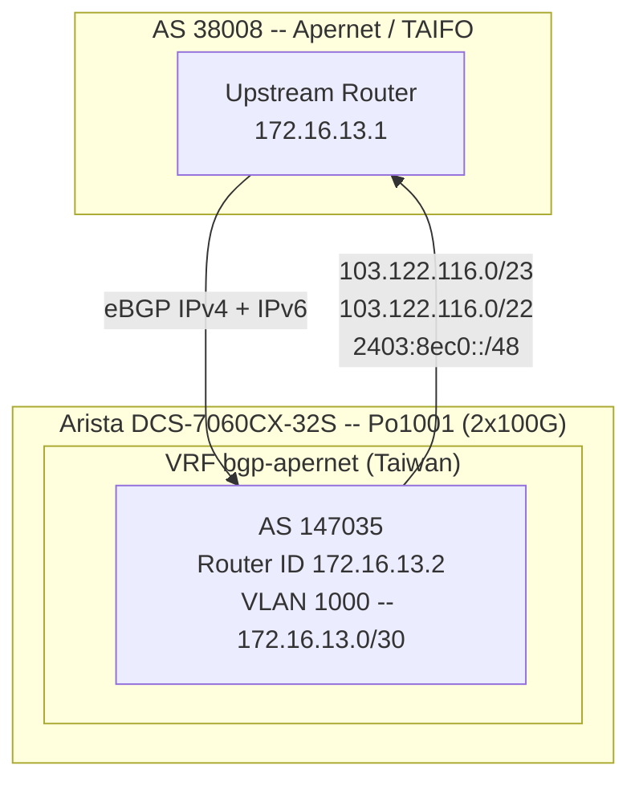

# 路由與 BGP

## 概述

Arista DCS-7060CX-32S 作為邊界路由器，在 bgp-apernet VRF 中執行 BGP，透過 2x100G bond (Po1001, 介面 Et31/1 + Et32/1) 與上游轉接供應商 (AS 38008, Apernet / TAIFO) 對等互聯。該 VRF 宣告台灣位址區塊前綴。

內部路由由 Arista SVI 處理運算/API VLAN，管理 NAT 則由 NFX250 JunOS 負責。

---

## BGP 對等互聯圖

---

## VRF: bgp-apernet（台灣上行鏈路）

| 參數 | 值 |
|------|-----|
| 本地 AS | 147035 |
| Router ID | 172.16.13.2 |
| 對等互聯 VLAN | 1000 (172.16.13.0/30) |
| IPv4 鄰居 | 172.16.13.1 (AS 38008) |
| IPv6 鄰居 | 2406:4440:bf:f001::1 (AS 38008) |
| 最大路徑數 | 2 |

### 宣告前綴

| AFI | 前綴 |
|-----|------|
| IPv4 | 103.122.116.0/23 |
| IPv4 | 103.122.116.0/22 |
| IPv6 | 2403:8ec0::/48 |

### Route Map

| 方向 | Route Map |
|------|-----------|
| 入站 | TAG_EBGP |
| 出站 (IPv4) | EXPORT_APERNET |
| 出站 (IPv6) | EXPORT_V6_APERNET |

---

## Prefix List

| Prefix List | 允許 | 使用者 |
|-------------|------|--------|
| EXPORT_APERNET | 103.122.116.0/22 le 24 | Route map EXPORT_APERNET（台灣出站） |
| EXPORT_V6_APERNET | 2403:8ec0::/48 | Route map EXPORT_V6_APERNET |

---

## Route Map 詳情

| Route Map | 功能 |
|-----------|------|
| TAG_EBGP | 為所有入站 eBGP 路由標記 tag 1145 |
| EXPORT_APERNET | 匹配 prefix list EXPORT_APERNET；用於台灣 IPv4 出站宣告 |
| EXPORT_V6_APERNET | 匹配 prefix list EXPORT_V6_APERNET；用於台灣 IPv6 出站宣告 |
| RM-FIB-POLICY | 拒絕帶有 tag 1145 的路由安裝至 FIB（防止 BGP 學習的路由出現在主路由表中） |

TAG_EBGP route map 套用於 bgp-apernet VRF 的入站方向。RM-FIB-POLICY 確保透過 eBGP 學習的路由僅用於 BGP 最佳路徑選擇，不會安裝為核心/硬體轉發表中的活躍路由。

---

## QoS / 速率限制

速率限制套用於 BGP 對等互聯 VLAN，以限制上游頻寬：

| VLAN | 方向 | CIR | Burst |
|------|------|-----|-------|
| 1000（台灣對等互聯） | 入站 | 1.7 Gbps | 8 MB |
| 1000（台灣對等互聯） | 出站 | 1.7 Gbps | 8 MB |

---

## 靜態路由

| 範圍 / VRF | 目的地 | 下一跳 |
|------------|--------|--------|
| Management（預設 VRF） | 0.0.0.0/0 | 192.168.7.1 |
| bgp-apernet（台灣） | 0.0.0.0/0 | 172.16.13.1 |

---

## IPv6 Router Advertisement

| VLAN | RA 間隔 | RA 存活時間 | DNS 伺服器 |
|------|---------|-------------|------------|
| 2116 (tw-pub) | 360 s | 3600 s | 2606:4700:4700::1111 (Cloudflare) |

---

## BGP Session 狀態

在資料收集時，`show ip bgp summary` 顯示 bgp-apernet VRF 中無作用中的鄰居。這可能表示上游正在維護，或在查詢期間 session 處於管理性停用狀態。請在 Arista 上執行 `show ip bgp summary vrf all` 進行後續驗證。

---

## 上游實體路徑

連接至 AS 38008 的上游鏈路為 2x100G LACP bond：

| 參數 | 值 |
|------|-----|
| Port-Channel | Po1001 |
| 成員介面 | Et31/1, Et32/1 |
| 速率 | 2 x 100 Gbps |
| 對端 | AS 38008 (Apernet / TAIFO) |

---

## 內部路由

### Arista SVI 閘道

Arista 為以下 VLAN 提供第三層閘道介面 (SVI)，使運算節點與上游之間的流量得以路由：

| VLAN | 名稱 | 用途 |
|------|------|------|
| 1113 | API | OpenStack API 網路 |
| 2116 | tw-pub | 台灣公用網路（浮動 IP） |

### 管理網路路由

| 範圍 | 閘道 | 網路 |
|------|------|------|
| 管理 VLAN 3000 | NFX250 JunOS (192.168.0.254) | 192.168.0.0/24 |
| 運算節點預設路由 | 192.168.0.254 via eno1 | 管理網路 |

### Ceph 儲存網路

Ceph 流量僅為第二層，不需要路由：

- **公用網路：** VLAN 1114 (192.168.114.0/24) -- 客戶端至 OSD
- **叢集網路：** VLAN 1115 (192.168.115.0/24) -- OSD 複製

---

## NAT（管理流量出站）

NFX250 JunOS 為需要存取網際網路的管理平面流量（套件更新、NTP 等）提供 NAT：

| 參數 | 值 |
|------|-----|
| NAT 閘道 | NFX250 JunOS (fw1) |
| 公用介面 | ge-1/0/0.0 -- 103.122.117.250/23 (VLAN 2116) |
| 內部子網 | 管理網路 (192.168.0.0/24) 及相關 OOB 網路 |
| 功能 | 出站管理流量的來源 NAT |
