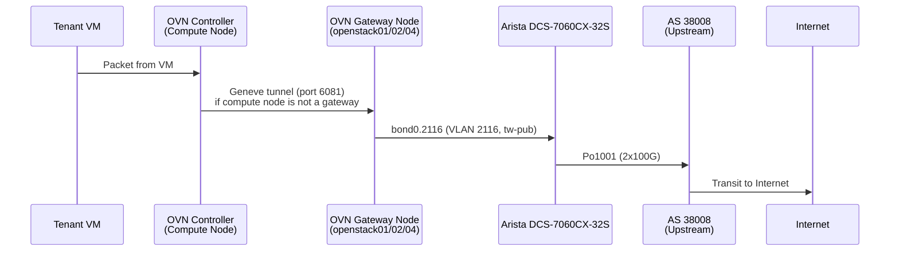
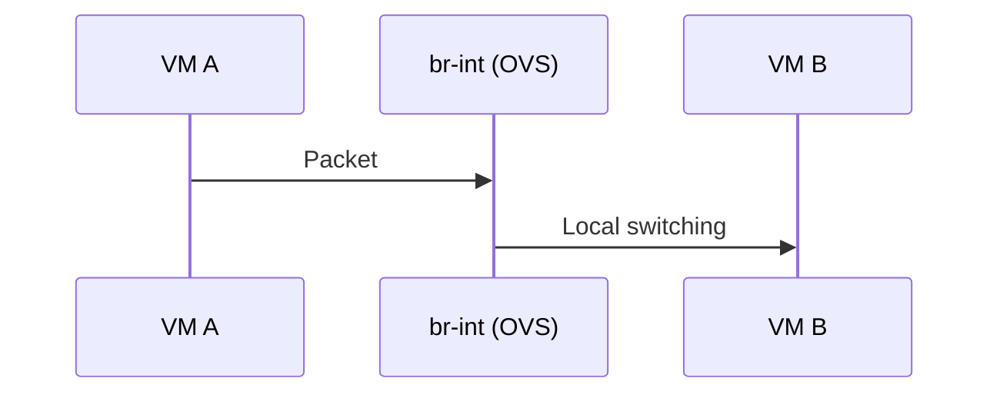
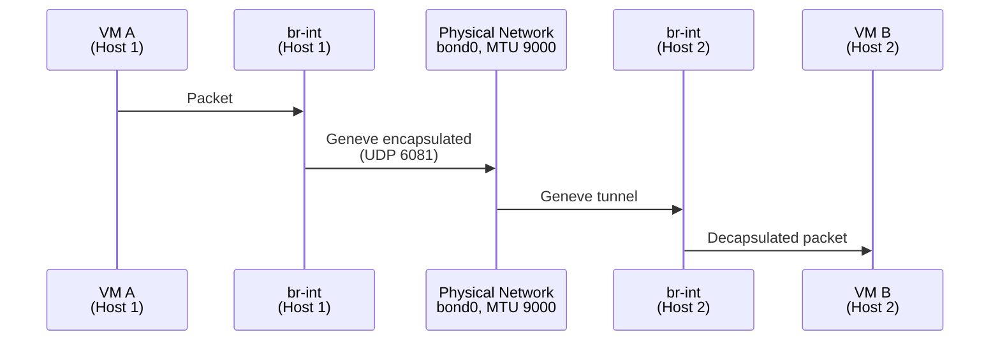
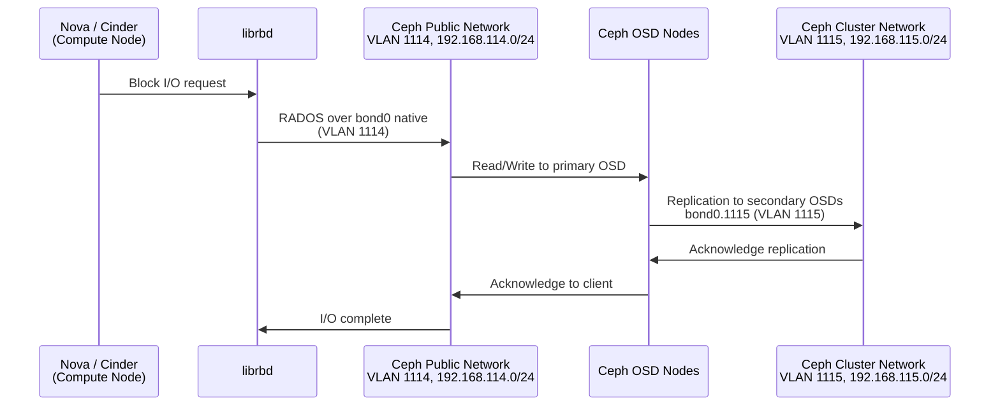
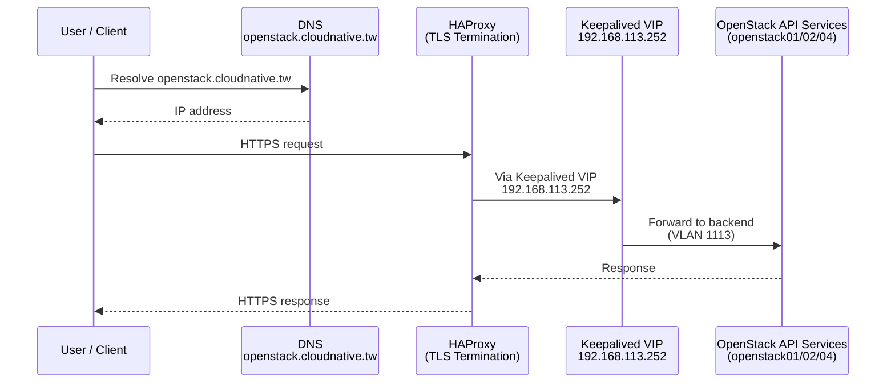
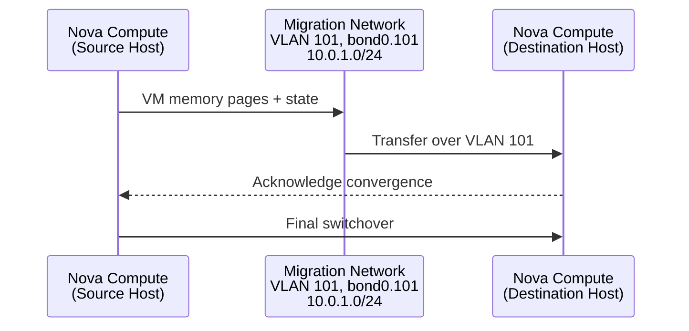
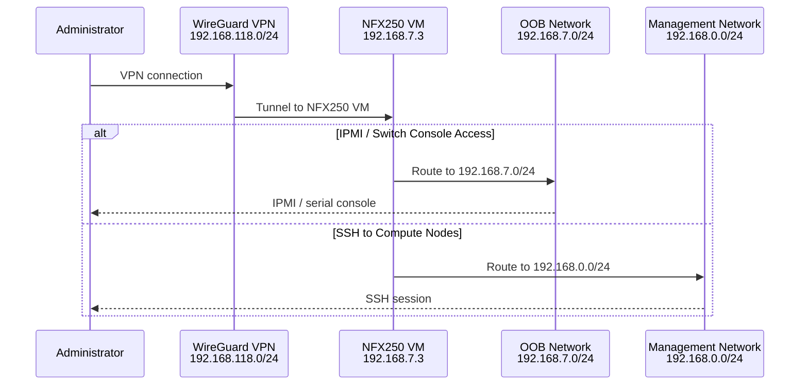

# 流量路徑

## 概述

本文件描述 Infra Labs 基礎架構中的主要流量路徑，涵蓋南北向（租戶至網際網路）、東西向（虛擬機至虛擬機）、儲存、API 存取、即時遷移及管理路徑。

---

## 1. 南北向：租戶虛擬機至網際網路

租戶虛擬機透過 OVN 分散式路由及閘道節點存取網際網路。非閘道運算節點透過 Geneve 隧道將南北向流量傳送至閘道 chassis。

**OVN Controller 閘道節點：** openstack01, openstack02, openstack04

**非閘道節點（隧道至閘道）：** openstack05, openstack06

### 說明

- 閘道選擇由 OVN HA chassis group 管理；當閘道節點故障時，流量會自動切換。
- VLAN 2116 (tw-pub) 承載台灣公用 IP (103.122.116.0/22)。
- 回程流量依循反向路徑：上游遞送至 Arista SVI，轉發至閘道節點，閘道節點再視需要透過隧道送回運算主機。

---

## 2. 東西向：虛擬機至虛擬機（同一主機）

當兩台虛擬機位於同一虛擬化主機時，流量在 OVS 內部本地交換，不會離開主機。

### 說明

- 無實體網路傳輸。所有轉發皆在本機運算節點的 OVS bridge 內完成。
- OVN 安全群組規則仍在 OVS datapath 中執行。

---

## 3. 東西向：虛擬機至虛擬機（不同主機）

跨主機虛擬機流量透過 bond0 介面使用 Geneve 封裝。實體 MTU 9000 可容納 Geneve 額外負擔，而無需分片內層封包。

### 說明

- Geneve 增加約 50-54 位元組的額外負擔（外層 Ethernet + IP + UDP + Geneve header）。
- 實體 MTU 為 9000 時，內層虛擬機 MTU 可安全維持在 1500，或若租戶網路需要 jumbo frame，可提升至約 8900。

---

## 4. 儲存：運算節點至 Ceph

運算節點透過 Ceph 公用網路存取 Ceph 區塊儲存 (RBD)。OSD 間的複製使用獨立的叢集網路，避免與客戶端 I/O 競爭。

### 說明

- VLAN 1114（公用）作為 bond0 上的 native/untagged VLAN 承載。
- VLAN 1115（叢集）作為 tagged 子介面 (bond0.1115) 承載。
- 兩個網路皆為純 L2；Ceph 流量不需要路由。

---

## 5. API：使用者至 OpenStack

外部使用者透過 HAProxy + Keepalived 對存取 OpenStack API，其負責 TLS 終結並將流量負載平衡至後端服務。

### 說明

- Keepalived 在控制節點間提供 VIP 故障轉移。
- HAProxy 終結 TLS，並將請求分發至 Keystone、Nova、Neutron、Cinder 及其他 API 端點。
- API 流量在內部走 VLAN 1113。

---

## 6. 即時遷移

即時遷移流量使用專用 VLAN，防止記憶體傳輸期間與儲存及 API 網路產生競爭。

### 說明

- VLAN 101 專用於即時遷移，在 bond0 上以 tagged 方式承載 (bond0.101, 子網 10.0.1.0/24)。
- 使用獨立 VLAN 可避免與 Ceph 儲存 (VLAN 1114/1115) 及 API 流量 (VLAN 1113) 的頻寬競爭。
- bond0 提供 2x25G 聚合頻寬，足以應付大多數工作負載的記憶體傳輸需求。

---

## 7. 管理：管理員 VPN 存取

管理員透過終結於 NFX250 VM 的 WireGuard VPN 存取基礎架構節點，該 VM 橋接至 OOB (IPMI/console) 及管理 (SSH) 網路。

### 說明

- WireGuard 從 192.168.118.0/24 分配位址給 VPN 客戶端。
- NFX250 VM (192.168.7.3) 作為 VPN 子網與 OOB 網路 (192.168.7.0/24，供 IPMI 及交換機管理) 及管理網路 (192.168.0.0/24，供 SSH 至運算節點) 之間的閘道。
- 這是管理存取的唯一支援路徑；不存在直接對公用網際網路暴露 SSH 的情形。
