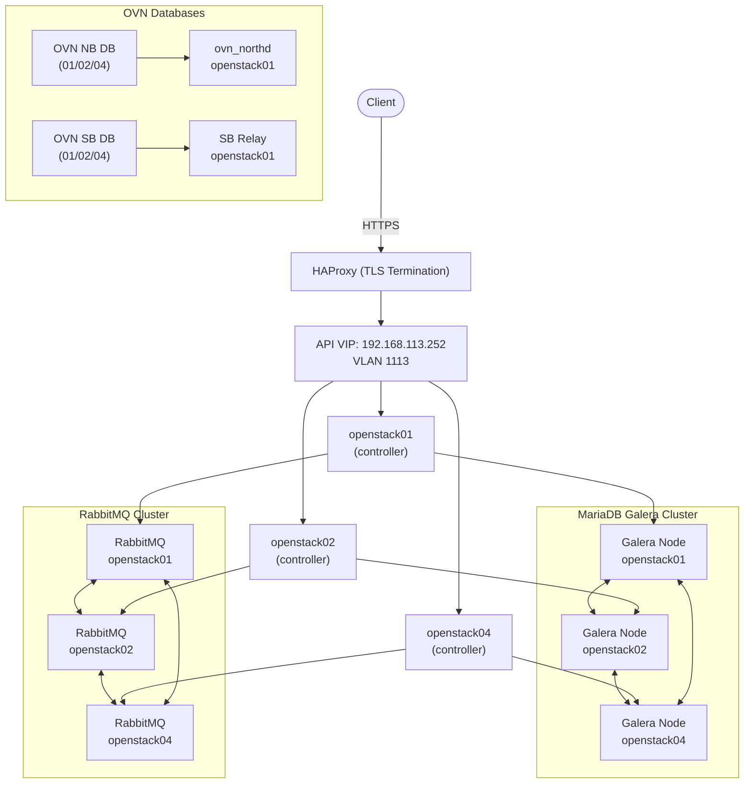

# 控制平面與高可用性

OpenStack 控制平面運行於三個控制節點 -- `openstack01`、`openstack02` 和 `openstack04` -- 為所有 API 服務和叢集後端提供 active-active 高可用性。

## HA 概覽

## 虛擬 IP 與負載平衡

| 元件 | 詳細資訊 |
|------|----------|
| **Keepalived VIP** | 192.168.113.252，位於 VLAN 1113（API 網路） |
| **公開端點** | openstack.cloudnative.tw（透過 HAProxy 進行 TLS） |
| **協定** | VRRP，用於控制節點之間的 VIP 故障轉移 |

- **HAProxy** 將所有 API 請求負載平衡至三個控制節點。每個控制節點皆運行一個 HAProxy 實例；僅持有 VIP 的節點會實際接收流量。
- **Keepalived** 管理 192.168.113.252 的 VRRP VIP。若主控制節點故障，另一個控制節點會在數秒內接管 VIP。

## 叢集服務

### MariaDB Galera

- **節點**：openstack01、openstack02、openstack04
- **複寫方式**：同步多主（Galera wsrep）
- **連線路由**：ProxySQL 在 Galera 叢集前方提供連線池與查詢路由
- **Quorum**：需要 3 個節點中的 2 個才能維持寫入可用性

### RabbitMQ

- **節點**：openstack01、openstack02、openstack04
- **用途**：所有 OpenStack 服務通訊的 AMQP 訊息代理（Nova、Neutron、Cinder 等）
- **Quorum**：需要 3 個節點中的 2 個才能維持佇列可用性

### OVN 資料庫

- **OVN Northbound DB**：分散於三個控制節點
- **OVN Southbound DB**：分散於三個控制節點
- **ovn_northd**：運行於 openstack01（將 NB 資料庫條目轉換為 SB 資料庫條目）
- **SB Relay**（`ovn_sb_db_relay_1`）：運行於 openstack01，減少運算節點對 SB 資料庫的直接連線，提升擴展性

### Memcached

- 運行於所有三個控制節點
- 為 Keystone token 驗證及其他服務提供 session 快取

### Valkey + Sentinel

- **Valkey**：Redis 相容的分支，作為快取層使用
- **Sentinel**：為 Valkey 實例提供自動故障轉移
- 運行於控制節點，處理 session 與快取資料

## Quorum 需求

所有叢集服務（MariaDB Galera、RabbitMQ、OVN NB/SB 資料庫）皆使用 quorum 模型，要求多數節點可用：

| 叢集 | 節點數 | Quorum | 可容忍故障數 |
|------|--------|--------|-------------|
| MariaDB Galera | 3 | 2 | 1 |
| RabbitMQ | 3 | 2 | 1 |
| OVN NB/SB DB | 3 | 2 | 1 |

**若失去 2 個控制節點，將導致整個控制平面中斷。** 運算節點上既有的 VM 工作負載會繼續運行，但在 quorum 恢復之前，將無法執行任何 API 操作（建立、刪除、遷移）。
