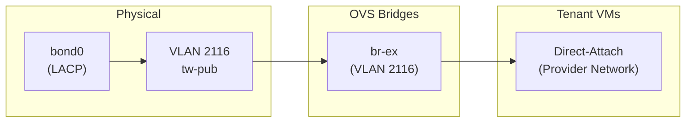
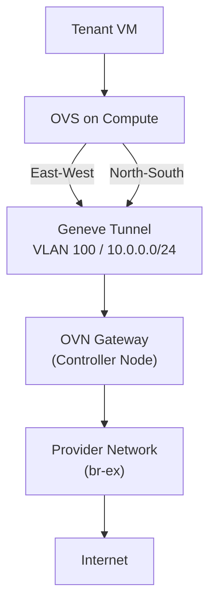

# Neutron 網路（OVN）

Neutron 使用 **OVN**（Open Virtual Network）作為其 ML2 mechanism driver，提供分散式虛擬路由、安全群組、DHCP 及 metadata 服務，無需傳統的 Neutron agent。

## OVN 架構

- **ML2 mechanism driver**：OVN
- **隧道類型**：Geneve（UDP port 6081）
- **OVN Northbound DB**：分散於 openstack01、openstack02、openstack04
- **OVN Southbound DB**：分散於 openstack01、openstack02、openstack04
- **ovn_northd**：運行於 openstack01（將邏輯流從 NB DB 轉換至 SB DB）
- **SB Relay**（`ovn_sb_db_relay_1`）：運行於 openstack01，分擔運算節點對 SB 的直接連線

## 網路代理

| Agent | 主機 | 類型 | 狀態 |
|-------|------|------|------|
| OVN Controller Gateway | openstack01 | Gateway | Active |
| OVN Controller Gateway | openstack02 | Gateway | Active |
| OVN Controller Gateway | openstack04 | Gateway | Active |
| OVN Controller | openstack05 | Compute | Active |
| OVN Metadata | openstack01 | Metadata | Active |
| OVN Metadata | openstack02 | Metadata | Active |
| OVN Metadata | openstack04 | Metadata | Active |
| OVN Metadata | openstack05 | Metadata | Active |
| OVN Neutron | openstack01 | Neutron | Active |
| OVN Neutron | openstack05 | Neutron | Active |

- **Gateway agent** 運行於控制節點，處理南北向流量（外部連線、SNAT）。
- **Compute agent** 運行於運算節點，處理東西向流量（VM 之間的通訊）。
- **Metadata agent** 運行於所有主機，提供實例 metadata（cloud-init）。

## Provider 網路

### VLAN 2116 -- tw-pub

- **子網路**：103.122.116.0/23
- **類型**：flat/VLAN provider network
- **用途**：需要公開位址的實例直接連接（使用者直接連線至 provider network）
- **OVS bridge**：br-ex
- **承載於**：gateway 節點上 bond0 的子介面

## 租戶網路

- **Overlay 類型**：Geneve 隧道
- **傳輸網路**：VLAN 100（vm-int），子網路 10.0.0.0/24
- **MTU**：租戶流量為 1442（9000 實體 MTU 減去 Geneve 開銷）
- **封裝 port**：UDP 6081

Geneve 隧道建立於所有主機（控制節點與運算節點）之間，經由 vm-int 網路。每個租戶網路會獲得唯一的 VNI（Virtual Network Identifier）以實現隔離。

## OVN 資料流

- **東西向流量**（同一租戶內 VM 對 VM）：透過 Geneve 隧道在運算節點之間直接路由，使用 OVN 的分散式虛擬路由。
- **南北向流量**（VM 對外部）：經由控制節點上的 OVN gateway agent 路由，套用 SNAT 後送至 provider network。使用者直接連線至 provider network 以取得入站連線。

## Octavia（負載平衡器）

Octavia 提供 Load-Balancer-as-a-Service（LBaaS）。在服務目錄中註冊於 port 9876，可使用 amphora driver（專用 haproxy VM）或 OVN provider driver（輕量化，整合於 OVN 中）進行負載平衡。
