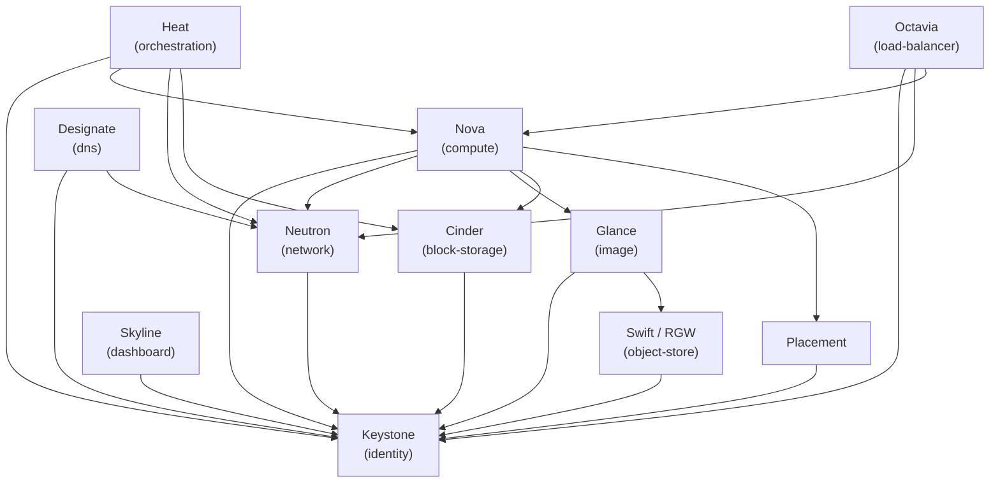

# 服務目錄與端點

所有 OpenStack 服務皆註冊於 Keystone 服務目錄中，具備公開端點和內部端點。公開端點透過 HAProxy 以 TLS 提供服務。內部端點則使用 API VIP（192.168.113.252）上的純 HTTP。

## 端點列表

| 服務 | 類型 | 公開端點 | 內部端點 |
|------|------|----------|----------|
| Keystone | identity | `https://openstack.cloudnative.tw:5000` | `http://192.168.113.252:5000` |
| Nova | compute | `https://openstack.cloudnative.tw:8774/v2.1` | `http://192.168.113.252:8774/v2.1` |
| Nova Legacy | compute_legacy | `https://openstack.cloudnative.tw:8774/v2/%(tenant_id)s` | `http://192.168.113.252:8774/v2/%(tenant_id)s` |
| Neutron | network | `https://openstack.cloudnative.tw:9696` | `http://192.168.113.252:9696` |
| Glance | image | `https://openstack.cloudnative.tw:9292` | `http://192.168.113.252:9292` |
| Cinder | block-storage | `https://openstack.cloudnative.tw:8776/v3` | `http://192.168.113.252:8776/v3` |
| Cinderv3 | volumev3 | `https://openstack.cloudnative.tw:8776/v3/%(tenant_id)s` | `http://192.168.113.252:8776/v3/%(tenant_id)s` |
| Swift (RGW) | object-store | `https://s3.cloudnative.tw:6780/swift/v1/AUTH_%(project_id)s` | `http://192.168.113.252:6780/swift/v1/AUTH_%(project_id)s` |
| Heat | orchestration | `https://openstack.cloudnative.tw:8004/v1/%(tenant_id)s` | `http://192.168.113.252:8004/v1/%(tenant_id)s` |
| Heat CFN | cloudformation | `https://openstack.cloudnative.tw:8000/v1` | `http://192.168.113.252:8000/v1` |
| Designate | dns | `https://openstack.cloudnative.tw:9001` | `http://192.168.113.252:9001` |
| Octavia | load-balancer | `https://openstack.cloudnative.tw:9876` | `http://192.168.113.252:9876` |
| Placement | placement | `https://openstack.cloudnative.tw:8780` | `http://192.168.113.252:8780` |
| Skyline | panel | `https://openstack.cloudnative.tw:9998` | `http://192.168.113.252:9998` |

## 備註

- 所有公開端點使用 HTTPS（TLS 於 HAProxy 終止）。
- 所有內部端點使用 API VIP（192.168.113.252）上的純 HTTP，經由 VLAN 1113。
- Swift 端點由 Ceph RADOS Gateway（RGW）提供，支援 S3 相容及 Swift 相容的物件儲存。
- Skyline 為儀表板 UI，取代 Horizon。
- Region：**RegionOne**（單一 region 部署）。

## 服務相依性圖

所有服務皆透過 Keystone 進行驗證。Nova 是關聯性最高的服務，依賴 Neutron 提供網路、Glance 提供映像檔、Cinder 提供磁碟區，以及 Placement 進行資源追蹤。
