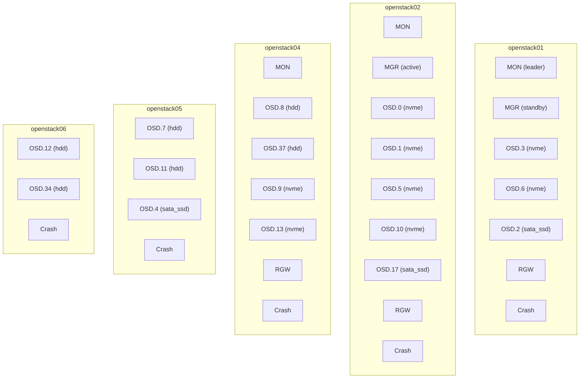

# Ceph 叢集拓撲

本頁記錄 Ceph daemon 配置、OSD 佈局、容量及 I/O 特性。所有資料來源為透過 `cephadm shell` 進行的即時叢集檢查。

---

## 叢集識別資訊

| 參數 | 數值 |
|------|------|
| 版本 | Tentacle（Ceph 20.x，Squid 的後繼版本） |
| 部署方式 | Cephadm（容器化 daemon） |

---

## Daemon 配置



### Daemon 摘要

| Daemon 類型 | 數量 | 主機 |
|-------------|------|------|
| MON | 3 | openstack01（leader）、openstack02、openstack04 |
| MGR | 2 | openstack02（active）、openstack01（standby） |
| OSD | 17 | openstack01（3）、openstack02（5）、openstack04（4）、openstack05（3）、openstack06（2） |
| RGW | 3 | openstack01、openstack02、openstack04（single zone） |
| Crash | 5 | 每台 OSD 主機各一個 |

MON daemon 在 Ceph public 網路（192.168.114.x）上監聽 port 3300（v2 協定）和 6789（v1 舊版協定）。

---

## OSD Map

| 主機 | OSD ID | 裝置類別 | 權重（TiB） | 實體磁碟 |
|------|--------|----------|------------|----------|
| openstack01 | osd.3 | nvme | 3.49 | KIOXIA CD6 3.84 TB |
| openstack01 | osd.6 | nvme | 3.49 | KIOXIA CD6 3.84 TB |
| openstack01 | osd.2 | sata_ssd | 1.46 | Intel S3500 1.6 TB |
| openstack02 | osd.0 | nvme | 1.75 | KIOXIA CD6 1.9 TB |
| openstack02 | osd.1 | nvme | 1.75 | KIOXIA CD6 1.9 TB |
| openstack02 | osd.5 | nvme | 1.75 | KIOXIA CD6 1.9 TB |
| openstack02 | osd.10 | nvme | 1.75 | KIOXIA CD6 1.9 TB |
| openstack02 | osd.17 | sata_ssd | 1.46 | Intel S3500 1.6 TB |
| openstack04 | osd.8 | hdd | 14.55 | Seagate X18 16 TB |
| openstack04 | osd.37 | hdd | 14.55 | Seagate X18 16 TB |
| openstack04 | osd.9 | nvme | 3.49 | Samsung PM983 3.84 TB |
| openstack04 | osd.13 | nvme | 3.49 | Samsung PM983 3.84 TB |
| openstack05 | osd.7 | hdd | 14.55 | Seagate X18 16 TB |
| openstack05 | osd.11 | hdd | 14.55 | Seagate X18 16 TB |
| openstack05 | osd.4 | sata_ssd | 1.46 | Intel S3500 1.6 TB |
| openstack06 | osd.12 | hdd | 14.55 | Seagate X18 16 TB |
| openstack06 | osd.34 | hdd | 14.55 | Seagate X18 16 TB |

全部 17 個 OSD 狀態均為：**up** 且 **in**。

---

## CRUSH 階層結構

所有主機位於 CRUSH tree 中的單一 rack（`ty6`）下：

```
root: default
  rack: ty6
    host: openstack01  (8.44 TiB)
    host: openstack02  (8.46 TiB)
    host: openstack04  (36.08 TiB)
    host: openstack05  (30.56 TiB)
    host: openstack06  (29.10 TiB)
```

完整的 CRUSH 規則定義及 failure domain 分析請參閱 [CRUSH Map 與規則](crush-map.md)。

---

## 網路

| 網路 | 子網路 | VLAN | 介面 | 用途 |
|------|--------|------|------|------|
| Public | 192.168.114.0/24 | 1114 | bond0（native） | MON 通訊、用戶端 I/O（RBD、RGW） |
| Cluster | 192.168.115.0/24 | 1115 | bond0.1115 | OSD 複製、復原、backfill |

兩個網路均在 Arista 資料平面 fabric 上運行，MTU 為 9000（jumbo frames），以降低大型循序 I/O 的每封包額外負擔。
