# CRUSH Map 與規則

CRUSH（Controlled Replication Under Scalable Hashing）決定 Ceph 如何將資料分佈至各 OSD。本頁記錄 Infra Labs 叢集的 CRUSH 階層結構、裝置類別、規則定義及 failure domain 特性。

---

## CRUSH 階層結構

所有伺服器位於單一 rack 中。階層結構為扁平式：root -> rack -> host -> OSD。

```mermaid
graph TD
    ROOT["root: default"]
    RACK["rack: ty6"]
    ROOT --> RACK

    HOST01["host: openstack01<br/>8.44 TiB"]
    HOST02["host: openstack02<br/>8.46 TiB"]
    HOST04["host: openstack04<br/>36.08 TiB"]
    HOST05["host: openstack05<br/>30.56 TiB"]
    HOST06["host: openstack06<br/>29.10 TiB"]

    RACK --> HOST01
    RACK --> HOST02
    RACK --> HOST04
    RACK --> HOST05
    RACK --> HOST06

    HOST01 --> OSD3["osd.3 nvme 3.49T"]
    HOST01 --> OSD6["osd.6 nvme 3.49T"]
    HOST01 --> OSD2["osd.2 sata_ssd 1.46T"]

    HOST02 --> OSD0["osd.0 nvme 1.75T"]
    HOST02 --> OSD1["osd.1 nvme 1.75T"]
    HOST02 --> OSD5["osd.5 nvme 1.75T"]
    HOST02 --> OSD10["osd.10 nvme 1.75T"]
    HOST02 --> OSD17["osd.17 sata_ssd 1.46T"]

    HOST04 --> OSD8["osd.8 hdd 14.55T"]
    HOST04 --> OSD37["osd.37 hdd 14.55T"]
    HOST04 --> OSD9["osd.9 nvme 3.49T"]
    HOST04 --> OSD13["osd.13 nvme 3.49T"]

    HOST05 --> OSD7["osd.7 hdd 14.55T"]
    HOST05 --> OSD11["osd.11 hdd 14.55T"]
    HOST05 --> OSD4["osd.4 sata_ssd 1.46T"]

    HOST06 --> OSD12["osd.12 hdd 14.55T"]
    HOST06 --> OSD34["osd.34 hdd 14.55T"]
```

---

## 裝置類別

Ceph 根據底層儲存媒體類型自動為每個 OSD 指派裝置類別。CRUSH 規則引用這些類別，將資料放置限制在所需的層級。

| 裝置類別 | OSD 數量 | 主機 | 總權重（TiB） |
|----------|----------|------|--------------|
| nvme | 8 | openstack01、openstack02、openstack04 | 20.96 |
| sata_ssd | 3 | openstack01、openstack02、openstack05 | 4.38 |
| hdd | 6 | openstack04、openstack05、openstack06 | 87.30 |

---

## CRUSH 規則

以下規則已在叢集中定義。資料來源為 `ceph osd crush rule dump`。

| 規則 ID | 規則名稱 | 類型 | 裝置類別 | Failure Domain | 步驟摘要 |
|---------|----------|------|----------|----------------|----------|
| 0 | replicated_rule | replicated | all | host | 預設規則；chooseleaf firstn，host 層級 |
| 1 | replicated_nvme | replicated | nvme | host | chooseleaf firstn，host 層級，僅 NVMe |
| 2 | default.rgw.buckets.data | replicated (indep) | hdd | host | chooseleaf indep，host 層級，僅 HDD |
| 3 | replicated_sata_ssd | replicated | sata_ssd | host | chooseleaf firstn，host 層級，僅 SATA SSD |
| 4 | testbench | replicated (indep) | hdd | host | chooseleaf indep，host 層級，僅 HDD |
| 5 | volumes-hdd | replicated (indep) | hdd | host | chooseleaf indep，host 層級，僅 HDD |
| 6 | images | replicated (indep) | hdd | host | chooseleaf indep，host 層級，僅 HDD |
| 7 | replicated_hdd | replicated | hdd | host | chooseleaf firstn，host 層級，僅 HDD |

### 規則與 Pool 對映

| 規則 | 使用該規則的 Pool |
|------|-----------------|
| replicated_rule (0) | （預設，目前未使用） |
| replicated_nvme (1) | .mgr、volumes、vms、.rgw.root、default.rgw.log、default.rgw.control、default.rgw.meta、default.rgw.buckets.index、default.rgw.buckets.non-ec、testbench |
| default.rgw.buckets.data (2) | （未使用——已由規則 7 取代） |
| replicated_sata_ssd (3) | volumes-sata-ssd |
| testbench (4) | （未使用） |
| volumes-hdd (5) | （未使用） |
| images (6) | （未使用） |
| replicated_hdd (7) | backups、images、default.rgw.buckets.data |

### 遺留規則

規則 2、4、5 和 6 使用 `chooseleaf_indep`（一種 erasure coding 風格的選擇演算法），但被套用於 replicated pool。這些似乎是早期叢集設定遺留的規則。目前未指派至任何使用中的 pool（規則 2 已被規則 7 取代用於 RGW bucket 資料）。可安全清除。

---

## Failure Domain 分析

所有 CRUSH 規則使用 `host` 作為 failure domain，意即同一物件的副本不會放置在同一台實體伺服器上。其影響因層級而異。

### NVMe 層級

- **具有 NVMe OSD 的主機**：openstack01（2 個 OSD）、openstack02（4 個 OSD）、openstack04（2 個 OSD）
- **複製設定**：size=3、min_size=2
- **分析**：恰好 3 台主機擁有 NVMe OSD。在複製 size 為 3 的設定下，每台主機必須儲存每個物件的一份副本。這意味著：
  - 遺失 1 台主機：叢集降級至 2 份副本（高於 min_size）。資料仍可存取，但在故障節點恢復或新增 NVMe OSD 之前無法重新複製至第三台主機。
  - 遺失 2 台主機：部分物件的資料將低於 min_size。I/O 可能停滯。
- **風險**：單一主機故障後 NVMe rebalancing 的餘裕為零。新增第四台具備 NVMe 的主機可改善韌性。

### SATA SSD 層級

- **具有 SATA SSD OSD 的主機**：openstack01（1 個 OSD）、openstack02（1 個 OSD）、openstack05（1 個 OSD）
- **複製設定**：size=2、min_size=1（volumes-sata-ssd pool）
- **分析**：僅維持 2 份副本。遺失 1 台主機會使資料僅剩單一副本（min_size=1 允許繼續 I/O）。若 3 台主機中遺失 2 台，則副本恰好落在該 2 台主機上的物件將會遺失。
- **風險**：這是刻意的成本/容量權衡。降低的複製份數僅適用於可容忍較高風險的工作負載。關鍵資料不應使用此層級。

### HDD 層級

- **具有 HDD OSD 的主機**：openstack04（2 個 OSD）、openstack05（2 個 OSD）、openstack06（2 個 OSD）
- **複製設定**：size=3、min_size=2
- **分析**：恰好 3 台主機，情況與 NVMe 層級相同。遺失 1 台主機會降級至 2 份副本且無 rebalancing 的餘裕。新增第四台具備 HDD 的主機可改善韌性。
- **風險**：中等。HDD pool 儲存備份、映像及 RGW bucket 資料。這些通常為一次寫入的工作負載，因此暫時性降級的影響低於服務活躍 VM I/O 的 NVMe 層級。

### 摘要

| 層級 | 主機數 | 複製設定 | 可容忍主機故障數 | Rebalance 餘裕 |
|------|--------|----------|-----------------|---------------|
| NVMe | 3 | 3/2（size/min） | 1 | 無 |
| SATA SSD | 3 | 2/1（size/min） | 1（降級至單一副本） | 無 |
| HDD | 3 | 3/2（size/min） | 1 | 無 |
