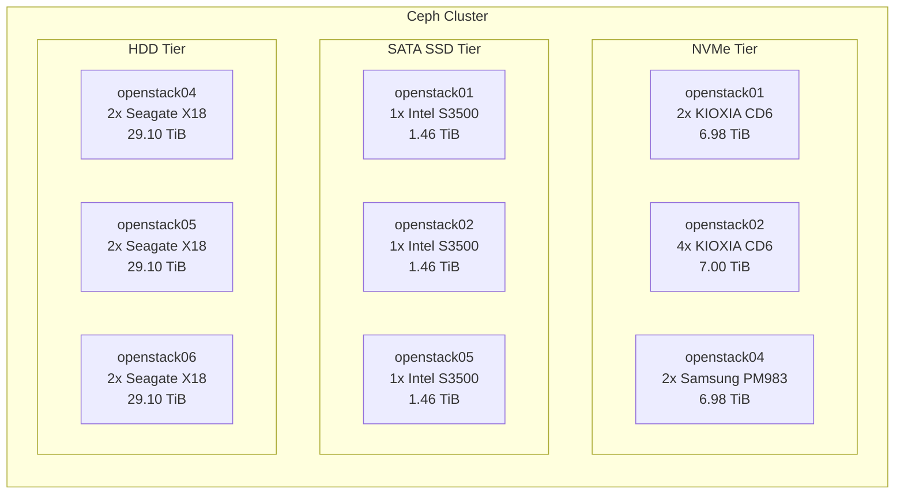

# 儲存架構

Infra Labs 使用 Ceph 作為統一儲存後端，從單一叢集提供 block（RBD）、object（RGW/S3）及 filesystem（CephFS）服務。Ceph 叢集橫跨五台 OSD 主機，共 17 個 OSD，組織為三個裝置類別層級：NVMe 用於高效能工作負載、SATA SSD 用於具成本效益的持久性儲存、HDD 用於大容量儲存及備份。

---

## 設計原則

- **單一叢集、多層級**——一個 Ceph 叢集服務所有儲存需求。CRUSH 規則根據效能需求將資料導向適當的裝置類別。
- **與 OpenStack 緊密整合**——Nova、Cinder、Glance 及 Cinder Backup 均使用原生 RBD 驅動程式。物件儲存由 Ceph RGW 提供，並整合 Keystone 認證。
- **主機層級 failure domain**——所有 CRUSH 規則以 `host` 作為 failure domain，確保副本分佈在不同的實體伺服器上。
- **Cephadm 部署**——叢集由 Cephadm 管理，透過容器化模型處理 daemon 生命週期、升級及監控。

---

## 叢集概覽

| 參數 | 數值 |
|------|------|
| 版本 | Tentacle（Ceph 20.x） |
| 部署工具 | Cephadm |
| MON daemon | 3（openstack01、openstack02、openstack04） |
| MGR daemon | 2（openstack02 active、openstack01 standby） |
| OSD daemon | 17 |
| RGW daemon | 3（每台控制主機一個，single zone） |

---

## 儲存層級

| 層級 | 裝置類別 | 主機 | OSD 數量 | 原始容量 | 主要用途 |
|------|----------|------|----------|----------|----------|
| NVMe | nvme | openstack01、02、04 | 8 | 20.96 TiB | VM volumes（`volumes`）、ephemeral disks（`vms`）、RGW metadata |
| SATA SSD | sata_ssd | openstack01、02、05 | 3 | 4.38 TiB | 具成本效益的 volumes（`volumes-sata-ssd`） |
| HDD | hdd | openstack04、05、06 | 6 | 87.30 TiB | 備份、Glance 映像、RGW bucket 資料 |

---

## OpenStack 整合摘要

| OpenStack 服務 | Ceph 介面 | Pool | 層級 |
|----------------|----------|------|------|
| Nova（ephemeral disks） | RBD | vms | NVMe |
| Cinder（高效能 volumes） | RBD | volumes | NVMe |
| Cinder（標準 volumes） | RBD | volumes-sata-ssd | SATA SSD |
| Cinder Backup | RBD | backups | HDD |
| Glance（映像） | RBD | images | HDD |
| Swift / S3（物件儲存） | RGW | default.rgw.buckets.data | HDD |

---

## 網路

Ceph 流量在 Arista 資料平面 fabric 上透過專用 VLAN 傳輸，MTU 為 9000：

| 網路 | 子網路 | VLAN | 介面 | 用途 |
|------|--------|------|------|------|
| Public | 192.168.114.0/24 | 1114 | bond0（native） | 用戶端至叢集通訊及 MON 通訊 |
| Cluster | 192.168.115.0/24 | 1115 | bond0.1115 | OSD 間複製與復原 |

---

## 子頁面

- [Ceph 叢集拓撲](ceph-topology.md)——daemon 配置、OSD map、容量、I/O 統計
- [CRUSH Map 與規則](crush-map.md)——CRUSH 階層結構、裝置類別、規則定義、failure domain 分析
- [Pool 與 OpenStack 整合](pools-and-backends.md)——pool 設定、複製配置及各服務後端對映
