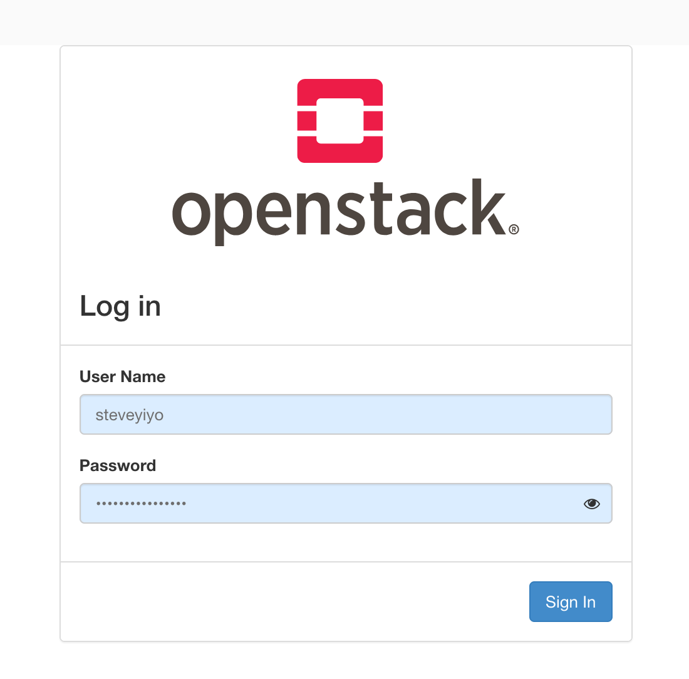
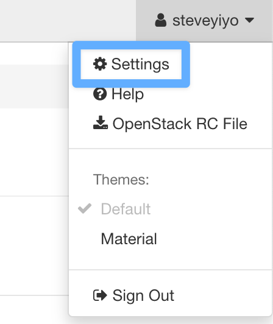
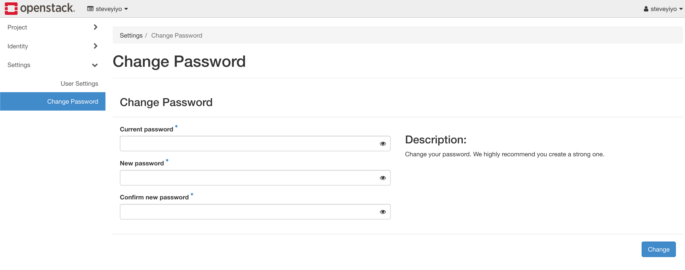

# 開始使用 Openstack

Openstack 連結：[https://openstack.cloudnative.tw](https://openstack.cloudnative.tw)

Jerry 在部落格上撰寫了一些使用的相關心得，也可以參考其撰寫的內容 [Jerry Yang's Blog](https://blog.yangjerry.tw/categories/IT-%E9%90%B5%E4%BA%BA%E8%B3%BD/2022/)

## 登入系統並更換密碼

取得帳號及密碼後，登入 OpenStack

點擊右上方的 Settings

接著選擇左邊的 Change Password，即可修改密碼。

接下來請照著教學建立 VM。
