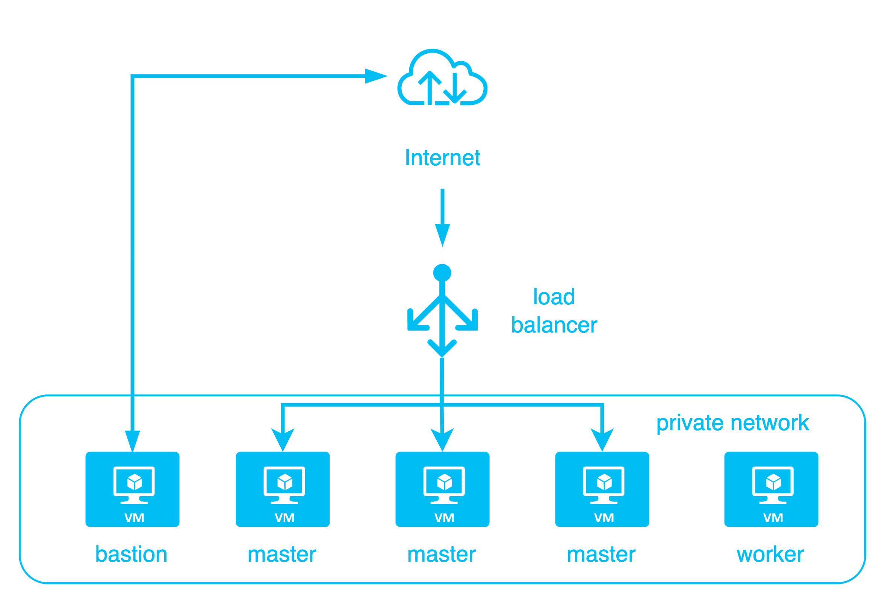

# OpenStack 上利用 kops 搭建 K8S Cluster

:::note 本篇 Lab 相關附件
本篇相關附件在[這裡](https://github.com/cloud-native-taiwan/Infra-Labs-Docs/tree/main/attachments/kops)
:::

本次 lab 將會帶領大家利用 kops 在 OpenStack 上快速搭建一個 Kubernetes cluster。

## kops 是什麼？

Kops 是 Kubernetes Operation 的縮寫，顧名思義就是一個拿來做 K8S 維運相關操作的一個工具，而 kops 目前有幾項特點

- 支援建立、維護、升級、摧毀 K8S 群集
- 支援 AWS (production)、OpenStack/DigitalOcean (Beta)、Azure/GCP (Alpha)
- 能夠透過 kops 生成群集的 Terraform template
- 管理 K8S cluster add-ons
- 自動部署 K8S 群集

## kops 名詞

### Storage

#### STATE_STORE

STATE STORE 定義了 kops 需要儲存其資料的地方，kops 會儲存的資料包含了 cluster spec、instance group 跟 ssh key 等。

### API

#### Cluster spec

Cluster spec 定義了群集本身所需的一些 specification，例如群集中的 DNS、Load Balancer、etcd cluster 等資訊。
#### Instace Group

Instance Group 定義了實際 worker node、master node、etcd node 的一些相關資料，以 OpenStack 為例就是會建立的虛擬機所使用的 flavor、image 等。
### Cloud

#### The Cloud

The Cloud 為不同雲端平台定義了統一的 golang interface，由於 kops 支援很多不同雲端環境，所以利用這個 interface 做 abstraction

#### Tasks

一個 task 就是對雲端環境操作的一個 API call

#### Model 

Model 是將之前定義的 cluster spec 裡面的內容對應到實際的 task
例如說我們在 cluster spec 上定義了一個 load balancer ，那 loadbalancer model 就會將其對應到實際上建立一個 loadbalancer 所需要的各種 API call

## 安裝 kops

### 前置準備

安裝 kops 前需要安裝 kubectl，安裝方式請見此[官方文件](https://kubernetes.io/docs/tasks/tools/)

### 透過 homebrew 安裝

```bash
brew update && brew install kops
```

### 透過官方編譯好的 release 安裝

#### Linux

```bash
curl -Lo kops https://github.com/kubernetes/kops/releases/download/$(curl -s https://api.github.com/repos/kubernetes/kops/releases/latest | grep tag_name | cut -d '"' -f 4)/kops-linux-amd64
chmod +x kops
sudo mv kops /usr/local/bin/kops
```

#### Mac

```bash
curl -Lo kops https://github.com/kubernetes/kops/releases/download/$(curl -s https://api.github.com/repos/kubernetes/kops/releases/latest | grep tag_name | cut -d '"' -f 4)/kops-darwin-amd64
chmod +x kops
sudo mv kops /usr/local/bin/kops
```

#### 自行編譯

自行編譯的話請先確認環境內有安裝 golang，並且設定好 GOPATH 與 GOBIN

```bash
git clone git@github.com:kubernetes/kops.git
cd kops
make
```

## Lab：建立 Kubernetes Cluster

### 下載 OpenStack Credential

> **Note**
>
> 請聯絡 admin 開啟 load balancer 使用權限

進入 OpenStack 面板 -> Identity / Application Credentials，在右上方選擇建立新的 Application Credential。
> 以 CNTUG Infra Lab 為例，該連結在 https://openstack.cloudnative.tw/identity/application_credentials/

建立完成後，點擊 Download openrc file，將會下載一個 Shell Script 檔案。

下載完成後，會需要將 RC file 的資訊放進 shell environment variable

```bash
source openrc.sh
export OS_DOMAIN_NAME=Default
```

### 設定 kops STATE_STORE

kops 會需要設定儲存資料的問題也就是上面提到的 STATE_STORE

由於 Infra Labs 有提供 Swift 服務，我們可以直接利用

```bash
export KOPS_STATE_STORE=swift://kops
```

### 建立 Kubernetes Cluster Template

接下來要利用 kops 建立 cluster 的資料，很簡單只需要一行指令：

>  **Note**
>
> 請替換指令中 <cluster_name> 跟 <ssh_key_path>

```bash
kops create cluster \
  --cloud openstack \
  --name <cluster_name> \
  --state ${KOPS_STATE_STORE} \
  --zones nova \
  --network-cidr 10.0.0.0/24 \
  --image Ubuntu-22.04 \
  --master-count=3 \
  --node-count=1 \
  --node-size m1.small \
  --master-size m1.small \
  --etcd-storage-type NVMe \
  --api-loadbalancer-type public\
  --topology private \
  --bastion \
  --ssh-public-key <ssh_key_path> \
  --networking calico \
  --os-ext-net public \
  --os-dns-servers=8.8.8.8,8.8.4.4 \
  --os-octavia=true \
  --os-octavia-provider=ovn
```

本次 lab 中，我們會建立一個共 4 node 的 cluster，包含 3 個 master/etcd node 跟 1 個 work node。

架構圖如下：



`kops create cluster` 會建立 cluster spec, instance group 等等資料，接下來需要用 `kops update cluster` 來實際建立 Kubernetes cluster

```bash
kops update cluster --name <cluster_name> --yes --admin
```

這時候 kops 就會開始呼叫 OpenStack API，建立 Kubernetes cluster 所需要的 VM，網路，硬碟，load balancer 等資源。結束後要等待大約 5-10 分鐘讓整個 cluster 啟動。

此時這個新建立的 Kubernetes cluster 的 config 會被寫入在 `~/.kube/config` 下

> **Note**
>
> 若是在 update 中出現 409 error，並且 OpenStack Dashboard 上 load balancer 在 PENDING_UPDATE 狀態，請聯絡管理員

### 驗證 Kubernetes Cluster

最後我們可以驗證 Kubernetes Cluster 安裝成功。

```bash
kops validate cluster --wait 5m
```

會得到以下 output

```Using cluster from kubectl context: igene.k8s.local

Validating cluster igene.k8s.local

INSTANCE GROUPS
NAME		ROLE	MACHINETYPE	MIN	MAX	SUBNETS
bastions	Bastion	m1.tiny		1	1	nova
master-nova-1	Master	m1.small	1	1	nova
master-nova-2	Master	m1.small	1	1	nova
master-nova-3	Master	m1.small	1	1	nova
nodes-nova	Node	m1.small	1	1	nova

NODE STATUS
NAME			ROLE	READY
master-nova-1-nvhtbc	master	True
master-nova-2-jgnhbo	master	True
master-nova-3-vllcwf	master	True
nodes-nova-yxorvl	node	True

Your cluster igene.k8s.local is ready
```

此時就可以利用 `kubectl` 對 cluster 進行操作了。

使用 kops 安裝的 cluster 預設已經安裝 `cloud-provider-openstack` 並且整合了 Cinder CSI 和 Octavia Load Balancer 等功能。

```bash
kubectl get csidrivers.storage.k8s.io
NAME                       ATTACHREQUIRED   PODINFOONMOUNT   STORAGECAPACITY   TOKENREQUESTS   REQUIRESREPUBLISH   MODES                  AGE
cinder.csi.openstack.org   true             true             false             <unset>         false               Persistent,Ephemeral   13h
```

### 刪除 Kubernetes Cluster

kops 紀錄了其建立在 OpenStack 上的所有資源，因此要摧毀 Kubernetes cluster 並且釋出資源非常簡單，只需一行指令：

```bash
kops delete cluster <cluster_name> --yes
```

kops 將會刪除所有在 OpenStack 上建立的資源。

## 小結

在此次 lab 中，我們教學了如何利用 kops 在 OpenStack 上建立一個完整的 Kubernetes cluster。kops 搭建的 cluster 同時也整合了 `cloud-provider-openstack` 的相關功能，讓使用者可以在 cluster 內直接使用 `persistant volume` 和 `load balancer` 等功能。

後續與 Kubernetes 相關的 lab 也會建議利用此方法架設 Kubernetes cluster。