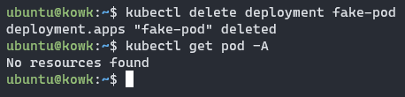

# KWOK in Docker - 體驗上千節點的 K8s 工具

:::note
本篇文章同步發佈在 [Jerry Yang's Blog: KWOK in Docker - 體驗上千節點的 K8s 工具](https://blog.yangjerry.tw/2023/03/11/kwok-in-docker/)
:::

Kubernetes SIGs（Special Interest Group 特別興趣小組）前陣子發布了很有趣的 K8s 模擬器 —— KWOK：Kubernetes WithOut Kubelet。

KWOK 的應用情境，開發者想要在幾秒鐘內建立一個由數千個節點組成的 Kubernetes，且模擬具有低資源佔用的真實節點，並且在不花費太多基礎設施的情況下大規模測試的 Kubernetes 控制器。

讓我們現在來體驗 KWOK 工具的安裝 & 模擬吧！

## Demo 環境

本次實驗使用 CNTUG Infra Labs 的主機，有興趣的朋友可以直接到 [CNTUG Infra Labs 說明文件](https://docs.cloudnative.tw/) 首頁點擊「申請 Infra Labs」。

- OS: Ubuntu 22.04
- Docker Engine: 23.0.1
- KOWK: Docker - All in one image - cluster:v1.26.0
- K8s simulate version: v1.26.0
- kubectl version: v1.26.0

## 前置作業

### 安裝 Docker

根據 Docker 官方安裝教學：

```bash
curl -fsSL https://get.docker.com -o get-docker.sh
sudo sh get-docker.sh
```

安裝完後就可以直接使用了，但如果不想前面一直打 `sudo`，就加入以下命令。

```bash
sudo usermod -aG docker $USER
```

最後再 logout 重新登入就可以了。

### 安裝 kubectl

`kubectl` 是一個命令列工具，用於操作 Kubernetes 集群，使用下列步驟安裝 `kubectl` 。

```bash
curl -LO https://dl.k8s.io/release/v1.26.0/bin/linux/amd64/kubectl
curl -LO https://dl.k8s.io/v1.26.0/bin/linux/amd64/kubectl.sha256
echo "$(cat kubectl.sha256) kubectl" | sha256sum --check
# If check success, install it. 
sudo install -o root -g root -m 0755 kubectl /usr/local/bin/kubectl
# Remove install files.
rm kubectl*
```


使用 `kubectl` 指令測試版本，確認 `kubectl` 安裝成功。

```bash
kubectl version
```

## 啟動 KWOK

```bash
docker run --rm -it -d -p 8080:8080 registry.k8s.io/kwok/cluster:v1.26.0
```


用 `docker ps -a` 確認服務是不是有啟動成功


確認沒問題後就可以依照官方教學開始實驗模擬。

## 實驗模擬

建立完成後，就可以用 `kubectl` 查看資源。

```bash
kubectl get node -o wide
kubectl get pod -A
kubectl get svc -A
```


但目前裡面是沒有任何內容，為了要模擬 K8s 狀況，要先加入新節點。

### KWOK 新增節點

輸入以下命令就可以新增節點。（**註：這裡是根據 KWOK 官網加入節點的教學，實際上 K8s 不會這樣新增節點，特此注意。**）

```bash
kubectl apply -f - <<EOF
apiVersion: v1
kind: Node
metadata:
  annotations:
    node.alpha.kubernetes.io/ttl: "0"
    kwok.x-k8s.io/node: fake
  labels:
    beta.kubernetes.io/arch: amd64
    beta.kubernetes.io/os: linux
    kubernetes.io/arch: amd64
    kubernetes.io/hostname: kwok-node-0
    kubernetes.io/os: linux
    kubernetes.io/role: agent
    node-role.kubernetes.io/agent: ""
    type: kwok
  name: kwok-node-0
spec:
  taints: # Avoid scheduling actual running pods to fake Node
    - effect: NoSchedule
      key: kwok.x-k8s.io/node
      value: fake
status:
  allocatable:
    cpu: 32
    memory: 256Gi
    pods: 110
  capacity:
    cpu: 32
    memory: 256Gi
    pods: 110
  nodeInfo:
    architecture: amd64
    bootID: ""
    containerRuntimeVersion: ""
    kernelVersion: ""
    kubeProxyVersion: fake
    kubeletVersion: fake
    machineID: ""
    operatingSystem: linux
    osImage: ""
    systemUUID: ""
  phase: Running
EOF
```

新增後會顯示 `node/kwok-node-0 created`。

確認 Node 有進入 Ready。

```bash
kubectl get node -o wide
```


### 新增 Deployment

這裡我們來嘗試加入一些 Pod 到 KWOK 裡面。

```bash
kubectl apply -f - <<EOF
apiVersion: apps/v1
kind: Deployment
metadata:
  name: fake-pod
  namespace: default
spec:
  replicas: 10
  selector:
    matchLabels:
      app: fake-pod
  template:
    metadata:
      labels:
        app: fake-pod
    spec:
      affinity:
        nodeAffinity:
          requiredDuringSchedulingIgnoredDuringExecution:
            nodeSelectorTerms:
              - matchExpressions:
                  - key: type
                    operator: In
                    values:
                      - kwok
      # A taints was added to an automatically created Node.
      # You can remove taints of Node or add this tolerations.
      tolerations:
        - key: "kwok.x-k8s.io/node"
          operator: "Exists"
          effect: "NoSchedule"
      containers:
        - name: fake-container
          image: fake-image
EOF
```

Deployment 建立成功後，會顯示下列輸出: `deployment.apps/fake-pod created`

建立完成後，列出 Deployment、ReplicaSet 和所有 Pod。

```bash
kubectl get deployment
kubectl get replicaset
kubectl get pod
```


看起來沒問題，連 ReplicaSet 都可以模擬呢！

也可以試著 describe deployment。

```bash
kubectl describe deploy fake-pod
```


describe 出來的內容很實際呢，下一段來編輯看看 Deployment。

### 編輯 Deployment

模擬工具可以模仿多個 Pod 做 scale up 情況，那我們就來嘗試看看！

```bash
kubectl edit deploy fake-pod
```


就把 `.spec.replicas` 調到 120 個看看。


編輯完成後退出，成功就會顯示 `deployment.apps/fake-pod edited`，來看看有沒有產生成功。

```bash
kubectl get deployment
kubectl get replicaset
```


這裡顯示為 110 個 READY，就代表是沒有問題的，因為單節點 Pod 數量建議上限為 110 個。

如果回去看前面建立節點的步驟，`.status.allocatable.pods` 也是寫上 110。

也可以搭配 `grep` 看一下 Pending 的 Pod。

```bash
kubectl get pod | grep Pending
```


### 刪除 Deployment

```bash
kubectl delete deployment fake-pod
kubectl get pod -A
```



## 停止 KWOK

最後就把 KOWK 的 container 停止就好。

```bash
docker ps -a
docker stop <CONTAINER ID>
```


## 總結

目前這樣初步玩下來覺得 KWOK 是還蠻不錯的模擬器，這樣測下來結果該有的都有，這工具個人覺得蠻適合剛入門 K8s 的人，或者想測試一些多節點的特殊玩法，不用怕測失敗把整個環境搞爛花時間重建，如果想要模擬上千節點情況也不需要昂貴的硬體設備。

真要說唯一缺點的話，`CrashLoopBackOff` 是不會出現的，~~沒辦法讓新手體驗地獄，真的有點可惜~~，但畢竟是 `K8s WithOut Kubelet`，背後是不會跑真正的 container，沒有辦法模擬出也是很正常的。
