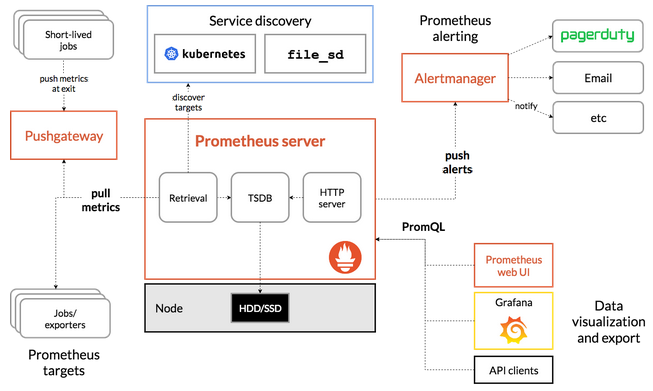
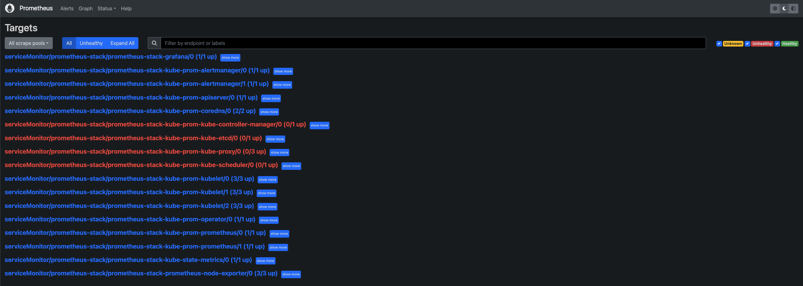
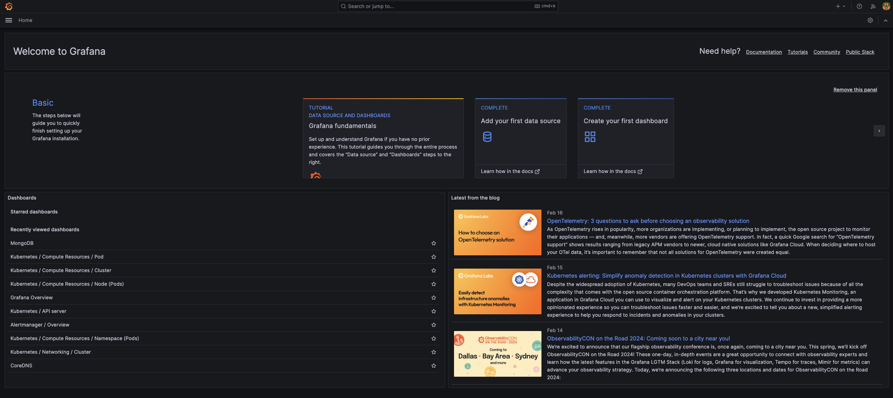
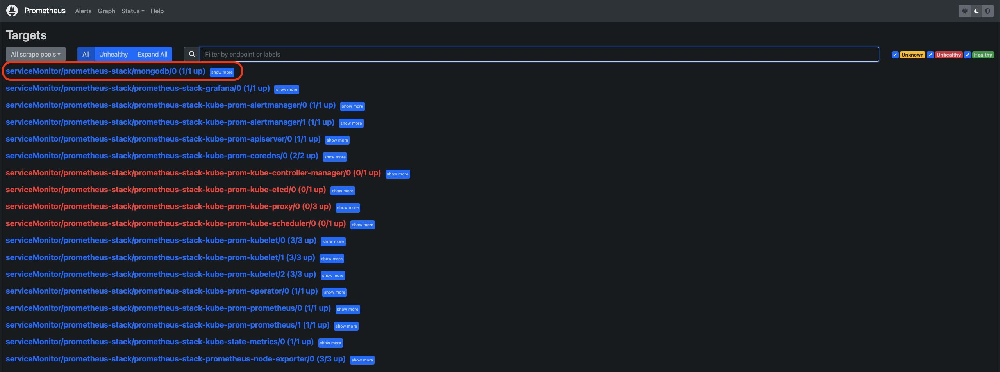
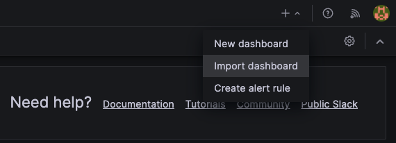
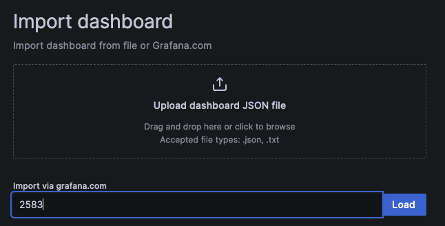
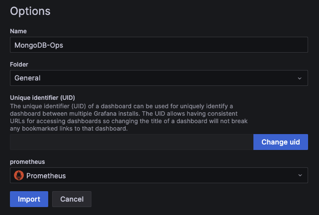
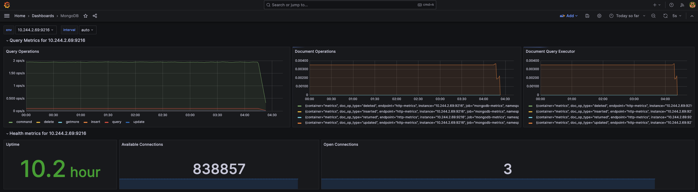

# 架設 Promethues 監控 K8s 叢集並以 exporter 蒐集應用程式 metrics

本次 Lab 將簡單介紹 Prometheus 的架構，以及如何在 OpenStack 上的 K8s 叢集中快速架設 Prometheus 作為監控工具，並且架設 MongoDB 以及對應的 Exporter，讓 Prometheus 可以抓取到應用程式的 metrics，最後在 Grafana 上面呈現資訊。

:::note
此 Lab 需要先建立一個 Kubernetes 叢集，可透過 OpenStack 上的資源或 minikube 等。本次 Lab 的操作基於 OpenStack 上的 Kubernetes 叢集，由一個 Control Plane 和兩個 Worker Node 組成。
:::

## Prometheus 介紹

### Prometheus 簡介及架構

Prometheus 在過去幾年逐漸變成監控工具的代名詞，不僅能用在雲端原生環境，也可用於傳統裸機部署環境。運用監控工具的優勢在於快速定位問題點，以往沒有監控概念的情況下，在現今漸趨複雜的微服務架構中，很難迅速找到錯誤的癥結點。而 Prometheus 正好可以解決這樣的痛點。

Prometheus 官方網站提供架構圖如下:



中間的 Prometheus server 就是其最核心的部分，負責執行實際的監控工作。核心包含三部分，依照資料傳輸流程，分別來看各個元件做了哪些事情:

1. Retrieval: 監控工具理所當然的要有負責蒐集資料的元件，而在 Prometheus 中負責這件事的元件為 Retrieval，有固定的工作週期，負責向 target 拉取 (pull) metrics data，這個 target 可以是 K8s 叢集內的資源例如各個 applications、services、客製的 Exporter。Retrieval 拉取資料後再將其儲存到 TSDB。
2. TSDB (Time Series Database): 透過 Retrieval 蒐集的資料需要有地方儲存，在 Prometheus 中是以時間序列型的資料庫來儲存 pull 得到的 metrics data，像是 CPU Usage 或 exception 數量等。
3. HTTP Server: 而監控最終的目的還是需要提供查詢、視覺化的功能，而 HTTP Server 就是負責處理來自 Prometheus 本身的 Web UI、Grafana 或其他 API Client query 請求的伺服器。
4. Pushgateway: 通常只用於不適合 pull 機制的場景，比如定期資料庫備份或 CI/CD Runner 在執行 build, test, deploy 的作業；這類型作業因屬非持續執行的 process，時間跨度過短，因此 Prometheus 也提供更適合此類型作業的 Push 機制。而由於 PushGateway 在監控多個實體時，可能成為單點故障或潛在瓶頸，且某種程度上也失去 Prometheus 自動監控各實體的設計，因此需相當注意使用時機。
5. Prometheus Web UI: 預設的 GUI，提供透過 HTTP 並下 PromQL 語法查詢 metrics data 的方法。
6. AlertManager: 顧名思義，負責在觸發告警規則時發送訊息給使用者，管道多元，包含 e-mail、Discord、Slack 等。

### Metrics 種類
在談可觀測性 (Observability) 的時候不免會提到三本柱 Metric (指標)、Log (日誌)、Trace (追蹤)，而其中 Prometheus 提供的就是 Metrics 的資訊，實際資料內容大概會像這樣:
```plain
# HELP collector_scrape_time_ms Time taken for scrape by collector
# TYPE collector_scrape_time_ms gauge
collector_scrape_time_ms{collector="diagnostic_data",exporter="mongodb"} 136
collector_scrape_time_ms{collector="general",exporter="mongodb"} 0
collector_scrape_time_ms{collector="replset_status",exporter="mongodb"} 0
# HELP go_gc_duration_seconds A summary of the pause duration of garbage collection cycles.
# TYPE go_gc_duration_seconds summary
go_gc_duration_seconds{quantile="0"} 2.2998e-05
go_gc_duration_seconds{quantile="0.25"} 6.0768e-05
go_gc_duration_seconds{quantile="0.5"} 7.5658e-05
go_gc_duration_seconds{quantile="0.75"} 9.0277e-05
go_gc_duration_seconds{quantile="1"} 0.000573308
go_gc_duration_seconds_sum 0.916284376
go_gc_duration_seconds_count 10404
```
其中 `TYPE` 與 `HELP` 欄位作為註解用，提升可讀性，`HELP` 主要是該段 metrics 的註解，而 `TYPE` 欄位會顯示該筆資料是什麼類型的 metrics。目前 Prometheus 提供 4 種類型的 metrics:
1. Counter: 累計型的數值，僅能增加或在重啟時歸零，適合用來表示收到的 request 數量、完成任務數量、發生 error 次數等需要追蹤事件發生的總次數的場景。
2. Gauge: 可任意上升或下降的數值指標，可用來表示 CPU 溫度、記憶體用量等。
3. Histogram: 直方圖類型，可表示樣本的分佈情形，像是不同 request response time 區間統計。
4. Summary: 類似直方圖，但額外提供百分位數的計算。

:::note
關於 4 種 metrics type 的詳細介紹可參考 [Metrics Type](https://prometheus.io/docs/concepts/metric_types/)。
:::

### Pull Mechanism

Prometheus 與其他監控系統不同在於獲取資料的方式。以 AWS Cloud Watch 為例，是由系統中各個 application 或 server 主動推送 metrics 到 Cloud Watch 中心化的平台，這樣的缺點是網路負載高，進一步造成監控系統反而可能會成為服務的瓶頸，另外這樣的方式也需要 application 或 server 在底層額外安裝 daemon 去 push metrics 給上述服務。

而 Prometheus 採用的是 Pull 的機制，它會主動去拉取各個服務的 metrics，對於監控來說，這樣可以更好定位問題點的發現，因為以 push 機制來說，只要被監控的服務本身出問題，就不會推送通知到監控系統中；換言之用 pull 的方式只要 Prometheus 自身正常運作，就可以正常監控到各個服務的狀態。

## 在 Kubernetes 上架設 Prometheus

簡單介紹完 Prometheus 之後，就來實際架設並瞭解 Prometheus 如何運作。操作之前，請確認你已經在 OpenStack 上有一座多節點的 Kubernetes 叢集，並可以透過 "Helm" 來操作叢集內的資源。

:::note
Helm 的安裝，請參考 [Installing Helm](https://helm.sh/docs/intro/install/)。
:::

首先先透過 Helm 將本次 lab 要使用的 `kube-prometheus-stack` 的 Helm Chart 加入:

```bash
helm repo add prometheus-community https://prometheus-community.github.io/helm-charts
helm repo update
```

因為後續會用到 exporter 來抓取資料，在實際安裝前需要先更改預設 `values.yaml` 中的一些設定:

```bash
helm show values prometheus-community/kube-prometheus-stack --version 51.6.0 > values.yaml 
```

其中需要改的有下列:
- `.prometheus.serviceMonitorSelectorNilUsesHelmValues` 改為 `false`。
- `.grafana.defaultDashboardsTimezone` 改為 `Asia/Taipei`。
- `.prometheus.prometheusSpec.retentionTime` 改為空字串 `""`。
- `.grafana.adminPassword` 可自行更改。

:::note
實務上，由於 Prometheus 本質上有儲存資料的功能 (儲存 Metrics Data 的 Time Series Database)，而在 Kubernetes 中要做到儲存資料需要用到 PV 及 PVC。在 OpenStack 的環境中，會需要用到 [Cinder CSI](https://github.com/kubernetes/cloud-provider-openstack/blob/master/docs/cinder-csi-plugin/using-cinder-csi-plugin.md) 去做到掛載雲端硬碟作為儲存空間的功能，並在 Prometheus 的 `values.yaml` 中更改 `.prometheus.prometheusSpec.storageSpec` 的設定；本次 Lab 將不額外說明這部分的設定，預設採用 Kubernetes 中 `emptyDir` 作為 volume，意即這些 metrics data 將直接儲存在 Pod 中，但 Pod 死亡後資料不會儲存，作為實驗性質的操作。詳細可參考 [Storage of Prometheus Operator](https://github.com/prometheus-operator/prometheus-operator/blob/main/Documentation/user-guides/storage.md)
:::

完成之後，就可以接著安裝 Prometheus Operator:

```bash
helm install prometheus-stack prometheus-community/kube-prometheus-stack -f values.yaml -n prometheus-stack --version 51.6.0
```

順利安裝的話會看到下列資訊:
```plain
NAME: prometheus-stack
LAST DEPLOYED: Sat Feb 17 10:00:26 2024
NAMESPACE: prometheus-stack
STATUS: deployed
REVISION: 1
NOTES:
kube-prometheus-stack has been installed. Check its status by running:
  kubectl --namespace prometheus-stack get pods -l "release=prometheus-stack"

Visit https://github.com/prometheus-operator/kube-prometheus for instructions on how to create & configure Alertmanager and Prometheus instances using the Operator.
```

確認安裝的服務皆成功啟動（然後用 `kubectl -n prometheus-stack get all -l "release=prometheus-stack"` 確認）:
```plain
NAME                                                         READY   STATUS    RESTARTS   AGE
pod/alertmanager-prometheus-stack-kube-prom-alertmanager-0   2/2     Running   0          6h22m
pod/prometheus-prometheus-stack-kube-prom-prometheus-0       2/2     Running   0          6h22m
pod/prometheus-stack-grafana-66f8959fdc-qg7sh                3/3     Running   0          6h22m
pod/prometheus-stack-kube-prom-operator-59b78bf746-mlgpw     1/1     Running   0          6h22m
pod/prometheus-stack-kube-state-metrics-5fc6bbc456-wb8gr     1/1     Running   0          6h22m
pod/prometheus-stack-prometheus-node-exporter-8zxcz          1/1     Running   0          6h22m
pod/prometheus-stack-prometheus-node-exporter-dgdt5          1/1     Running   0          6h22m
pod/prometheus-stack-prometheus-node-exporter-vccmt          1/1     Running   0          6h22m

NAME                                                TYPE        CLUSTER-IP       EXTERNAL-IP   PORT(S)                      AGE
service/alertmanager-operated                       ClusterIP   None             <none>        9093/TCP,9094/TCP,9094/UDP   6h22m
service/prometheus-operated                         ClusterIP   None             <none>        9090/TCP                     6h22m
service/prometheus-stack-grafana                    ClusterIP   10.97.26.58      <none>        80/TCP                       6h22m
service/prometheus-stack-kube-prom-alertmanager     ClusterIP   10.98.7.168      <none>        9093/TCP,8080/TCP            6h22m
service/prometheus-stack-kube-prom-operator         ClusterIP   10.96.160.59     <none>        443/TCP                      6h22m
service/prometheus-stack-kube-prom-prometheus       ClusterIP   10.108.206.139   <none>        9090/TCP,8080/TCP            6h22m
service/prometheus-stack-kube-state-metrics         ClusterIP   10.109.99.167    <none>        8080/TCP                     6h22m
service/prometheus-stack-prometheus-node-exporter   ClusterIP   10.102.147.213   <none>        9100/TCP                     6h22m

NAME                                                       DESIRED   CURRENT   READY   UP-TO-DATE   AVAILABLE   NODE SELECTOR            AGE
daemonset.apps/prometheus-stack-prometheus-node-exporter   3         3         3       3            3           kubernetes.io/os=linux   6h22m

NAME                                                  READY   UP-TO-DATE   AVAILABLE   AGE
deployment.apps/prometheus-stack-grafana              1/1     1            1           6h22m
deployment.apps/prometheus-stack-kube-prom-operator   1/1     1            1           6h22m
deployment.apps/prometheus-stack-kube-state-metrics   1/1     1            1           6h22m

NAME                                                             DESIRED   CURRENT   READY   AGE
replicaset.apps/prometheus-stack-grafana-66f8959fdc              1         1         1       6h22m
replicaset.apps/prometheus-stack-kube-prom-operator-59b78bf746   1         1         1       6h22m
replicaset.apps/prometheus-stack-kube-state-metrics-5fc6bbc456   1         1         1       6h22m

NAME                                                                    READY   AGE
statefulset.apps/alertmanager-prometheus-stack-kube-prom-alertmanager   1/1     6h22m
statefulset.apps/prometheus-prometheus-stack-kube-prom-prometheus       1/1     6h22m
```

確認所有資源都正常顯示 `Running` 後，可以進一步來看 Grafana 以及 Prometheus 的介面:

```bash
kubectl port-forward service/prometheus-stack-kube-prom-prometheus 9090 -n prometheus-stack
kubectl port-forward service/prometheus-stack-grafana 8080:80 -n prometheus-stack
```

在本地端瀏覽器打開 `localhost:9090` 就可以看到 Prometheus 的介面:



而 `localhost:8080` 則可以看到 Grafana 的介面:



### Service Discovery

安裝了上述資源，透過 UI 也觀察到目前 Prometheus 可以監控我們的 K8s 叢集，那有沒有想過 Prometheus 到底是怎麼做到這件事的呢？又為什麼前面的設定中，`.prometheus.prometheusSpec.serviceMonitorSelectorNilUsesHelmValues` 要改為 `false` 呢？接下來就淺談 Prometheus 服務發現 (Service Discovery) 的機制。

由於本次 Lab 使用 Prometheus Operator 來安裝 Prometheus，所以其實除了上述資源，Operator 實際上在背後安裝許多 Custom Resource Definition (CRD)，而其中用來作為 Prometheus 發現並抓取服務 metrics data 的關鍵 resource 就是 **ServiceMonitor**。

我們可以透過 `kubectl get crd` 來看目前叢集中有哪些 CRD:

```bash
NAME                                        CREATED AT
alertmanagerconfigs.monitoring.coreos.com   2024-02-01T20:10:53Z
alertmanagers.monitoring.coreos.com         2024-02-01T20:10:53Z
podmonitors.monitoring.coreos.com           2024-02-01T20:10:53Z
probes.monitoring.coreos.com                2024-02-01T20:10:53Z
prometheusagents.monitoring.coreos.com      2024-02-01T20:10:54Z
prometheuses.monitoring.coreos.com          2024-02-01T20:10:54Z
prometheusrules.monitoring.coreos.com       2024-02-01T20:10:54Z
scrapeconfigs.monitoring.coreos.com         2024-02-01T20:10:54Z
servicemonitors.monitoring.coreos.com       2024-02-01T20:10:54Z
thanosrulers.monitoring.coreos.com          2024-02-01T20:10:54Z
```

可以看到 `servicemonitors.monitoring.coreos.com` 確實存在於叢集中。但要看 Prometheus 是以什麼規則來選擇 ServiceMonitor，則要看 `prometheuses.monitoring.coreos.com` 這個 CRD。

用 `kubectl get prometheuses.monitoring.coreos.com -oyaml -n prometheus-stack` 看裡面的設定:

```yaml {71} showLineNumbers
apiVersion: v1
items:
- apiVersion: monitoring.coreos.com/v1
  kind: Prometheus
  metadata:
    annotations:
      meta.helm.sh/release-name: prometheus-stack
      meta.helm.sh/release-namespace: prometheus-stack
    creationTimestamp: "2024-02-17T10:00:38Z"
    generation: 1
    labels:
      app: kube-prometheus-stack-prometheus
      app.kubernetes.io/instance: prometheus-stack
      app.kubernetes.io/managed-by: Helm
      app.kubernetes.io/part-of: kube-prometheus-stack
      app.kubernetes.io/version: 51.6.0
      chart: kube-prometheus-stack-51.6.0
      heritage: Helm
      release: prometheus-stack
    name: prometheus-stack-kube-prom-prometheus
    namespace: prometheus-stack
    resourceVersion: "3885062"
    uid: 6b3e20bf-43bc-4d4a-8317-05cd763d2838
  spec:
    alerting:
      alertmanagers:
      - apiVersion: v2
        name: prometheus-stack-kube-prom-alertmanager
        namespace: prometheus-stack
        pathPrefix: /
        port: http-web
    enableAdminAPI: false
    evaluationInterval: 30s
    externalUrl: http://prometheus-stack-kube-prom-prometheus.prometheus-stack:9090
    hostNetwork: false
    image: quay.io/prometheus/prometheus:v2.47.1
    listenLocal: false
    logFormat: logfmt
    logLevel: info
    paused: false
    podMonitorNamespaceSelector: {}
    podMonitorSelector:
      matchLabels:
        release: prometheus-stack
    portName: http-web
    probeNamespaceSelector: {}
    probeSelector:
      matchLabels:
        release: prometheus-stack
    replicas: 1
    retention: ""
    routePrefix: /
    ruleNamespaceSelector: {}
    ruleSelector:
      matchLabels:
        release: prometheus-stack
    scrapeConfigNamespaceSelector: {}
    scrapeConfigSelector:
      matchLabels:
        release: prometheus-stack
    scrapeInterval: 30s
    securityContext:
      fsGroup: 2000
      runAsGroup: 2000
      runAsNonRoot: true
      runAsUser: 1000
      seccompProfile:
        type: RuntimeDefault
    serviceAccountName: prometheus-stack-kube-prom-prometheus
    serviceMonitorNamespaceSelector: {}
    serviceMonitorSelector: {}
    shards: 1
    tsdb:
      outOfOrderTimeWindow: 0s
    version: v2.47.1
    walCompression: true
  status:
    availableReplicas: 1
    conditions:
    - lastTransitionTime: "2024-02-17T10:02:30Z"
      observedGeneration: 1
      status: "True"
      type: Available
    - lastTransitionTime: "2024-02-17T10:02:30Z"
      observedGeneration: 1
      status: "True"
      type: Reconciled
    paused: false
    replicas: 1
    shardStatuses:
    - availableReplicas: 1
      replicas: 1
      shardID: "0"
      unavailableReplicas: 0
      updatedReplicas: 1
    unavailableReplicas: 0
    updatedReplicas: 1
kind: List
metadata:
  resourceVersion: ""
```

其中第 71 行的 `.spec.serviceMonitorSelector` 就是 Prometheus 選擇要註冊哪些 ServiceMonitor 的規則，目前的規則為空 ( `{}` )，代表任何 ServiceMonitor 都會被 Prometheus 給註冊用來抓取服務的 metrics data。

而為什麼這裡的設定會是 `{}` 呢？回到前述提到在更改 Prometheus 的 `values.yaml` 時，`.prometheus.prometheusSpec.serviceMonitorSelectorNilUsesHelmValues` 改為 `false` 的設定正與此相關。我們來看 `values.yaml` 該段設定的詳細內容:

```bash
prometheus:
  ...
  prometheusSpec:
    ...
    ## If true, a nil or {} value for prometheus.prometheusSpec.serviceMonitorSelector will cause the
    ## prometheus resource to be created with selectors based on values in the helm deployment,
    ## which will also match the servicemonitors created
    ##
    serviceMonitorSelectorNilUsesHelmValues: false

    ## ServiceMonitors to be selected for target discovery.
    ## If {}, select all ServiceMonitors
    ##
    serviceMonitorSelector: {}
    ## Example which selects ServiceMonitors with label "prometheus" set to "somelabel"
    # serviceMonitorSelector:
    #   matchLabels:
    #     prometheus: somelabel
```

可以發現註解有提到若 `.prometheus.prometheusSpec.serviceMonitorSelectorNilUsesHelmValues` 值為 `true`，而且 `.prometheus.prometheusSpec.serviceMonitorSelector` 值如果為 `nil` 或 `{}`，則後續透過 Helm 安裝的應用程式就會基於其預設的 serviceMonitorSelector 的值去建立該應用程式以及對應的 ServiceMonitor。

而如果要忽略限制，讓 `serviceMonitorSelector` 值為 `{}` 以選擇註冊所有的 ServiceMonitor，則必須讓前面的 `serviceMonitorSelectorNilUsesHelmValues` 值改為 `false` 才能使 `If {}, select all ServiceMonitors` 的條件成立 (參考原 [Chart template 的條件判斷](https://github.com/prometheus-community/helm-charts/blob/main/charts/kube-prometheus-stack/templates/prometheus/prometheus.yaml#L159))。

:::note
實務上也可以維持 `serviceMonitorSelectorNilUsesHelmValues` 為 `true`，然後去設定 `serviceMonitorSelector` 的 `matchLabels` 的值，並在之後安裝的應用程式也撰寫相同的 `matchLabels`。此 Lab 為快速 Demo，採取直接選取所有 ServiceMonitor 的做法。
:::


## 安裝 MongoDB 與其 Exporter

### 什麼是 Exporter?

在安裝之前，先淺談在 Prometheus 的監控系統中為何需要 Exporter 以及什麼是 Exporter。

前面有提到 Metrics Data 有特定的格式，Exporter 所做的事就是去抓取應用程式的資料，轉譯成符合 Prometheus 要求的格式，並且 expose `/metrics` 的端點讓 Prometheus 的 Retrieval 可以抓到 exporter 所轉譯的 metrics data。而 Exporter 本身通常也會是一個 Pod 或 Container，跟它負責抓取的應用程式本身是解耦的。

以預設的 `node-exporter` 來說，它所做的事就是去抓取各個 Node (以 OpenStack 來說就是各台虛擬主機)的 CPU Usage、Disk Utilization、Memory Usage 等數值，並轉譯成前面提過的 Prometheus 專屬的格式，並 expose `/metrics` 端點讓 Prometheus Retrieval 可以去抓到對應的 metrics data。


### 實際部署

了解 Prometheus 服務發現的機制以及 Exporter 後，接下來將以 MongoDB 為例，實際部署 MongoDB 以及其 Exporter 到叢集中，並驗證 Prometheus 能否順利自動抓取到 MongoDB Exporter 所提供的 metrics data。

首先將 MongoDB 的 Repo 加入:

```bash
helm repo add bitnami https://charts.bitnami.com/bitnami
helm repo update
```

接下來把 MongoDB 預設的 `values.yaml` 輸出成檔案來更改設定:

```bash
helm show values bitnami/mongodb > mongodb.yaml --version 14.8.0
```

要更改的地方有:
- `.persistence.enabled` 改為 `false`。
- `.metrics.enabled` 改為 `true`
- `.metrics.serviceMonitor.enabled` 改為 `true`
- `.metrics.serviceMonitor.namespace` 改為 `"prometheus-stack"`
- `.metrics.prometheusRule.enabled` 改為 `true`

安裝 MongoDB 預設是不會啟用 exporter container 的，更改 `.metrics` 底下的設定就是為了啟用 exporter。接下來就實際安裝 MongoDB 與其 Exporter:

```bash
helm install mongodb bitnami/mongodb -f mongodb.yaml --version 14.8.0
```

這樣就完成 MongoDB 與 Exporter 的實際部署。我們可以進到 Prometheus UI 確認 MongoDB Exporter 是否有自動成為 Prometheus 的 target:



## 建立 Grafana MongoDB Dashboard

Grafana 官方有提供使用者可以上傳客製化的 Dashboard，也有應用程式開發方會上傳建議使用的 Dashboard，相當方便。因為前面已經建立了 MongoDB Exporter，這邊就以官方提供的 Dashboard ID 直接建立對應的 Dashboard 來觀察 MongoDB 的情形。

1. Grafana 首頁右上角點選 **Import Dashboard**



2. 輸入 [Dashboard ID](https://grafana.com/grafana/dashboards/2583-mongodb/)



3. 選取資料來源為 Prometheus



4. 完成匯入 Dashboard



上述僅提供了最簡單建立 Dashboard 的方法，實際上可以根據應用程式的特性去撰寫 PromQL 客製化適合使用的 Dashboard。

## 總結

Prometheus 提供了最基礎的監控措施，且有相當多的第三方套件或函式庫可搭配使用，以生態系來說相當好上手，比較少有 Prometheus 做不到的監控場景，加上 Grafana 的快速發展，基於 Prometheus 的生態系與工具越來越完整；但實務上除了建立監控的 infrastructure，更重要的是如何建立所謂的可觀測性，了解在監控什麼、為何而監控應該是更需要花時間去研究的部分。
