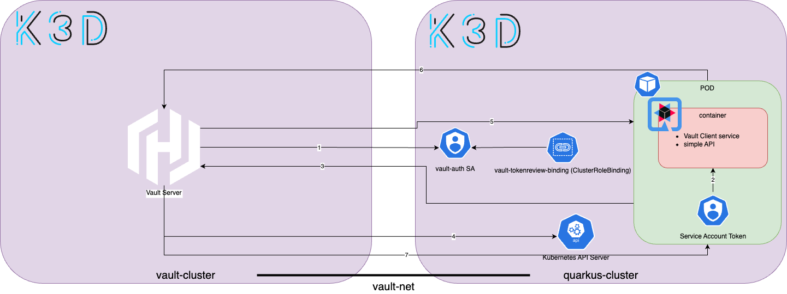

# Quarkus 整合 Vault 與 Secrets Store CSI Driver

Vault 是一個可將機密資訊集中化管理的一個平台，不論是憑證、密碼等。再者要存取這些資訊都要經過一層身份驗證才能獲取儲存在 Vault 服務上的機密資訊。專案整合 Vault 服務能夠降低敏感數據暴露風險、集中管理提高生產效率等。本文章會透過第三方工具整合 Vault 實現無入侵程式碼，其優勢可以將不熟悉的專案進行整合。

此文章會學習到

- Vault 服務整合外部 kubernetes
- Secrets Store CSI Driver 整合 Vault
- 使用 Secrets Store CSI Driver CRDs 宣告資源


本實驗環境

- OS: Windows 11 WSL
- Docker Engine: 23.0.5
- k3d version: v5.6.0
- kubectl version: v1.27.1
- Helm version: v3.11.3
- Vault chart version: 0.26.1
- Secret Store CSI chart version: 1.4.0 

本實驗環境的建置可應用於標準 Kubernetes 叢集。本實驗所使用的專案[連接](https://github.com/CCH0124/vault-with-quarkus/tree/d939a7b057bf7688b9ee6162fe2cf4fa0365db9d/secret-csi-vault)。

## 建立環境

### Vault 服務

宣告 K3d 設定

```yaml
# config.yaml
apiVersion: k3d.io/v1alpha4 
kind: Simple 
metadata:
  name: vault-cluster 
servers: 1 
agents: 2  
kubeAPI: 
  host: "vault.cch.com" 
  hostIP: "127.0.0.1" 
  hostPort: "6450"
image: rancher/k3s:v1.27.7-k3s1
network: vault-net
ports:
  - port: 8050:80
    nodeFilters:
      - loadbalancer
  - port: 8453:443
    nodeFilters:
      - loadbalancer
options:
  k3s:
    extraArgs:
      - arg: --disable=traefik
        nodeFilters:
          - server:*
```

使用上述設定檔建立模擬 kubernetes 環境

```bash
k3d cluster create --servers-memory 3G  --agents-memory 3G -c config.yaml
```

安裝 Nginx Ingress 服務

```bash
$ helm repo add ingress-nginx  https://kubernetes.github.io/ingress-nginx
$ helm search repo ingress-nginx
$ helm install ingress-nginx ingress-nginx/ingress-nginx --version 4.8.3 --namespace ingress-nginx --create-namespace
```

安裝 Vault 服務

```bash
$ helm repo add hashicorp https://helm.releases.hashicorp.com
$ helm search repo hashicorp/vault
$ helm install vault hashicorp/vault --version 0.26.1 --namespace vault --create-namespace -f values.yaml
NAME: vault
LAST DEPLOYED: Thu Nov 30 20:51:14 2023
NAMESPACE: vault
STATUS: deployed
REVISION: 1
NOTES:
Thank you for installing HashiCorp Vault!

Now that you have deployed Vault, you should look over the docs on using
Vault with Kubernetes available here:

https://developer.hashicorp.com/vault/docs


Your release is named vault. To learn more about the release, try:

  $ helm status vault
  $ helm get manifest vault
```

安裝完之後需要解封，才能存取 Vault 中的資源，這是一個 Vault 加密機制。

```bash
$ kubectl --namespace vault exec -it vault-0 -- vault operator init
Unseal Key 1: SOb6GoV2ScLTwDNzSy4igMSLjlMsW3DnpXc47/bm4Yxx
Unseal Key 2: TuI2LjfKBxPgrmMWOvTYmjFcfgjFKrbnmloWWMPXYnov
Unseal Key 3: JMY26yi9G1h14s7vvHB4aryF16Di3SnPj/W6kdseis6d
Unseal Key 4: QKQdXjp2sqPOqluU/DFn3ogvOUD2MwtH4+NwTlL5ufRh
Unseal Key 5: JBfWTtw/JSw+3iHbgNP1SXVQN94YztbXARZL682KCQMp

Initial Root Token: hvs.QyjNEBlD8y5BH4KsYycz5k5K

Vault initialized with 5 key shares and a key threshold of 3. Please securely
distribute the key shares printed above. When the Vault is re-sealed,
restarted, or stopped, you must supply at least 3 of these keys to unseal it
before it can start servicing requests.

Vault does not store the generated root key. Without at least 3 keys to
reconstruct the root key, Vault will remain permanently sealed!

It is possible to generate new unseal keys, provided you have a quorum of
existing unseal keys shares. See "vault operator rekey" for more information.
```

## 建置 Quarkus Kubernetes 叢集

設定 Quarkus Kubernetes 叢集，對應本實驗[專案](https://raw.githubusercontent.com/CCH0124/vault-with-quarkus/main/secret-csi-vault/k3d/config.yaml)。

```yaml
apiVersion: k3d.io/v1alpha4
kind: Simple
metadata:
  name: quarkus-cluster
servers: 1
agents: 1
kubeAPI: 
  host: "app.cch.com" 
  hostIP: "127.0.0.1"
  hostPort: "6451"
image: rancher/k3s:v1.27.7-k3s1
network: vault-net
ports:
  - port: 8051:80
    nodeFilters:
      - loadbalancer
  - port: 8451:443
    nodeFilters:
      - loadbalancer
options:
  k3s:
    extraArgs:
      - arg: --disable=traefik
        nodeFilters:
          - server:*
```

```bash
$ k3d cluster create -c config.yaml --servers-memory 2GB --agents-memory 2GB
```

本實驗專案是透過 Quarkus 框架來整合 Vault。

## Kubernetes 叢集整合 Vault 服務

Quarkus 專案會部署至 Quarkus Kubernetes 叢集，但 Vault 服務為另一個叫 vault-cluster 的環境。下面將會示範如何從 Vault 設定基於 Kubernetes 的認證，以讓 quarkus-cluster 中 quarkus 應用程式存取。

在 quarkus-cluster 叢集中手動建置一個給 `ServiceAccount` 的長期 API 令牌，並透過 `kubernetes.io/service-account.name` 建立一個新 `Secret` 物件，內容包含 `ca.crt`、`token` 等欄位。有關手動建立長期令牌可參閱[官方](https://kubernetes.io/docs/tasks/configure-pod-container/configure-service-account/#manually-create-a-long-lived-api-token-for-a-serviceaccount)。

```yaml
apiVersion: v1
kind: ServiceAccount
metadata:
  name: vault-auth
  labels:
    app.kubernetes.io/managed-by: vault
---
apiVersion: v1
kind: Secret
metadata:
  name: vault-auth
  annotations:
    kubernetes.io/service-account.name: vault-auth
type: kubernetes.io/service-account-token
---
apiVersion: rbac.authorization.k8s.io/v1
kind: ClusterRoleBinding
metadata:
   name: role-tokenreview-binding
roleRef:
   apiGroup: rbac.authorization.k8s.io
   kind: ClusterRole
   name: system:auth-delegator
subjects:
- kind: ServiceAccount
  name: vault-auth
  namespace: default
```

透過 `kubernetes.io/service-account-token` 建立的長期令牌將賦予給 Vault 服務並與 quarkus-cluster 互動。如果使用短期令牌，一旦 Pod 或 `ServiceAccount` 被刪除 Kubernetes 就會撤銷它，或者如果令牌過期後，Vault 將無法再使用該令牌與 kubernetes API。但，長期令牌沒有短期令牌的安全性，但兩方式都能整合。

設定給 Vault 驗證 quarkus-cluster 資訊。`K8S_HOST` 對於本範例來說會有環境上網路路由問題，因此會使用 k3d 建置出來的 `serverlb` 容器 IP 位置。至於能夠通訊是透過 `network: vault-net` 設定。下面為實驗步驟：

1. 登入 Vault

```bash
export VAULT_ADDR=https://vault-demo.cch.com:8453
export VAULT_SKIP_VERIFY=true
vault login -tls-skip-verify hvs.2fVKDYNbdS1kxa186pWZuDWn
```

2. 建置設定給 Vault 驗證的資訊

```bash
export SA_JWT_TOKEN=$(kubectl get secret  vault-auth -o jsonpath="{ .data.token }" | base64 --decode; echo)
kubectl -n default get secret  vault-auth -o jsonpath="{.data['ca\.crt']}" | base64 --decode | tee -a ca.crt
export K8S_HOST=$(kubectl config view --raw --minify --flatten -o jsonpath='{.clusters[].cluster.server}')
```

3. Vault 服務啟用 Kubernetes 認證

```bash
$ vault auth enable --path=quarkus-cluster kubernetes
Success! Enabled kubernetes auth method at: quarkus-clust
```

4. 設定 quarkus-cluster 認證

```bash
$ vault write auth/quarkus-cluster/config token_reviewer_jwt=$SA_JWT_TOKEN kubernetes_host=https://172.20.0.6:6443 kubernetes_ca_cert="$(cat ca.crt)"
$ vault read  auth/quarkus-cluster/config
Key                       Value
---                       -----
disable_iss_validation    true
disable_local_ca_jwt      false
issuer                    n/a
kubernetes_ca_cert        -----BEGIN CERTIFICATE-----
MIIBdzCCAR2gAwIBAgIBADAKBggqhkjOPQQDAjAjMSEwHwYDVQQDDBhrM3Mtc2Vy
dmVyLWNhQDE3MDE1OTUyNTQwHhcNMjMxMjAzMDkyMDU0WhcNMzMxMTMwMDkyMDU0
WjAjMSEwHwYDVQQDDBhrM3Mtc2VydmVyLWNhQDE3MDE1OTUyNTQwWTATBgcqhkjO
PQIBBggqhkjOPQMBBwNCAAROecAvJxanXKn5xhGgPAIr4vCSkUON/gTK804MxLAw
AaYiNJIHZcBCsF2HrLjno9Z5WXgMr4auihygOCH+duMEo0IwQDAOBgNVHQ8BAf8E
BAMCAqQwDwYDVR0TAQH/BAUwAwEB/zAdBgNVHQ4EFgQUIZoFjtr+3eM5JOD6Bj7r
CtjOPjUwCgYIKoZIzj0EAwIDSAAwRQIgPASRbtat2BdrxFfhN2vE4mJqt+G4Q3c6
WPp0RVUPPYACIQDBNsAVzwTTCBYTd49DrVd3KyA6q19nY21bxMtVMHjxtw==
-----END CERTIFICATE-----
kubernetes_host           https://172.20.0.6:6443
pem_keys                  []
```

5. 建置 quarkus-cluster 認證的角色

```bash
vault write auth/quarkus-cluster/role/quarkus-vault \
    bound_service_account_names=* \
    bound_service_account_namespaces=* \
    policies=quarkus \
    ttl=24h
```

這邊 `*` 表示所有的意思，但建議會是明確的定義。`policies` 則為存取資源像是 KV 引擎、KPI 的權限控管。


6. 驗證

本實驗的 Quarkus 專案定義了一個 `greeting.message` 環境變數，因此下面會定義 KV 引擎。

```bash
# 啟用 secrets 引擎，定義版本 2，且路徑 kv
$ vault secrets enable -version=2 kv
Success! Enabled the kv secrets engine at: kv/
```

推送 `greeting.message` 的 KV 值至 Vault。

```bash
$ vault kv put kv/quarkus/vault-demo greeting.message="vault hello!"
======= Secret Path =======
kv/data/quarkus/vault-demo

======= Metadata =======
Key                Value
---                -----
created_time       2023-12-03T04:48:18.833082542Z
custom_metadata    <nil>
deletion_time      n/a
destroyed          false
version            1
```

定義 `policy`，會對應到第 5 步驟 `policies` 的值。

```bash
# policy.hcl
path "kv/data/quarkus/vault-demo" {
    capabilities = ["read"]
}
# 定義個名稱為 quarkus 的 policy 角色
vault policy write quarkus policy.hcl
```

最後透過部署 Quarkus 資源驗證，部署檔案透過此[連結](https://github.com/CCH0124/vault-with-quarkus/blob/main/secret-csi-vault/k8s/deployment.yaml)取得。

```bash
# 在 quarkus-cluster 部署
kubectl apply -f k8s/deployment.yaml
```

成功獲取 Vault 上定義的值。
```bash
$ curl -k https://app.cch.com:8451/info
{"message":"vault hello!"}
```

到這邊可以知道如何透過一個 Vault 服務整合外部的 Kubernetes。並透過 Quarkus 框架所提供的 Vault API 進行互動，設定如下。

```bash
quarkus.tls.trust-all=true
quarkus.vault.url=https://vault-demo.cch.com:8453 # 定義連線 Vault API 位置
quarkus.vault.kv-secret-engine-mount-path=kv
quarkus.vault.secret-config-kv-path=quarkus/vault-demo
quarkus.vault.kv-secret-engine-version=2
quarkus.vault.authentication.kubernetes.auth-mount-path=auth/quarkus-cluster
quarkus.vault.authentication.kubernetes.role=quarkus-vault
```

本範例的 Quarkus 應用程式成功連線後，在 Vault 服務可以看到其日誌。Pod 中容器應用程式將透過 Vault API `/v1/auth/quarkus-cluster/login` 進行登入，並驗證來自 `serviceAccount` 令牌，成功後再透過 Vault API `/v1/kv/data/quarkus/vault-demo` 獲取 `secrets` 資源。

```bash
{"@level":"debug","@message":"completed_request","@module":"core","@timestamp":"2023-12-06T11:33:22.628656Z","client_address":"10.42.2.1","client_id":"","duration":"2ms","request_method":"POST","request_path":"/v1/auth/quarkus-cluster/login","start_time":"2023-12-06T11:33:22Z","status_code":200}
{"@level":"debug","@message":"completed_request","@module":"core","@timestamp":"2023-12-06T11:33:22.660627Z","client_address":"10.42.2.1","client_id":"faf515ee-37d8-f117-1afe-d9d4879850ed","duration":"0ms","request_method":"GET","request_path":"/v1/kv/data/quarkus/vault-demo","start_time":"2023-12-06T11:33:22Z","status_code":200}
```

## Vault 與 Secrets Store CSI Driver 整合

安裝 `Secrets Store CSI Driver` 時 K3d 版本要 v5.6.0，否則會有 [CreateContainerError](https://github.com/kubernetes-sigs/secrets-store-csi-driver/issues/1017) 錯誤訊息，運行 K3d 需多做這一步 [K3D_FIX_MOUNTS](https://github.com/k3d-io/k3d/pull/1268)。

使用 Helm 安裝。

```bash
helm repo add secrets-store-csi-driver https://kubernetes-sigs.github.io/secrets-store-csi-driver/charts
helm install csi-secrets-store secrets-store-csi-driver/secrets-store-csi-driver --version 1.4.0 --namespace kube-system --set syncSecret.enabled=true
```

安裝完後每個節點都會有一個 Pod，該 Pod 是由 `DaemonSet` 所產生。

```bash
$ kubectl get pods -A -l app.kubernetes.io/instance=csi-secrets-store -o wide
NAMESPACE     NAME                                               READY   STATUS    RESTARTS   AGE     IP          NODE                           NOMINATED NODE   READINESS GATES
kube-system   csi-secrets-store-secrets-store-csi-driver-ss22c   3/3     Running   0          3h38m   10.42.1.4   k3d-quarkus-cluster-server-0   <none>           <none>
kube-system   csi-secrets-store-secrets-store-csi-driver-vg547   3/3     Running   0          3h38m   10.42.0.4   k3d-quarkus-cluster-agent-0    <none>           <none>
```

安裝 [vault-csi-provider](https://github.com/hashicorp/vault-csi-provider)，以讓 Secrets Store CSI 取得儲存在 Vault 中的資訊，並使用 Secrets Store CSI 介面將它們掛載到 Kubernetes Pod 中。

使用 Helm 安裝 Vault 的 CSI 介面。

```bash
helm install vault hashicorp/vault --version 0.26.1 --namespace vault --create-namespace  --set "server.enabled=false" --set "injector.enabled=false" --set "csi.enabled=true"
```

如果不安裝 vault-csi-provider，則會導致 Secrets Store CSI 介面不知道如何整合 Vault，在啟動 Pod 時會出現以下訊息 `provider not found: provider "vault"`。

```bash
  Warning  FailedMount  22m (x13 over 32m)    kubelet            MountVolume.SetUp failed for volume "vault-secret-env" : rpc error: code = Unknown desc = failed to mount secrets store objects for pod default/secret-csi-vault-7b98fd57d5-5kxfw, err: error connecting to provider "vault": provider not found: provider "vault"
  Warning  FailedMount  12m (x8 over 30m)     kubelet            Unable to attach or mount volumes: unmounted volumes=[vault-secret-env vault-secret-file], unattached volumes=[], failed to process volumes=[]: timed out waiting for the condition
```

該 Secret store CSI 還能夠整合其它第三方服務可參考[官方資訊](https://secrets-store-csi-driver.sigs.k8s.io/providers)。本實驗會整合 Vault。

首先礙於 K3d 建立環境，這邊 Vault 使用 NodePort 方式將 Vault 服務給導出。讀者如有不用 NodePort 方式，在不吝嗇分享。

```bash
$ kubectl get svc -n vault
NAME                       TYPE        CLUSTER-IP      EXTERNAL-IP   PORT(S)                         AGE
...
vault                      NodePort    10.43.27.225    <none>        8200:30820/TCP,8201:31082/TCP   18h
# 找出 vault 所屬的節點
$ kubectl get pods -o wide -n vault
NAME                                  READY   STATUS    RESTARTS   AGE   IP          NODE                         NOMINATED NODE   READINESS GATES
vault-agent-injector-7fc4b89f-8hjk9   1/1     Running   0          18h   10.42.1.5   k3d-vault-cluster-agent-1    <none>           <none>
vault-0                               1/1     Running   0          18h   10.42.2.8   k3d-vault-cluster-server-0   <none>           <none>
# 獲取 Vault 所屬節點的 IP 
$ kubectl get node -o wide
NAME                         STATUS   ROLES                  AGE   VERSION        INTERNAL-IP   EXTERNAL-IP   OS-IMAGE   KERNEL-VERSION                       CONTAINER-RUNTIME
k3d-vault-cluster-server-0   Ready    control-plane,master   18h   v1.27.7+k3s1   172.20.0.5    <none>        K3s dev    5.15.133.1-microsoft-standard-WSL2   containerd://1.7.7-k3s1.27
k3d-vault-cluster-agent-1    Ready    <none>                 18h   v1.27.7+k3s1   172.20.0.7    <none>        K3s dev    5.15.133.1-microsoft-standard-WSL2   containerd://1.7.7-k3s1.27
k3d-vault-cluster-agent-0    Ready    <none>                 18h   v1.27.7+k3s1   172.20.0.6    <none>        K3s dev    5.15.133.1-microsoft-standard-WSL2   containerd://1.7.7-k3s1.27
```

整理總體的流程，其架構圖會如下。



1. 在 Vault 設置從 vault-auth 來的令牌、Kubernetes API 位置
2. 將 Pod 建立的 ServiceAccount 令牌掛載至容器中
3. Quarkus 透過 ServiceAccount 令牌呼叫 `/v1/auth/quarkus-cluster/login` 進行驗證
4. Vault 呼叫 `quarkus-cluster` 所設定的 Kubernetes API 位置呼叫 tokenReview API 驗證令牌合法性
5. Vault 回傳令牌
6. 透過第 5 步令牌獲取 `/v1/kv/data/quarkus/vault-demo` 的 KV 值
7. 回傳 KV 值

準備好上面的鍵值對後，將透過 Secret Store CSI 提供的 CRD 進行 Vault 存取宣告，這邊會分成基於 ENV 和 FILE 來做分享。

### 使用 ENV 方式宣告

建立一個可透過 Secrets Store CSI 提供的 CRD 來存取 Vault 中 KV 資源。預設上，KV 資源丟什麼值就取什麼值。

```yaml
# ENV base
apiVersion: secrets-store.csi.x-k8s.io/v1
kind: SecretProviderClass
metadata:
  name: quarkus-demo-env
  labels:
    app.kubernetes.io/managed-by: "vault"
spec:
  provider: vault
  parameters:
    roleName: 'quarkus-vault'
    vaultAddress: 'http://172.20.0.5:30820'
    vaultAuthMountPath: 'quarkus-cluster'
    objects: |
      - objectName: "greeting.message"
        secretPath: "kv/data/quarkus/vault-demo?version=1"
        secretKey: "greeting.message"
  secretObjects:
    - data:
      - key: greeting.message
        objectName: greeting.message
      secretName: quarkus
      type: Opaque
      labels:
        app.kubernetes.io/managed-by: "quarkus"
```

當部署 `kubectl apply -f k8s/deployment-secret-csi.yaml` 後可以發現，在上述使用 ENV 方式建立的 `SecretProviderClass` 物件，透過 `secretObjects` 欄位建立一個 `secret` 物件如下。

```bash
$ kubectl get secret
NAME         TYPE                                  DATA   AGE
...
quarkus      Opaque                                1      51m
```


其 `Secret` 資源可以被引用，在 `deployment` 物件中可宣告如下引用。

```yaml
...
      containers:
        - env:
            - name: KUBERNETES_NAMESPACE
              valueFrom:
                fieldRef:
                  fieldPath: metadata.namespace
            - name: GREETING_MESSAGE # 這邊喔
              valueFrom:
                secretKeyRef:
                  name: quarkus
                  key: greeting.message
...
          volumeMounts: # 這邊喔
...
          - name: vault-secret-env
            mountPath: "/mnt/secret s-store"
            readOnly: true
...
      volumes: # 這邊喔
...
      - name: vault-secret-env
        csi:
          driver: 'secrets-store.csi.k8s.io'
          readOnly: true
          volumeAttributes:
            secretProviderClass: 'quarkus-demo-env'
...
```

API 驗證

```bash
$ curl -k https://app.cch.com:8451/info
{"message":"vault hello!"}
```

這邊要注意的是如果要啟用 `secretObjects` 功能，即讓 CSI 介面幫你建立一個 `secret` 物件，要在安裝 CSI 時啟用該功能 `--set syncSecret.enabled=true`。


### 使用 FILE 方式宣告

在上面步驟建立的 quarkus/vault-demo 路徑下新增一個 `fullchain.crt` 的鍵值對，本範例需要一個憑證掛載至服務中才能執行驗證終端憑證的 API。這邊會將 pki 目錄下的檔案進行 base64 編碼在寫入 Vault 中 KV 資源。

```bash
$ secret-csi-vault/pki$ export FULL_CHAIN=$(cat ca-bundle.crt | base64 --wrap=1000)
$ vault kv put kv/quarkus/vault-demo fullchain.crt="$FULL_CHAIN"
======= Secret Path =======
kv/data/quarkus/vault-demo

======= Metadata =======
Key                Value
---                -----
created_time       2023-12-10T04:28:11.532295585Z
custom_metadata    <nil>
deletion_time      n/a
destroyed          false
version            3
```

相較於 ENV 方式，FILE 方式不必宣告 `secretObjects` 欄位。表示其用檔案方式進行掛載，這邊可以看到的是 encoding 欄位使用 base64，表示要將 KV 中 fullchain.crt 鍵對應的值進行 base64 解碼。下面是基於 FILE 方式進行宣告。

```yaml
# File based
apiVersion: secrets-store.csi.x-k8s.io/v1
kind: SecretProviderClass
metadata:
  name: quarkus-demo-file
  labels:
    app.kubernetes.io/managed-by: "vault"
spec:
  provider: vault
  parameters:
    roleName: 'quarkus-vault'
    vaultAddress: 'http://172.20.0.5:30820'
    vaultAuthMountPath: 'quarkus-cluster'
    objects: |
      - objectName: "fullchain.crt"
        secretPath: "kv/data/quarkus/vault-demo?version=3"
        secretKey: "fullchain.crt"
        encoding: "base64"
```

同樣，在 `Deployment` 資源的宣告下，要將上面的 `SecretProviderClass` 物件進行掛載，如下。這如同 ENV 方式，但因為是 FILE 形式所以不必宣告 `env` 欄位。

```bash
...
          volumeMounts:
          - name: vault-secret-file
            mountPath: "/opt/pki"
            readOnly: true
      volumes:
      - name: vault-secret-file
        csi:
          driver: 'secrets-store.csi.k8s.io'
          readOnly: true
          volumeAttributes:
            secretProviderClass: 'quarkus-demo-file'
...
```

在 `mountPath` 欄位定義了要將 Vault 取出的 `fullchain.crt` 資源放置 `/opt/pki` 路徑下。可透過下述指令驗證，但要先部署 `kubectl apply -f k8s/deployment-secret-csi.yaml` 。

```bash
$ kubectl exec secret-csi-vault-7b98fd57d5-cjddz -- ls /opt/pki
fullchain.crt
```

透過終端憑證驗證。進行 API 驗證，並回應 200。

```bash
$ curl -v -k -XPOST --form client=@end-entity.crt https://app.cch.com:8451
...
< HTTP/2 200
< date: Sun, 10 Dec 2023 07:24:50 GMT
< content-length: 0
< strict-transport-security: max-age=15724800; includeSubDomains
<
* Connection #0 to host app.cch.com left intact
```

上面 ENV 或 FILE 簡易的流程是 kubelet 在 Pod volume 掛載期間調用 CSI 驅動程式。因此，在 Pod 啟動後，後續更改不會觸發對該掛載或 Kubernetes 金鑰中內容的更新。那這可能是用第三方套件像是 [Reloader](https://github.com/stakater/Reloader) 或是應用程式自行實現。

如果上面範例設定有像是找不到 Vault 中定義的 Key 問題則 Pod 會處於 ContainerCreating 狀態，如下

```bash
$ kubectl get pods -w
secret-csi-vault-7b98fd57d5-gmvw6   0/1     ContainerCreating   0          24s
$ kubectl describe pods secret-csi-vault-7b98fd57d5-gmvw6
...
  Normal   Scheduled    116s                default-scheduler  Successfully assigned default/secret-csi-vault-7b98fd57d5-gmvw6 to k3d-quarkus-cluster-agent-0
  Warning  FailedMount  52s (x8 over 116s)  kubelet            MountVolume.SetUp failed for volume "vault-secret-file" : rpc error: code = Unknown desc = failed to mount secrets store objects for pod default/secret-csi-vault-7b98fd57d5-gmvw6, err: rpc error: code = Unknown desc = error making mount request: {kv/data/quarkus/vault-demo}: {key "fullchain.crt" does not exist at the secret path}
```

Secrets Store CSI Driver 官方提供了下圖架構圖。kubelet 會呼叫 Secrets Store CSI Driver，在透過 `SecretProviderClass` 檢索內容。不過其會隨著 Pod 的刪除而刪除，但這不見得是壞事，畢竟資源它幫你清，減少垃圾資源的存在。更多的細節可至官方進行[翻閱](https://secrets-store-csi-driver.sigs.k8s.io/concepts)。


對於 Secrets Store CSI Driver 基本上支援所有 Kubernetes Secret 類型，個人覺得將私有鏡像存取的令牌使用 base64 編碼並將其整合至 Vault，最後使用 Secrets Store CSI Driver 將其私有鏡像存取的令牌進行抓取並載入至 Pod 讓其生命週期由 Secrets Store CSI Driver 進行控管，這樣減少了不必要的資訊洩漏。

到這邊很清楚的知道 `SecretProviderClass` CRD 進行定義，其提供了介面給第三方界接。透過下面 `kubectl explain` 來看，其提供 `parameters` 給第三方進行串接，因此每個實作的第三方都會定義的不同。

```yaml
$ kubectl explain SecretProviderClass.spec
GROUP:      secrets-store.csi.x-k8s.io
KIND:       SecretProviderClass
VERSION:    v1

FIELD: spec <Object>

DESCRIPTION:
    SecretProviderClassSpec defines the desired state of SecretProviderClass

FIELDS:
  parameters    <map[string]string>
    Configuration for specific provider

  provider      <string>
    Configuration for provider name

  secretObjects <[]Object>
    <no description>
```

實際上本文章範例定義的 `parameters`，是透過 Vault 官方的規範進行設定，下面 parameters 下描述的欄位都參考至 Vault 針對於 CSI 的[設定](https://developer.hashicorp.com/vault/docs/platform/k8s/csi/configurations)。這邊下面針對上面的實驗內容進行簡易的設定描述。

```yaml
...
  parameters:
    roleName: 'quarkus-vault'
    vaultAddress: 'http://172.20.0.5:30820'
    vaultAuthMountPath: 'quarkus-cluster'
    objects: |
      - objectName: "fullchain.crt"
        secretPath: "kv/data/quarkus/vault-demo?version=3"
        secretKey: "fullchain.crt"
        encoding: "base64"
```

- roleName 登入 Vault 時要使用的角色名稱
- vaultAddress Vault 服務通訊位置
- vaultAuthMountPath Vault 中定義 auth 的路徑，用於登入時呼叫登入 API 路徑
- objects 檢索 Vault 資源

## 總結

本章透過單一 Vault 服務整合多個叢集，並整合 Kubernetes 身份驗證來讓 Vault 存取 Kubernetes 叢集，同樣的 Vault 支援多種認證，可依照場景進行整合。最後透過 Secrets Store CSI Driver 方式實現無侵入方式讓應用程式與 Vault 進行整合。雖然目前對於自動更新支援度不是很好，但該功能透過社群會逐漸穩定，但其對於不熟悉專案與 Vault 整合是一個好的方式。當然，`Secrets Store CSI Driver` 並非是一種唯一的解決方案，會選擇也許是容易理解、設定容易。

## 參考資料

- [hashicorp Vault - auth kubernetes](https://developer.hashicorp.com/vault/docs/auth/kubernetes)
- [secrets store csi driver](https://secrets-store-csi-driver.sigs.k8s.io/)
