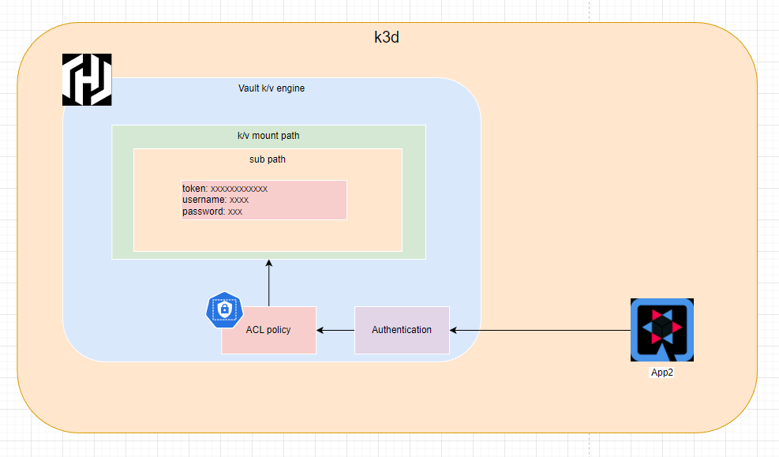

# Quarkus 整合 Vault KV 引擎
:::note
本篇文章內容與實驗會同步[CCH0124 - vault-demo](https://github.com/CCH0124/quarkus-demo/tree/main/vault-demo/example/vault)
:::

HashiCorp Vault 屬於 CNCF 的 Key Management 類別的一員。

現今服務開發對於應用程式存取機密性資料相對都是難免，無論是在原始碼、配置檔或是其它位置。如果沒有一個機制來控管授權，想必是相當的可怕隨時都有洩漏危機。透過 Vault 可以集中管理這些機密資源，應用程式或是使用者要存取機密資源都需經過身分驗證來獲取相對應訪問資源，這樣可減少不必要的洩漏。

本文章會學習到以下
- 安裝 Vault
- 使用 Vault Client 交互
- 使用 KV 引擎
- 設置 Vault Auth (Token/Kubernetes)
- 設置 Vault Policy
- Quarkus 框架整合 Vault KV 引擎


## 實驗環境

- OS: Windows 11 WSL
- Docker Engine: 23.0.5
- k3d version: v5.4.9
- kubectl version: v1.27.1
- Helm
- Vault 

## 環境安裝與配置
1. [install docker](https://docs.docker.com/engine/install/ubuntu/)
2. [install kubectl](https://kubernetes.io/docs/tasks/tools/install-kubectl-linux/#install-kubectl-on-linux)
3. [install k3d](https://k3d.io/v5.4.9/#install-script)


安裝完 k3d 後，使用下面 K3d 配置檔案建立一個 Kubernetes 環境

```yaml
## vault-conf.yaml
apiVersion: k3d.io/v1alpha4 # this will change in the future as we make everything more stable
kind: Simple # internally, we also have a Cluster config, which is not yet available externally
metadata:
  name: vault-cluster # name that you want to give to your cluster (will still be prefixed with `k3d-`)
servers: 1 # same as `--servers 1`
agents: 2 # same as `--agents 2`
kubeAPI: # same as `--api-port myhost.my.domain:6445` (where the name would resolve to 127.0.0.1)
  host: "vault.cch.com" # important for the `server` setting in the kubeconfig
  hostIP: "127.0.0.1" # where the Kubernetes API will be listening on
  hostPort: "6450"
image: rancher/k3s:v1.23.14-k3s1
network: argo-net
ports:
  - port: 8050:80
    nodeFilters:
      - loadbalancer
  - port: 8453:443
    nodeFilters:
      - loadbalancer
options:
  k3s:
    extraArgs:
      - arg: --disable=traefik
        nodeFilters:
          - server:*
```

使用 `k3d` 命令工具安裝模擬的 Kubernetes 環境，配置檔指向上述定義的檔案
```bash
$ k3d cluster create --config=vault-conf.yaml
```
當 Kubernetes 環境被建立之後，透過 `kubectl config` 指令可以看到被建立的環境如下
```bash
$ kubectl config get-contexts
CURRENT   NAME                                                                 CLUSTER                                                              AUTHINFO                                                             NAMESPACE
*         k3d-vault-cluster                                                    k3d-vault-cluster                                                    admin@k3d-vault-cluster
```


4. [Install Helm](https://helm.sh/docs/intro/install/#from-apt-debianubuntu)
5. Install Nginx ingress controller

在 `k3d` 上安裝 Kubernetes 時關閉了 `traefik` 選項，所以這邊用 `ingress-nginx` 取代，並使用 Helm chart 安裝

```bash
$ helm repo add ingress-nginx  https://kubernetes.github.io/ingress-nginx
$ helm search repo ingress-nginx
$ helm install ingress-nginx ingress-nginx/ingress-nginx --version 4.6.0 --namespace ingress-nginx --create-namespace
$ kubectl get all -n ingress-nginx
NAME                                            READY   STATUS    RESTARTS   AGE
pod/ingress-nginx-controller-7d5fb757db-gx8hp   1/1     Running   0          2m36s

NAME                                         TYPE           CLUSTER-IP      EXTERNAL-IP                        PORT(S)                      AGE
service/ingress-nginx-controller-admission   ClusterIP      10.43.138.141   <none>                             443/TCP                      2m36s
service/ingress-nginx-controller             LoadBalancer   10.43.236.109   172.19.0.2,172.19.0.3,172.19.0.4   80:32369/TCP,443:31027/TCP   2m36s

NAME                                       READY   UP-TO-DATE   AVAILABLE   AGE
deployment.apps/ingress-nginx-controller   1/1     1            1           2m36s

NAME                                                  DESIRED   CURRENT   READY   AGE
replicaset.apps/ingress-nginx-controller-7d5fb757db   1         1         1       2m36s
```

6. Install Vault

使用 Helm chart 安裝

```bash
helm repo add hashicorp https://helm.releases.hashicorp.com
helm search repo hashicorp/vault
quarkus-demo/vault-demo$ helm install vault hashicorp/vault --version 0.25.0 --namespace vault --create-namespace -f values/vault/values.yaml
```

關於 Vault 的 `values.yaml` 安裝配置可參考我的[鏈結](https://raw.githubusercontent.com/CCH0124/quarkus-demo/main/vault-demo/values/vault/values.yaml)

安裝完之後必須作初始化和解封的動作

```bash
# 初始化
$ kubectl --namespace vault exec -it vault-0 -- vault operator init
Unseal Key 1: rie1qIyzUi7hBPNkHPgI5FAni67Dwd8or8F1pK5BHGHP
Unseal Key 2: V1JTIz+PZOJRpWen8eGBu3a/f70rurWh57gF7prZTy1+
Unseal Key 3: sbYXRQ74xQJmEC8JjoL6i5W2SzydEK81sI7fyUTX1QFW
Unseal Key 4: 4cAAitfZP5wOy6Dv/9poBuPa8r6HjJ11OYNgDcVUiFMz
Unseal Key 5: kkEnDx8VPY3IzHMIY2zF+DntuH8W+ZhelDlK7Z6e7VIq

Initial Root Token: hvs.3nqeHIjaG8aIMZmmBuOPSlM4

Vault initialized with 5 key shares and a key threshold of 3. Please securely
distribute the key shares printed above. When the Vault is re-sealed,
restarted, or stopped, you must supply at least 3 of these keys to unseal it
before it can start servicing requests.

Vault does not store the generated root key. Without at least 3 keys to
reconstruct the root key, Vault will remain permanently sealed!

It is possible to generate new unseal keys, provided you have a quorum of
existing unseal keys shares. See "vault operator rekey" for more information.
```

```bash
# 解封，預設上至少選三個 Unseal Key
$ kubectl --namespace vault exec -ti vault-0 -- vault operator unseal rie1qIyzUi7hBPNkHPgI5FAni67Dwd8or8F1pK5BHGHP
$ kubectl --namespace vault exec -ti vault-0 -- vault operator unseal sbYXRQ74xQJmEC8JjoL6i5W2SzydEK81sI7fyUTX1QFW
$ kubectl --namespace vault exec -ti vault-0 -- vault operator unseal kkEnDx8VPY3IzHMIY2zF+DntuH8W+ZhelDlK7Z6e7VIq
```

7. [Install Vault client](https://developer.hashicorp.com/vault/downloads)

要安裝的原因是不想使用 `kubectl exec` 方式進行一些配置，因此交互會從 windows WSL 環境為請求端，再透過 ingress 的入口進行存取。

在 WSL 環境中，需定義兩個環境變數 `VAULT_ADDR` 和 `VAULT_SKIP_VERIFY`
```bash
export VAULT_ADDR=https://vault-demo.cch.com:8453
export VAULT_SKIP_VERIFY=true
```

- `VAULT_ADDR` 這邊指向 Ingress 入口位置
- `VAULT_SKIP_VERIFY` 因為沒有完整的 SSL，所以這邊跳過驗證，但實務上不建議

接著透過 `vault login` 登入，這邊登入的 `token` 是使用上個步驟的初始 Vault 時產生的 Root Token。
```bash
$ vault login -tls-skip-verify hvs.3nqeHIjaG8aIMZmmBuOPSlM4 
```

這邊必須要能夠登入，才能往下進行。

## KV secrets engine - version 2 

在啟用版本 2 的 `KV` 引擎時，必須透過 `secret` 引擎啟用。`secret` 引擎是一個儲存、生成或是加密數據的組件。版本 2 的 `KV` 引擎是一個可存取 key/value 對的功能，並且附帶過去每次異動版本歷程，因此舊的配置是可以被檢索的，下圖為官方提供的圖。


對於應用程式存取而言，必須要先啟用 `KV` 功能。

```bash
$ vault secrets enable -version=2 kv
Success! Enabled the kv secrets engine at: kv/
```

透過 `list` 指令可以列出我們創建的 `KV` 路徑引擎

```bash
$ vault secrets list
Path          Type         Accessor              Description
----          ----         --------              -----------
cubbyhole/    cubbyhole    cubbyhole_293822d8    per-token private secret storage
identity/     identity     identity_5bba97e7     identity store
kv/           kv           kv_cd1f8bda           n/a # 這是被啟用的 KV 引擎，路徑是 kv
sys/          system       system_6e9e02ef       system endpoints used for control, policy and debugging
```

### 建立給應用程式的 KV 對 

Quarkus 範例會定義 `mqtt.broker`、`mqtt.username` 和 `mqtt.password` 三個環境變數，最後目標是可以透過 API 介面來獲取從 Vault 儲存的值。

下面使用 `kv put` 將值定義至 Vault 中。在 Vault 的 `KV` 引擎中，它類似以資料夾結構為概念去建立路徑。在此範例中，會在 `kv` 路徑下建立一個 `quarkus/vault-demo` 路徑，並塞入我們要給應用程式的值。

```bash
$ vault kv put kv/quarkus/vault-demo mqtt.broker="tcp://localhost:8883" mqtt.username="demo" mqtt.password="demo1234"
======= Secret Path =======
kv/data/quarkus/vault-demo

======= Metadata =======
Key                Value
---                -----
created_time       2023-08-12T14:33:34.390315381Z
custom_metadata    <nil>
deletion_time      n/a
destroyed          false
version            1
```

建立後，可以透過 `kv get` 來獲取某路徑下已經定義的鍵值對。`version` 為 1，是因為我們推送了一次值。


```bash
$ vault kv get -mount=kv quarkus/vault-demo
======= Secret Path =======
kv/data/quarkus/vault-demo

======= Metadata =======
Key                Value
---                -----
created_time       2023-08-12T14:33:34.390315381Z
custom_metadata    <nil>
deletion_time      n/a
destroyed          false
version            1 # 上步驟推資料所以異動一次
# 下面為推送的鍵值對
======== Data ========
Key              Value
---              -----
mqtt.broker      tcp://localhost:8883
mqtt.password    demo1234
mqtt.username    demo
```

如果資料定義錯誤想要做修正可以使用 `kv patch` 指令，假設 `mqtt.password` 設定錯誤要換成 demo12345678。這時又對資料進行了異動因此 `version` 加了一個版號

```bash
$ vault kv patch -mount=kv quarkus/vault-demo mqtt.password=demo12345678
======= Secret Path =======
kv/data/quarkus/vault-demo

======= Metadata =======
Key                Value
---                -----
created_time       2023-08-12T14:41:39.647900006Z
custom_metadata    <nil>
deletion_time      n/a
destroyed          false
version            2 # 此時更新密碼因此版本在被遞增
```

更新後，再使用 `kv get` 時該 `mqtt.password` 應當是被置換過值。


### 檢索特定版本

如果想查看過去異動，或是更新前的查看都可以使用 `version` 來進行。在前面的過程中版本已經遞增至 2。如果想回頭看 1 的版本，可以如下

```bash
$ vault kv get -version=1 -mount=kv quarkus/vault-demo
======= Secret Path =======
kv/data/quarkus/vault-demo

======= Metadata =======
Key                Value
---                -----
created_time       2023-08-12T14:33:34.390315381Z
custom_metadata    <nil>
deletion_time      n/a
destroyed          false
version            1

======== Data ========
Key              Value
---              -----
mqtt.broker      tcp://localhost:8883
mqtt.password    demo1234
mqtt.username    demo
```

預設上版本 2 的 `KV` 引擎 `Maximum number of versions` 是未設定，如下使用 `read` 指令查詢可獲取其配置。但可以依照需求去做調整。

```bash
$ vault read kv/config
Key                     Value
---                     -----
cas_required            false
delete_version_after    0s
max_versions            0 
```

### 刪除與復原版本

對於 Vault 中 `delete` 動作是軟刪除，該版本會被標記是刪除且定義一個 `deletion_time` 時戳，這可用於 `undelete` 操作基本上可以認知成回滾。當 `KV` 版本超過 `max-versions` 設置的數量時，或者使用 `destroy` 操作時，版本的數據才會被永久刪除。

刪除版本 1

```bash
$ vault kv delete -versions=1 -mount=kv quarkus/vault-demo
Success! Data deleted (if it existed) at: kv/data/quarkus/vault-demo
```

刪除後，使用 `metadata` 操作獲取詳細版本資訊。`Version 1` 刪除後被定義了 `deletion_time`，表示不會被立即移除。此時注意 `Version 2` 因為沒做 `delete` 動作因此 `deletion_time` 沒被定義。

```bash
$ vault kv metadata get  -mount=kv quarkus/vault-demo
======== Metadata Path ========
kv/metadata/quarkus/vault-demo

========== Metadata ==========
Key                     Value
---                     -----
cas_required            false
created_time            2023-08-12T14:33:34.390315381Z
current_version         2
custom_metadata         <nil>
delete_version_after    0s
max_versions            0
oldest_version          0
updated_time            2023-08-12T14:41:39.647900006Z

====== Version 1 ======
Key              Value
---              -----
created_time     2023-08-12T14:33:34.390315381Z
deletion_time    2023-08-12T17:12:50.563260118Z # deletion_time 被定義，表示不會被立即移除
destroyed        false

====== Version 2 ======
Key              Value
---              -----
created_time     2023-08-12T14:41:39.647900006Z
deletion_time    n/a
destroyed        false
```

嘗試復原版本 1，注意到 `deletion_time` 欄位時戳被設置為 `n/a`。

```bash
$ vault kv undelete -versions=1 -mount=kv quarkus/vault-demo
Success! Data written to: kv/undelete/quarkus/vault-demo
$ vault kv metadata get  -mount=kv quarkus/vault-demo
======== Metadata Path ========
kv/metadata/quarkus/vault-demo
...
====== Version 1 ======
Key              Value
---              -----
created_time     2023-08-12T14:33:34.390315381Z
deletion_time    n/a # 要被刪除時間已經設回原始
destroyed        false

...
```

至於 `destroy` 操作，不接續展示基本上是會直接將指定版本資源刪除，不做任何標記。

## 定義訪問 quarkus/vault-demo 的角色

以此範例來說應用程式只想要讀取 `quarkus/vault-demo` 這個路徑下的資源，因此要給予適當權限，同時減少攻擊面。下面定義了一個政策的檔案，針對這 `kv/data/quarkus/vault-demo` 路徑只給予讀(read)權限。

```bash
# policy.hcl
path "kv/data/quarkus/vault-demo" {
    capabilities = ["read"]
}
```
如果將 `path` 定義 `kv/data/quarkus/+` 其實也是可以的，就看應用方面到哪裡。`+` 表示當下同層路徑都可存取 

- kv/data/quarkus/a
- kv/data/quarkus/b

但是下面是無法被存取
- kv/data/quarkus/a/a

將上述 `policy.hcl` 寫入 Vault 中，透過 `policy write` 指令。建立之後，透過 `policy list` 可以查看是否被建立。

```bash
$ vault policy write vault policy.hcl
Success! Uploaded policy: vault
$ vault policy list
default
vault # 建立的 policy 名稱是 vault
root
```

當然這樣定義了權限還不夠，因為它沒被綁定到某個主題可能是一個 `token` 服務或是 `user/pass` 服務。截至當前都是使用 `root` 的 `token` 做操作，應用程式的存取不應該使用 `root` 權限進行操作，因此需要再定義一個屬於應用程式存取的 `token`。


透過 `token create` 建立一個 `token` 如下，並賦予該有的權限，時效可用 `ttl` 設定。`token lookup` 可以查看該 `token` 內容，像是過期時間(expire_time)、可存取的政策(policies)等等。`-policy` 綁定了上步驟被定義為 `vault` 的政策，應用程式範例將使用此 `token` 進行存取。

```bash
$ vault token create -policy=vault --ttl=768h
Key                  Value
---                  -----
token                hvs.CAESIIDXLAV0-_yh1VJjVQkDxojDEP54lTfT0Y-UsVEBJKBhGh4KHGh2cy5lRFRMeFpBSmpGMGo2ZXRNR0RsTDh3UmI
token_accessor       KqbfPMrF6pmmFLb4n7E1niob
token_duration       768h
token_renewable      true
token_policies       ["default" "vault"]
identity_policies    []
policies             ["default" "vault"]

$ vault token lookup -accessor KqbfPMrF6pmmFLb4n7E1niob
Key                 Value
---                 -----
accessor            KqbfPMrF6pmmFLb4n7E1niob
creation_time       1692449442
creation_ttl        768h
display_name        token
entity_id           n/a
expire_time         2023-09-20T12:50:42.985961541Z
explicit_max_ttl    0s
id                  n/a
issue_time          2023-08-19T12:50:42.985964311Z
meta                <nil>
num_uses            0
orphan              false
path                auth/token/create
policies            [default vault]
renewable           true
ttl                 767h59m36s
type                service
```

對於 `token` 預設系統 `TTL` 值是 `768h` 如下。

```bash
$ vault read sys/auth/token/tune
Key                  Value
---                  -----
default_lease_ttl    768h
description          token based credentials
force_no_cache       false
max_lease_ttl        768h
token_type           default-service
```

要針對 `TTL` 進行調整可以使用以下方式，這邊要調整的話當下登入者必須有足夠權限。

```bash
$ vault write sys/auth/token/tune default_lease_ttl=8h max_lease_ttl=720h
```

## Quarkus 整合 Vault
上面章節透過 Vault 的 `KV` 給服務建立一個可存放機密物件的資源並將重要的資源存放至該路徑上。同時間，也建立了一個 `policy` 資源並將其和 `token` 資源綁在一起給應用程式做存取。

此章節會透過 Quarkus 框架與 Vault 進行一個整合範例。會分成兩部分來說明

1. 地端開發
2. 佈署至 Kubernetes 環境

Quarkus 使用 `io.quarkiverse.vault:quarkus-vault` 第三方套件整合 Vault，接續將會實作整合部分。範例中簡單的使用外部環境變數，如下

```java
mqtt.broker=
mqtt.username=
mqtt.password=
```

這些值在上面章節已經完成放置 Vault 服務。

### 地端開發
這邊再進行 Vault 存取的配置來讓 Vault 進行環境變數的注入。因為 SSL 非正式所以這邊使用了 `quarkus.tls.trust-all=true` 來進行信任。重點是下面配置

```bash
%dev.quarkus.vault.authentication.client-token=hvs.CAESIIDXLAV0-_yh1VJjVQkDxojDEP54lTfT0Y-UsVEBJKBhGh4KHGh2cy5lRFRMeFpBSmpGMGo2ZXRNR0RsTDh3UmI
quarkus.vault.url=https://vault-demo.cch.com:8453
quarkus.vault.kv-secret-engine-mount-path=kv
quarkus.vault.secret-config-kv-path=quarkus/vault-demo
quarkus.vault.kv-secret-engine-version=2
```

1. `quarkus.vault.authentication.client-token` 表示使用 token 方式對 Vault 進行存取
2. `quarkus.vault.url` 表示存取 Vault 的位置
3. `quarkus.vault.kv-secret-engine-mount-path` 啟用 secret 中的 kv 引擎掛載的路徑
4. `quarkus.vault.secret-config-kv-path` 掛載路徑下要存取的子路徑
5. `quarkus.vault.kv-secret-engine-version` 使用的版本，預設是 2

這邊的 `%dev` 是指在 dev 環境使用該值。

驗證方面，寫了一個 API 接口，透過該接口可以驗證是否從 Vault 的 `KV` 獲取資源

```java
    @GET
    @Path("/mqtt/config")
    @Produces(MediaType.APPLICATION_JSON)
    public Response config() {
        return Response.ok(Map.of("url", mqttConnect.broker())).build();
    } 
```

最後運行應用程式，嘗試存取 `/hello/mqtt/config` 接口如下，可以看出他確實拿到了資源。

```bash
$ curl http://localhost:8080/hello/mqtt/config
{"url":"tcp://localhost:8883"}
```

對於地端來說雖然 `quarkus.vault.authentication.client-token` 的值已經有限制權限和時效，但還是會習慣把 `quarkus.vault.authentication.client-token` 放置 .env 檔案中，這樣基本上原始碼不會出現關於存取 Vault 服務可存取 API 的 `toekn` 資源。

程式碼可參考我的[鏈結](https://github.com/CCH0124/quarkus-demo/tree/ef9e04122d4acb1ac2920d17322c23e924422c2b/vault-demo/example/vault)

### Kubernetes 環境
對於佈署至 Kubernetes 環境，Vault 提供了用 `serviceAccount` 的 `token` 存取 Vault 服務的功能。相較於使用上面 `token` 方式，會比較靈活很多，我會認為不必特別管理 `token` 是否會過期，或是管理多個 `token`。

要使用 Kubernetes 認證必須執行以下，這邊會使用 root 權限進行操作

1. 啟用該功能

```bash
$ vault auth enable kubernetes
Success! Enabled kubernetes auth method at: kubernetes/
```

2. 用 `/config` 介面配置 Vault 與 Kubernetes 的通訊，使用 Pod 的 `serviceAccount` 的 `token`。 Vault 將定期重新讀取該檔案以支援短期令牌(short-lived tokens)。這樣 Vault 將嘗試從預設掛載位置 `/var/run/secrets/kubernetes.io/serviceaccount/` 內的 `token` 和 `ca.crt` 加載它們。

```bash
$ vault write auth/kubernetes/config \
    kubernetes_host=https://$KUBERNETES_SERVICE_HOST:$KUBERNETES_SERVICE_PORT
Success! Data written to: auth/kubernetes/config
```

`$KUBERNETES_SERVICE_HOST` 與 `$KUBERNETES_SERVICE_PORT` 是環境變數，需替代真實的值，本人測試時環境變數似乎無法被系統替代。

3. 設定允許被存取的 `namespace` 與 `serviceAccount`

```bash
$ vault write auth/kubernetes/role/quarkus-vault \
> bound_service_account_names=vault \
> bound_service_account_namespaces=prod \
> policies=vault \
> ttl=1h
Success! Data written to: auth/kubernetes/role/quarkus-vault
```

- `quarkus-vault` 是角色名稱，應用程式存取用此角色
- `bound_service_account_names` 可使用該角色的 `serviceAccout`
- `bound_service_account_namespaces` 可使用該角色的 `namespace`
- `policies` 該角色綁定的政策，這邊會對應上面所設定的政策

Vault 中一個角色能被 kubernetes 中的 namespace 下的多個 serviceAccount 資源共同所使用，政策同樣也可以綁定多個。

當設定好之後，在 Quarkus 專案中的 `application.properties` 檔案定義以下，表示在 prod 環境中使用以下定義的值。

```bash
%prod.quarkus.vault.url=http://vault.vault.svc.cluster.local:8200
%prod.quarkus.vault.authentication.kubernetes.role=quarkus-vault
```

接著嘗試佈署我們的應用程式至 k3d 模擬的 Kubernetes 環境，下面是部分 deployment.yaml 檔案內容詳細可參考此[鏈結](https://raw.githubusercontent.com/CCH0124/quarkus-demo/main/vault-demo/example/vault/kubernetes/deployment.yaml)。

```yaml
# deployment.yaml
...
apiVersion: apps/v1
kind: Deployment
metadata:
  labels:
    app.kubernetes.io/managed-by: quarkus
    app.kubernetes.io/name: vault
    app.kubernetes.io/version: 1.0.0-SNAPSHOT
    app.kubernetes.io/part-of: vault
  name: vault
  namespace: prod
spec:
  replicas: 1
  selector:
    matchLabels:
      app.kubernetes.io/name: vault
      app.kubernetes.io/version: 1.0.0-SNAPSHOT
      app.kubernetes.io/part-of: vault
  template:
    metadata:
      labels:
        app.kubernetes.io/managed-by: quarkus
        app.kubernetes.io/name: vault
        app.kubernetes.io/version: 1.0.0-SNAPSHOT
        app.kubernetes.io/part-of: vault
      namespace: prod
    spec:
      containers:
        - env:
            - name: KUBERNETES_NAMESPACE
              valueFrom:
                fieldRef:
                  fieldPath: metadata.namespace
          image: registry.hub.docker.com/cch0124/vault:788ed52
          imagePullPolicy: Always
          ...
      securityContext:
        fsGroup: 185
        runAsGroup: 185
        runAsNonRoot: true
        runAsUser: 185
      serviceAccountName: vault
---
apiVersion: networking.k8s.io/v1
kind: Ingress
metadata:
  annotations:
    nginx.ingress.kubernetes.io/rewrite-target: /$2
  labels:
    app.kubernetes.io/name: vault
    app.kubernetes.io/part-of: vault
    app.kubernetes.io/version: 1.0.0-SNAPSHOT
    app.kubernetes.io/managed-by: quarkus
  name: vault
  namespace: prod
spec:
  ingressClassName: nginx
  rules:
    - host: vault-demo.cch.com
      http:
        paths:
          - backend:
              service:
                name: vault
                port:
                  name: http
            path: /api/v1(/|$)(.*)
            pathType: Prefix
```

接著透過佈署 deployment.yaml 測試，應用程式佈署資源如下

```bash
vault-demo/example/vault/kubernetes$ kubectl apply -f deployment.yaml
$ kubectl get all -n prod
NAME                         READY   STATUS    RESTARTS   AGE
pod/vault-76cfcb466f-s6z2m   1/1     Running   0          6m15s

NAME            TYPE        CLUSTER-IP      EXTERNAL-IP   PORT(S)    AGE
service/vault   ClusterIP   10.43.236.207   <none>        8080/TCP   34m

NAME                    READY   UP-TO-DATE   AVAILABLE   AGE
deployment.apps/vault   1/1     1            1           34m

NAME                               DESIRED   CURRENT   READY   AGE
replicaset.apps/vault-76cfcb466f   1         1         1       34m
$ kubectl get ingress -n prod
NAME    CLASS   HOSTS                ADDRESS                            PORTS   AGE
vault   nginx   vault-demo.cch.com   172.18.0.2,172.18.0.3,172.18.0.4   80      35m
```

測試，確實那到了 `KV` 上定義的值

```bash
$ curl http://vault-demo.cch.com:8050/api/v1/hello/mqtt/config
{"url":"tcp://localhost:8883"}
```

這邊，應用程式透過了 Vault 中 kubernete 認證方式對 Vault 進行存取，而非 `token` 認證。整體的流程會如下圖所示




## 總結

Vault 在應用上可以集中式管理機密資源，加上需要透過認證才能去存取資源基本上攻擊面或是洩漏資訊可能性少了很多。此篇文章透過了框架對 Vault 資源進行整合，其使用對開發者來說也是輕鬆。但對於應用程式存取 Vault 除了透過框架提供的方式，還可以使用 Vault 的 `sidecar` 方式或是 CSI (Container Storage Interface) 整合，如果是對於遺留較久的專案可以考慮這種方式。

但如果服務多的話，對於 Vault 上的 `path` 設計其實也是很重要的一環，不應當所有服務都對一個路徑下的 `KV` 進行存取。