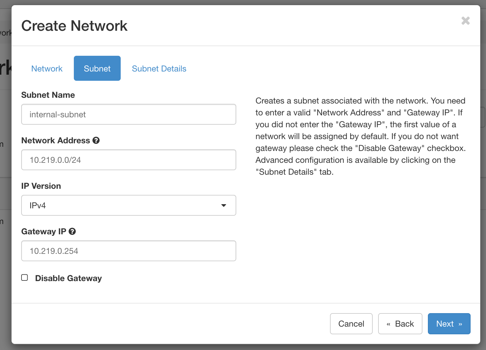

# 建立私有網路

OpenStack 允許各個用戶在自己專案建立自己的私有網路，私有網路中的 VM 可以透過路由器 SNAT 連線至外部網路。
我們會建議使用者建立一個自己的私有網路並且透過一個 bastion host 作為一個跳板連入。

首先，進入網路 -> [網路](https://openstack.cloudnative.tw/project/networks/)，點擊建立網路。

相繼輸入以下資訊

- 網路
    - 網路名稱
    - 勾選建立子網路
- 子網路
    - 子網路名稱
    - 網路地址
        - 請選擇慣用的私有網路地址
        - Eg. 10.0.0.0/8, 172.16.0.0/12, 192.168.0.0/16
    - IP Version （選擇 IPv4 或是 IPv6）
    - 閘道 IP（非必要，用於路由器 IP 地址）
- 子網路詳細資訊
    - DHCP 地址池
    - DNS 位置

## 建立路由器

路由器是用來做外部網路和私有網路中的 SNAT/DNAT，要透過路由器才能在 VM 上聯結浮動 IP

首先，進入網路 -> [路由器](https://openstack.cloudnative.tw/project/routers/)，點擊新增路由器，填寫：

- 路由器名稱
- 對外網路選擇 `publicv4` 或 `publicv6`

點選新增路由器。

當路由器建立完畢後，點選路由器名稱進入路由器資訊，並且選擇`網路卡`選單，點擊右方加入網路卡，填寫：
- 子網域
    - 選擇你建立的私有網路
- IP 位址
    - 填寫當初子網域所填寫的閘道 IP

點選提交後將會建立一個新的網路卡連接路由器和私有網路，提供給私有網路 SNAT 和上面 VM 浮動 IP DNAT

