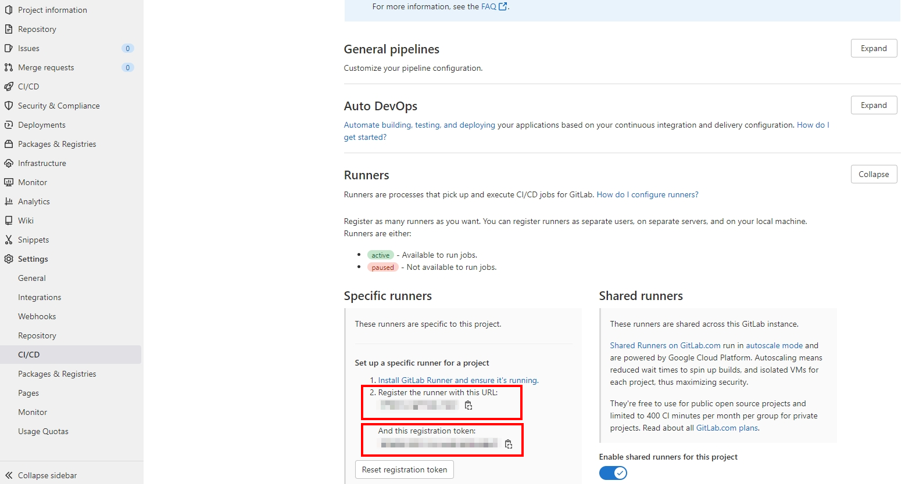
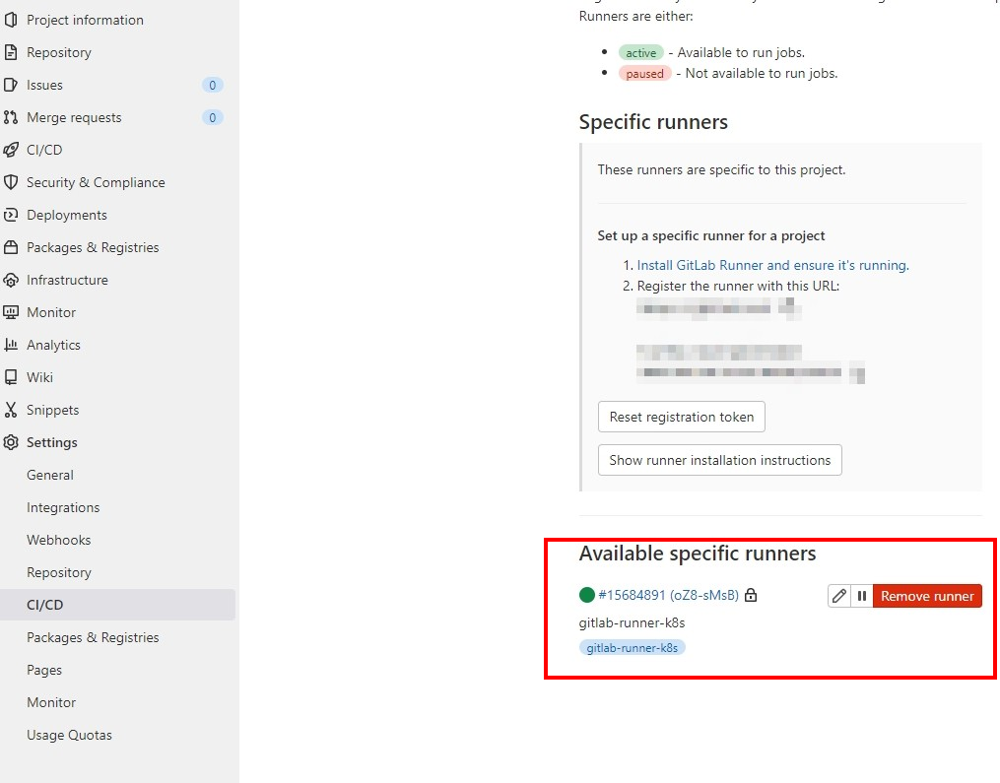
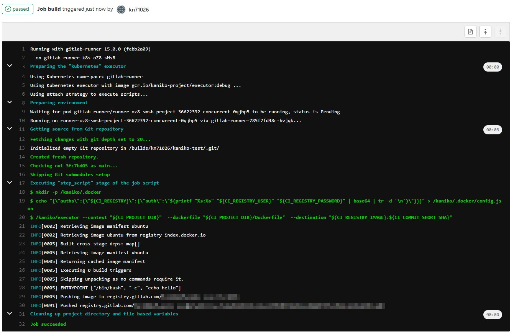

## Lab 2：Using Kaniko on Gitlab CI 
在 Lab2 中，將使用 Gitlab CI 整合 Kaniko，完成在 CICD 過程中的 image build 操作，步驟如下：

1. 建立 Gitlab runner，executor 必須是 Docker/Kubernetes/Docker Machine
2. 在 Gitlab 專案中加上 .gitlab-ci.yml 以導入 Kaniko

### 建立 Gitlab runner 
這邊的 GitLab runner executor 我們選擇使用 Kubernetes，方便起見，一樣使用 minikube 架設 cluster，建立步驟如下：
1. 建立 gitlab-runner namespace
- 建立 `gitlab-runner-namespace.yaml` 檔案，並切換到 gitlab-runner namespace

```shell=
$ kubectl create -f gitlab-runner-namespace.yaml
$ kubectl get namespace
NAME                   STATUS   AGE
gitlab-runner          Active   5s
$ kubectl config set-context --current --namespace=gitlab-runner
Context "minikube" modified.
```

2. 在 gitlab-runner namespace 下建立 role，允許 create/delete/exec/delete 以及 讀取 pods 的 log，在執行 pipeline 時，gitlab runner 會在 cluster 中建立新的 pod 執行 gitlab-ci.yaml 中定義的 job，因此需要讓 gitlab runner 有存取 Kubernetes API 的權限，預設在 gitlab-runner namespace 中的 default service account 是沒有權限的，因此我們需要先定義 `gitlab-runner-gitlab-runner-role.yaml`

- 接著建立 role

```shell=
$ kubectl create -f gitlab-runner-gitlab-runner-role.yaml
role.rbac.authorization.k8s.io/gitlab-runner created
$ kubectl get --namespace=gitlab-runner role
NAME            CREATED AT
gitlab-runner   2022-05-31T07:55:43Z
$ kubectl describe role --namespace gitlab-runner gitlab-runner
Name:         gitlab-runner
Labels:       <none>
Annotations:  <none>
PolicyRule:
  Resources    Non-Resource URLs  Resource Names  Verbs
  ---------    -----------------  --------------  -----
  pods/exec    []                 []              [create]
  pods/log     []                 []              [get]
  configmaps   []                 []              [list get create delete update]
  pods/attach  []                 []              [list get create delete update]
  secrets      []                 []              [list get create delete update]
  pods         []                 []              [list get watch create delete]
```


3. Assign/bind role 到 service account `system:serviceaccount:gitlabrunner:default`

在建立好 role 後，我們需要將 role bind 到 service account 

```shell=
$  kubectl create rolebinding --namespace=gitlab-runner gitlab-runner-binding --role=gitlab-runner --serviceaccount=gitlab-runner:default
rolebinding.rbac.authorization.k8s.io/gitlab-runner-binding created
$ kubectl get --namespace gitlab-runner rolebinding
NAME                    ROLE                 AGE
gitlab-runner-binding   Role/gitlab-runner   14s
```

4. 使用 Helm 安裝 gitlab runner

在完成上述的環境建置步驟後，終於可以安裝 gitlab runner 了，但這邊會使用到 Helm，若未安裝過需[先到官網安裝](https://helm.sh/docs/intro/install/)。

安裝 Helm 後，需要先加入 Gitlab Helm repository
```shell=
$ helm repo add gitlab https://charts.gitlab.io
```


裝好 Helm 後，在用 Helm 建立 Chart 前，需要先準備 **GitLab url** 以及 **runner registration token**，可以到想導入 Kaniko 的專案左側 sidebar 最下方 Settings 內的 CI/CD 頁面內，找到 Runner 並點開，就可以看到這兩項資訊：


若使用 gitlab ee 版本，URL 就會是 https://gitlab.com/， 但若是自架的 Gitlab，URL 就會有所不同。

再來創建等下要使用的 values.yaml，這邊提供較簡單的版本，若需要詳細設定可以參考 [Gitlab 官方的版本](https://gitlab.com/gitlab-org/charts/gitlab-runner/blob/main/values.yaml)

- 完成後可執行

```shell=
# For Helm 3
$ helm install --namespace gitlab-runner gitlab-runner -f values.yaml gitlab/gitlab-runner
```
- 若建立成功，可看到成功 deploy 的訊息，也可透過 `kubectl get all` 確認

```shell=
NAME: gitlab-runner
LAST DEPLOYED: Tue May 31 20:57:51 2022
NAMESPACE: gitlab-runner
STATUS: deployed
REVISION: 1
TEST SUITE: None
NOTES:
Your GitLab Runner should now be registered against the GitLab instance reachable at: "https://gitlab.com/"

Runner namespace "gitlab-runner" was found in runners.config template.
$  kubectl get all
NAME                                 READY   STATUS    RESTARTS   AGE
pod/gitlab-runner-785f7fd48c-bvjqk   1/1     Running   0          59s

NAME                            READY   UP-TO-DATE   AVAILABLE   AGE
deployment.apps/gitlab-runner   1/1     1            1           59s

NAME                                       DESIRED   CURRENT   READY   AGE
replicaset.apps/gitlab-runner-785f7fd48c   1         1         1       59s
```

- 在 Gitlab 專案 Settings 內的 CI/CD，點擊 Expand 展開 Runners 區塊，也能看到已註冊好的 Gitlab runner。




### 在 Gitlab 專案中導入 Kaniko
接著需要在專案根目錄中加入 `.gitlab-ci.yml`，若是之前已有 `.gitlab-ci.yml` 的專案，可直接更改檔案內容，另外專案本身也需有 Dockerfile，將在 `.gitlab-ci.yml` 內設定相關路徑，由於 GitLab ee 版本有提供 Container Registry，因此這邊不特別做設定推送 image 到 dockerhub上，這邊以官方提供的[範例設定檔](https://github.com/kn71026/Infra-Labs-Docs/blob/kaniko_lab/self-paced-labs/image_build/kaniko_lab/scripts/.gitlab-ci.yml)來示範。


commit 後即可看到 pipeline 開始執行，若 `.gitlab-ci.yml` 填寫正確即可看到 Kaniko 成功運行並 push image 到專案的 Container Registry 中。



若想推送到 Dockerhub 中，可先在本機登入 Dockerhub，再將 auth 資訊存入 GitLab CI/CD Variables 中，在 CI 過程中將變數傳入，即可推送到 Dockerhub，方法如下：

- 登入 Docker hub
```
docker login index.docker.io
```
- 檢查 auth 資訊是否有存入
```
cat ~/.docker/config.json
```
- 有成功登入應該會看到檔案內容如下：
```
{
	"auths": {
		"https://index.docker.io/v1/": {
			"auth": "xxxxxxxxxxxxxxx"
		}
	}
}
```
- 將上面的參數存入 GitLab 專案左側 sidebar Settings 內的 CI/CD Variables 中，並在創立完 `/kaniko/.docker` 目錄後，將此變數存進 `/kaniko/.docker/config.json` 中，或是也能用 secret 的方式，掛載相關認證資訊到 pod 上。

### 小結
在 Gitlab CI 過程中使用 Kaniko 還蠻方便的，但比較適用在使用 k8s executors 的情況，若搭配 Gitlab runner 以及 Kaniko 的 cache，build 速度則會更快。